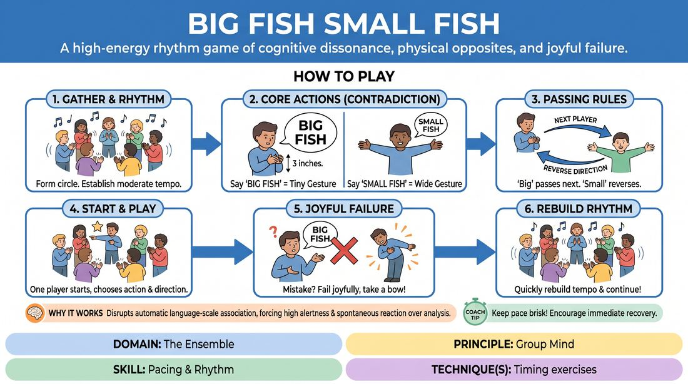

# Big Fish, Small Fish

{ .game-hero }

> A high-energy rhythm game of cognitive dissonance, physical opposites, and joyful failure.

## Overview
Players stand in a circle passing a verbal and physical signal that demands deliberate cognitive mismatch. By pairing the phrase 'Big Fish' with a tiny hand gesture, and 'Small Fish' with a wide hand gesture, the group builds a shared, high-speed rhythm. The game challenges players to override their natural instincts, resulting in hilarious mistakes and a strong sense of collective focus.

## What It Trains
- **Domain:** D4 — The Ensemble
- **Principle(s):** Group Mind; Fail Joyfully
- **Skill(s):** Pacing & Rhythm; Unfiltered Spontaneity; Peripheral Awareness
- **Technique(s):** Timing exercises
- **Focus:** connection

**Objective:** To develop group mind, rapid cognitive processing, and rhythmic pacing by forcing players to separate verbal cues from physical gestures while embracing mistakes with enthusiasm.

## Setup
Have all players stand in a circle facing inward. Ensure there is enough space for everyone to make wide hand gestures without hitting their neighbors. No props or materials are required.

## How to Play
1. Gather the group into a circle and establish a steady, moderate tempo by clapping or swaying together briefly.
2. Explain the two core actions, which rely on deliberate physical contradiction: saying 'Big Fish' requires a tiny hand gesture (hands about 3 inches apart), while saying 'Small Fish' requires a wide hand gesture (hands about 15 inches apart).
3. Introduce the directional rules: performing a 'Big Fish' (tiny gesture) passes the turn to the immediate next person in the current direction of the circle.
4. Performing a 'Small Fish' (wide gesture) reverses the direction of the pass, sending it back to the person who just went.
5. Designate one player to start the game by choosing either action and directing it to their left or right.
6. If a player makes a mistake—such as matching the word to its literal size, hesitating too long, or passing in the wrong direction—they must 'fail joyfully' by taking a dramatic, theatrical bow or letting out a playful sigh of defeat, then immediately restarting the circle.
7. Keep the pace brisk, encouraging the group to rebuild the rhythm immediately after every mistake.

## Facilitation Notes
- Side-coaching cue: 'Embrace the mismatch! Let your hands do the opposite of your mouth.'
- Pitfall: Players slowing down to think and avoid mistakes. Fix: Encourage speed over accuracy. It is much better to fail fast and loudly than to play slowly and perfectly.
- Side-coaching cue: 'Celebrate the slip-ups! When someone makes a mistake, the whole circle should cheer or gasp dramatically to keep the energy high.'
- Pitfall: Players making gestures that are ambiguous in size. Fix: Insist on extreme physical clarity—either very tiny or very wide.

## Variations
- Double Speed: Once the group understands the mechanics, challenge them to double the tempo of the passes.
- Silent Sea: Play the entire game in complete silence, using only the physical gestures to pass and reverse the flow, relying entirely on visual tracking.
- New Species: Introduce a third phrase, 'Medium Fish' (hands medium width), which skips the next person and passes to the second person in line.

## Debrief
- How did it feel to try to force your brain to do the exact opposite of what it wanted to do physically?
- What happened to the group's energy when we started celebrating our mistakes instead of apologizing for them?
- How did peripheral awareness and watching the whole circle help you anticipate when your turn was coming?

## Safety & Inclusion
Ensure players are standing far enough apart to avoid accidental physical contact during wide gestures. For players with limited mobility or hand dexterity, gestures can be adapted to any contrasting physical movements (e.g., a high head tilt vs. a low head tilt, or a wide blink vs. a tight squint).

## Why It Works
This game works by disrupting the brain's automatic association between language and physical scale. This cognitive friction forces players out of their analytical minds and into a state of high alertness and spontaneous reaction. By framing mistakes as moments of shared comedy, it builds psychological safety and reinforces the 'fail joyfully' principle, which is essential for collaborative ensemble work.
