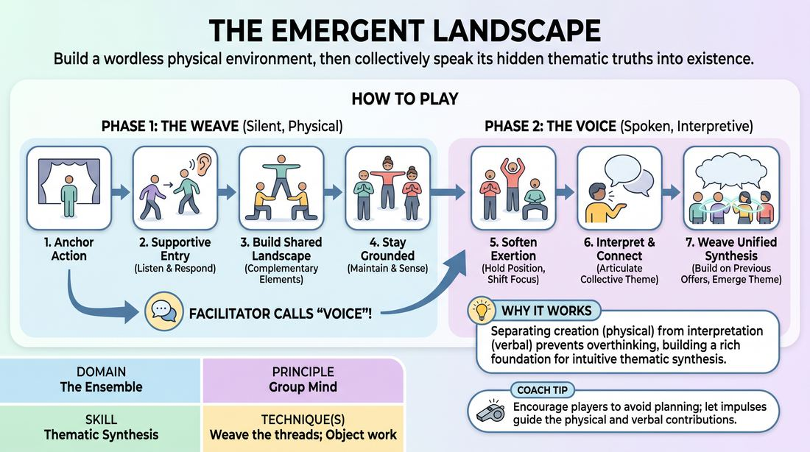

# Emergent Landscapes

{ .game-hero }

> Build a wordless physical environment, then collectively speak its hidden thematic truths into existence.

## Overview
An ensemble-building exercise in two distinct phases: a silent physical phase and a spoken interpretive phase. Players first construct a rich, multi-layered physical and auditory environment, then transition to verbally synthesizing the underlying themes and narratives implied by their collective creation. The result is a deep, shared experience of group mind and thematic discovery.

## What It Trains
- **Domain:** D4 — The Ensemble
- **Principle(s):** Group Mind; Follow the Follower; Serve the Piece
- **Skill(s):** Physicality & Space Work; Peripheral Awareness; Support Work; Suggestion Deconstruction (A-to-C); Pacing & Rhythm; Thematic Synthesis
- **Technique(s):** Object work; Stage-picture exercises; Thread-tracking drills; Playing architecture/objects; A-to-C drills; Weave the threads
- **Focus:** mixed

**Objective:** To develop the ability to weave disparate physical and sonic offers into a unified thematic narrative, strengthening group mind and training players to serve the collective piece over individual performance.

## Setup
A clear, open playing space with enough room for 3 to 8 players to move freely and form a physical tableau. No props or materials are required. Players start standing offstage or along the perimeter of the space.

## How to Play
1. Begin Phase One, 'The Weave': One player steps into the empty playing space and establishes a continuous physical or auditory anchor, such as a repetitive movement, a static pose, a rhythmic sound, or a specific interaction with imaginary architecture.
2. One by one, remaining players enter the space when they feel a strong, supportive impulse, ensuring they do not rush the timing of their entries.
3. Every entering player must remain completely silent, adding a new physical or sonic element that directly responds to and complements the existing stage picture and soundscape.
4. Maintain your chosen physical or auditory contribution once established, using peripheral awareness to stay grounded and responsive to the evolving environment without disrupting its overall rhythm.
5. Once all players have entered and the physical landscape is fully established, the facilitator calls out 'Voice' to initiate Phase Two.
6. In Phase Two, 'The Voice', players hold their physical positions but soften their physical exertion to allow verbal focus.
7. One at a time, players speak aloud to interpret the collective landscape, articulating what their physical element represents or how it connects to the broader environment.
8. Listen deeply to each spoken offer, building upon previous interpretations to weave a cohesive, shared theme, emotional truth, or narrative thread rather than introducing unrelated ideas.
9. Conclude the exercise when a unified thematic synthesis has emerged and every player has contributed to the verbal tapestry.

## Facilitation Notes
- Side-coaching during Phase One: Encourage players to vary their levels, proximity, and types of offers (e.g., if three players are making sounds, the next should offer a silent, strong physical pose).
- Pitfall: Players entering too quickly or all at once. Fix: Coach them to wait until the previous player's offer is fully integrated and readable before stepping in.
- Side-coaching during Phase Two: Remind players to speak from their physical perspective but to connect their words directly to what others have said, practicing 'A-to-C' association rather than literal description.
- Pitfall: Players trying to write a linear plot or joke during the verbal phase. Fix: Guide them toward poetic, atmospheric, or emotional statements that deepen the mood rather than forcing a traditional storyline.

## Variations
- Dynamic Shift: After the verbal phase concludes, one player initiates a single, dramatic physical change (e.g., collapsing or shifting a major boundary), prompting the group to instantly adapt their physical and verbal interpretations to this new reality.
- Emotional Undercurrents: Before starting, secretly assign or have each player select a specific internal emotion (e.g., grief, anticipation, awe) to drive their physical work, which they then reveal and synthesize during the verbal phase.
- Abstract Layering: For advanced players, forbid direct agreement or confirmation in the verbal phase; players must layer new, poetic interpretations that trust the group mind to find the underlying connection.

## Debrief
- How did the transition from physical creation to verbal interpretation change your understanding of what the group was building?
- What did you notice about how the theme evolved as more voices joined in Phase Two?
- How did you balance maintaining your individual physical anchor while remaining open to the shifting group mind?

## Safety & Inclusion
Ensure players are mindful of physical limitations when holding poses or repetitive movements for extended periods; encourage them to choose sustainable physical offers or adjust their physical intensity as needed during the verbal phase.

## Why It Works
By separating physical creation from verbal interpretation, the game prevents players from overthinking or planning. The physical phase builds a rich, intuitive foundation (the 'A'), which the verbal phase then deconstructs and synthesizes (the 'C'). This structured transition forces the ensemble to listen to the collective whole, practicing 'Follow the Follower' and 'Weaving the Threads' to discover a shared artistic truth.
