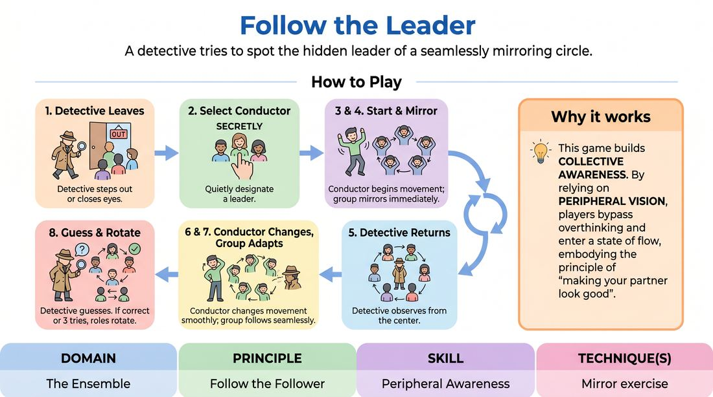

# The Silent Conductor

{ .game-hero }

> A detective tries to spot the hidden leader of a seamlessly mirroring circle.

## Overview
In this classic ensemble exercise, players stand in a circle and mirror the physical movements of a secretly designated leader. One player in the center acts as a detective, attempting to identify who is initiating the movements. The success of the group relies on soft focus, rapid adaptation, and collective support.

## What It Trains
- **Domain:** D4 — The Ensemble
- **Principle(s):** Group Mind; Follow the Follower; Make Your Partner a Genius
- **Skill(s):** Peripheral Awareness; Single-Partner Empathy & Mirroring
- **Technique(s):** Mirror exercise
- **Focus:** connection

**Objective:** Develops peripheral awareness, group mind, and physical mirroring skills, teaching players to follow non-verbal cues without breaking the illusion of a unified group.

## Setup
Players stand in a spacious circle facing inward. No props or special materials are required.

## How to Play
1. Select one player to be the Detective and ask them to step out of the room or close their eyes and cover their ears.
2. Quietly point to one player in the circle to designate them as the Conductor.
3. Instruct the Conductor to begin a simple, repetitive physical movement, such as swaying, shoulder rolling, or toe tapping.
4. Have the rest of the circle immediately mirror the Conductor's movement.
5. Invite the Detective back to stand in the center of the circle.
6. The Detective slowly rotates in the center, observing the players to guess who is leading the movement.
7. The Conductor must periodically change the movement smoothly, and the rest of the circle must adapt as quickly and seamlessly as possible.
8. The round ends when the Detective correctly identifies the Conductor, or after three incorrect guesses, at which point roles are rotated.

## Facilitation Notes
- Side-coach the circle: 'Soften your eyes. Use your peripheral vision to track the movement rather than staring directly at the Conductor.'
- Side-coach the Conductor: 'Make your transitions gradual and continuous, like a slow fade, rather than sudden jerks.'
- Common Pitfall: The circle hesitates during transitions, creating a 'wave' effect that easily reveals the leader. Fix: Encourage players to mirror whoever is next to them, distributing the responsibility of following.
- Common Pitfall: The Detective stands still. Fix: Encourage the Detective to move around, spin, and actively scan the physical energy of the room.

## Variations
- Organic Flow (No Leader): Remove the Detective and the designated Conductor. The group attempts to move in complete unison, initiating and passing leadership organically without anyone consciously deciding to lead.
- Vocal Symphony: The Conductor adds simple, repetitive vocalizations or rhythmic sounds to their physical movements, which the circle must mirror in pitch and volume.

## Debrief
- What strategies did you use to follow the Conductor without looking directly at them?
- As the Conductor, how did it feel to lead? Did you feel supported by the ensemble?
- How does this exercise relate to the concept of 'Group Mind' on stage?

## Safety & Inclusion
Ensure all movements chosen by the Conductor are physically accessible to everyone in the circle. If standing is difficult for any participant, the entire group can play the game seated in chairs.

## Why It Works
This game works because it shifts focus from individual performance to collective awareness. By relying on peripheral vision, players bypass analytical thinking and enter a state of flow, embodying the principle of 'making your partner look good' by instantly validating and matching their physical choices.
