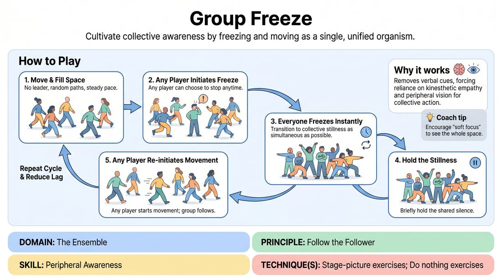

# Ensemble Freeze

{ .game-hero }

> Cultivate collective awareness by freezing and moving as a single, unified organism.

## Overview
In this exercise, players move dynamically throughout the space with no designated leader. At any moment, any individual can choose to freeze, prompting the entire group to instantly halt in unison. The goal is to achieve a seamless, collective transition between movement and absolute stillness using only peripheral vision and shared intuition.

## What It Trains
- **Domain:** D4 — The Ensemble
- **Principle(s):** Group Mind; Follow the Follower
- **Skill(s):** Silence & Stillness; Peripheral Awareness
- **Technique(s):** Do nothing exercises; Stage-picture exercises
- **Focus:** connection

**Objective:** To develop peripheral awareness, non-verbal connection, and the principle of 'follow the follower' by training players to react to subtle shifts in the group's collective physical state.

## Setup
An open, obstacle-free room where players can walk freely. No props or materials are required. Players begin scattered throughout the space, facing different directions.

## How to Play
1. Instruct all players to begin walking around the room at a moderate, steady pace, filling the empty spaces and avoiding walking in a simple circle.
2. Explain that there is no designated leader; every player has equal authority to initiate a freeze.
3. At any point, any player may choose to come to a complete, sudden stop and hold their physical position.
4. As soon as any player notices someone has stopped, they must immediately freeze in their current position as well.
5. The objective is for the entire room to transition from movement to absolute stillness as close to simultaneously as possible.
6. Once the entire group has achieved complete stillness and held it for a brief moment, any player may initiate movement again, prompting the rest of the group to resume walking.
7. Repeat this cycle of movement and stillness, encouraging the group to decrease the lag time between the initial freeze and the collective halt.

## Facilitation Notes
- Side-coaching cue: 'Soften your gaze. Use your peripheral vision to sense the entire room, not just the person directly in front of you.'
- Pitfall: Players looking directly at one another or turning their heads to check if others have stopped. Fix: Remind them to keep their heads facing forward and rely entirely on their wider field of vision.
- Side-coaching cue: 'Embrace the silence. Let the stillness be absolute—no shifting weight, no adjusting clothes, no giggling.'
- Pitfall: A single player trying to 'trick' the group by stopping abruptly or moving too fast. Fix: Remind the group that this is a collaborative exercise in unity, not a game of elimination or competition.

## Variations
- Soundscape Freeze: Players continuously hum, whistle, or make abstract vocal sounds while moving. When a freeze occurs, all sound must instantly cut off along with the physical movement.
- Tempo Shifts: Introduce different walking speeds (from 1 to 10). Freezing from a fast run (speed 9) or a slow crawl (speed 2) challenges the group's physical control and reaction time.
- Blind Freeze: Players move with their eyes closed (or soft-focused downward) and must rely entirely on auditory cues (footsteps stopping) and spatial intuition to freeze.

## Debrief
- How did it feel when the group froze in perfect unison versus when there was a delayed, domino effect?
- What physical adjustments did you have to make to sense people moving behind or beside you?
- How does 'following the follower' in this game translate to supporting your scene partners on stage?

## Safety & Inclusion
Ensure the walking space is clear of tripping hazards. Players with mobility constraints can participate at their own comfortable pace; the group should adapt its collective speed to ensure everyone can safely participate and freeze without risk of losing balance.

## Why It Works
This game works because it strips away verbal communication and forces players to rely on their kinesthetic empathy and peripheral vision. By removing a single leader, it democratizes the stage picture, teaching players that every individual movement affects the entire ensemble. It builds the 'group mind' necessary for spontaneous, unscripted physical theater.
