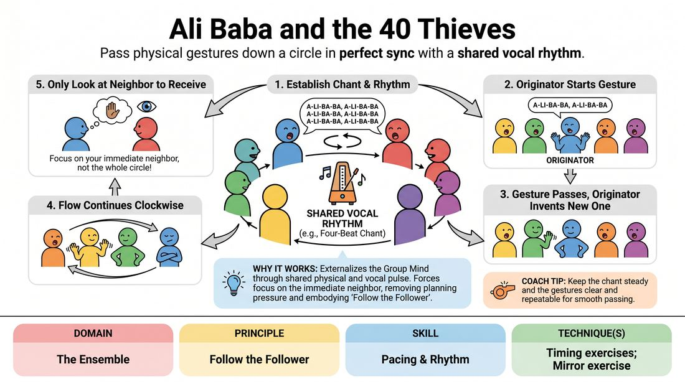

# The Rhythmic Conveyor Belt

{ .game-hero }

> Pass physical gestures down a circle in perfect sync with a shared vocal rhythm.

## Overview
The Rhythmic Conveyor Belt is a high-focus physical warm-up where players stand in a circle and pass physical movements sequentially around the ring. The entire group maintains a steady, chanted vocal rhythm, which acts as the metronome for the physical shifts. Players experience a hypnotic flow state as they balance tracking their neighbor's movement with executing their own in perfect tempo.

## What It Trains
- **Domain:** D4 — The Ensemble
- **Principle(s):** Commit 100%; Make Your Partner a Genius; Group Mind; Follow the Follower
- **Skill(s):** Physicality & Space Work; Single-Partner Empathy & Mirroring; Peripheral Awareness; Pacing & Rhythm
- **Technique(s):** Mirror exercise; Thread-tracking drills; Timing exercises
- **Focus:** connection

**Objective:** This game develops physical synchronization, peripheral awareness, and rhythmic precision, training players to follow the follower by shifting focus from self-expression to active, empathetic mirroring.

## Setup
Have all players stand in a clear circle with enough space to move their arms and legs freely. No props or materials are required.

## How to Play
1. Gather the group into a standing circle and establish a simple, repetitive four-beat vocal chant to act as the collective metronome.
2. Have the entire group chant this phrase continuously in unison to lock in a steady, medium-tempo rhythm.
3. Designate one player as the Originator to initiate the physical movement.
4. On the first beat of the next chant cycle, the Originator performs a simple, repeatable physical gesture and maintains it for the duration of that cycle.
5. On the next chant cycle, the player to the Originator's left must adopt the Originator's exact gesture, while the Originator invents a brand-new gesture.
6. On the third cycle, the third player adopts the second player's previous gesture, the second player adopts the Originator's previous gesture, and the Originator invents another new gesture.
7. Continue this pattern clockwise around the circle, so that every gesture ripples down the line like a wave, one player per chant cycle.
8. Instruct players to only look at the person immediately to their right to receive their next movement, preventing them from getting overwhelmed by the rest of the circle.

## Facilitation Notes
- Side-coaching cue: 'Keep your eyes on your neighbor, not the whole room. Trust the wave to reach you.'
- Pitfall: Players changing their gesture too early or too late. Fix: Remind the group that the transition must happen exactly on the first beat of the vocal chant.
- Pitfall: The chant speeding up as players get anxious. Fix: Act as the external metronome, grounding the tempo with a steady hand clap.
- Side-coaching cue: 'Keep the gestures simple and distinct. Big, clear shapes are easier to pass than micro-movements.'

## Variations
- Silent Conveyor: Remove the vocal chant entirely, requiring players to internalize the rhythm and rely purely on visual cues and breath to stay in sync.
- Bi-directional Wave: Start two different gestures at opposite sides of the circle moving in opposite directions, challenging players to manage the intersection.
- Emotional Conveyor: Instead of physical gestures, pass distinct emotional expressions or facial postures down the line.

## Debrief
- How did it feel to focus entirely on your immediate neighbor rather than trying to track the whole circle?
- What happened to the rhythm when we stopped overthinking our next move and just trusted the flow?
- How does this exercise help us support our scene partners when building physical environments or group scenes?

## Safety & Inclusion
Ensure players are aware they can adapt any physical gesture to fit their own mobility level; if a gesture is passed that a player cannot physically replicate, they should adapt it to a comfortable equivalent, and their neighbor must mirror that adapted version.

## Why It Works
This game works because it externalizes the Group Mind through a shared physical and vocal pulse. By forcing players to look only at their immediate neighbor, it strips away the pressure of planning ahead, embodying the 'Follow the Follower' principle. The strict rhythmic structure acts as a safety net, allowing players to experience effortless synchronization and deep ensemble connection.
