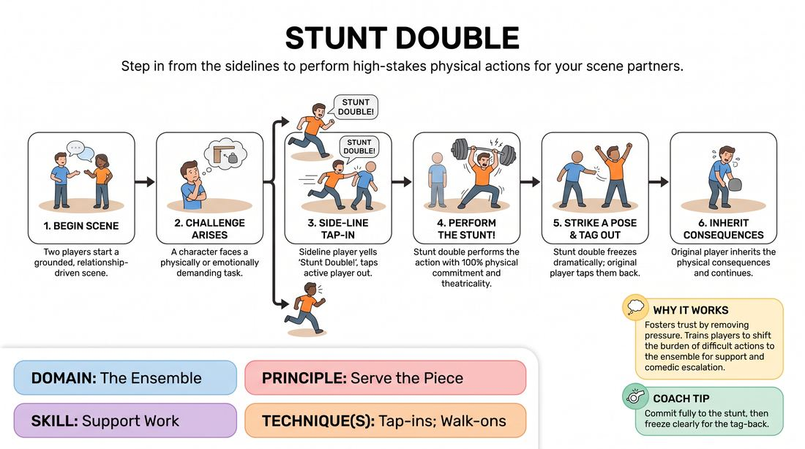

# Stunt Double

{ .game-hero }

> Step in from the sidelines to perform high-stakes physical actions for your scene partners.

## Overview
Two players initiate a grounded scene, but whenever a physically demanding, emotionally extreme, or absurdly difficult task arises, a sideline player leaps in as their stunt double. The stunt double executes the action with maximum physical commitment before tagging the original player back in to deal with the aftermath. This high-energy game builds a strong ensemble mindset by training players to actively support and elevate their peers.

## What It Trains
- **Domain:** D4 — The Ensemble
- **Principle(s):** Commit 100%; Make Your Partner a Genius; Serve the Piece
- **Skill(s):** Physicality & Space Work; Active Gifting; Peripheral Awareness; Support Work
- **Technique(s):** Walk-ons; Tap-ins
- **Focus:** comedy_game

**Objective:** To develop active support work and seamless tap-ins, training sideline players to maintain high peripheral awareness and jump in to make their partners look brilliant.

## Setup
An open performance space with two active players center stage, and the remaining players standing on the sidelines (the backline) ready to jump in. No props or chairs are needed.

## How to Play
1. Two players step forward to begin a standard, relationship-driven scene.
2. As the scene progresses, a character will inevitably face a challenging, dangerous, or highly specific physical or emotional task.
3. Before the active player performs the action, a player from the sideline must yell 'Stunt Double!' and run onto the stage, tapping the active player out.
4. The original player freezes or steps back safely, while the stunt double performs the action with 100% physical commitment and exaggerated theatricality.
5. Once the stunt is complete, the stunt double strikes a dramatic pose, freezes, and the original player taps them back out to resume their position.
6. The original player immediately inherits the physical consequences of the stunt (e.g., panting, covered in imaginary soot, or emotionally drained) and continues the scene.

## Facilitation Notes
- Encourage sideline players to watch like hawks; the transition should be fast and seamless to maintain the scene's momentum.
- Remind the main players not to do the stunts themselves. They should set up the challenge, pause, and wait for their support team to rescue them.
- Side-coaching cue: 'Commit to the physical aftermath! If your double just fought off ten ninjas, you should be out of breath when you step back in.'
- Pitfall: Sideline players waiting too long to jump in, causing dead air. Fix: Encourage immediate, impulsive tap-ins even if the action seems simple—any action can be turned into a stunt.

## Variations
- Emotional Doubles: Instead of physical stunts, sideline players jump in to express extreme, heightened emotional outbursts (e.g., intense grief, explosive rage, or overwhelming joy) before tagging out.
- Slow-Motion Stunts: All stunt sequences must be performed in highly detailed, dramatic slow-motion, requiring precise physical control and coordination from the stunt double.
- Specialist Doubles: The sideline player steps in as a highly specific expert (e.g., 'French Accent Double' or 'Operatic Singing Double') to handle a non-physical but highly specialized task.

## Debrief
- How did it feel to know that the sideline had your back the moment you faced a difficult task?
- What made a tap-in successful and seamless versus disruptive?
- How did inheriting the physical aftermath of the stunt change your character's choices in the scene?

## Safety & Inclusion
Ensure the performance space is clear of tripping hazards. Remind players that stunts are pantomimed and physicalized through safe, solo stage movement—no actual physical contact or dangerous acrobatics should be attempted.

## Why It Works
This game operates on a game engine of comedic escalation and active support. By shifting the burden of difficult actions to the sideline, it removes the pressure of perfection from the main players and fosters a deep sense of trust. It teaches the ensemble that they are a safety net for one another, transforming a simple scene into a collaborative, high-energy spectacle.
