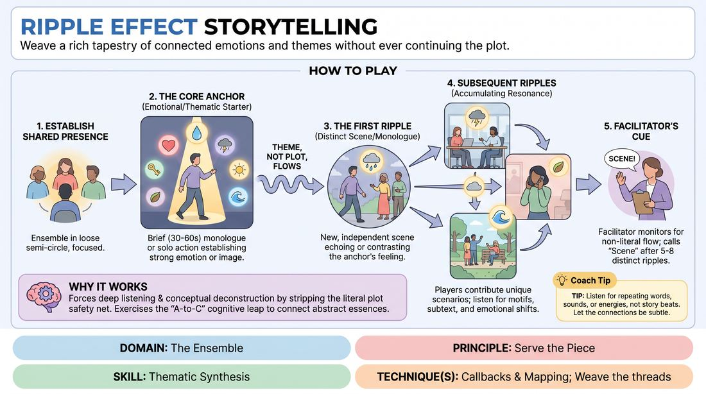

# Resonance Ripples

{ .game-hero }

> Weave a rich tapestry of connected emotions and themes without ever continuing the plot.

## Overview
A collaborative narrative exercise where players build a multi-layered performance by echoing and evolving emotional and thematic threads rather than continuing a linear storyline. One player initiates a core emotional or visual anchor, and subsequent players contribute distinct, independent scenes or monologues that act as ripples, expanding the shared thematic universe.

## What It Trains
- **Domain:** D4 — The Ensemble
- **Principle(s):** Group Mind; Follow the Follower; Serve the Piece
- **Skill(s):** Peripheral Awareness; Support Work; Suggestion Deconstruction (A-to-C); Thematic Synthesis
- **Technique(s):** Callbacks & Mapping; Weave the threads; A-to-C drills
- **Focus:** narrative

**Objective:** To develop thematic synthesis and mapping skills by training players to deconstruct scenes to their emotional essence and respond with resonant, non-literal callbacks that serve the collective piece.

## Setup
An open playing space with 4 to 8 players standing in a semi-circle or scattered comfortably. No props or chairs are required. The facilitator stands off-stage to observe and guide the transitions.

## How to Play
1. Begin with the ensemble standing in a loose semi-circle, establishing a shared, focused presence.
2. A single player steps forward to deliver a brief, 30-to-60-second monologue or solo action that establishes a strong emotional state, evocative image, or thematic concept.
3. Once the first player steps back, a second player self-selects and steps forward to initiate a completely new, distinct scene or monologue.
4. This second contribution must not continue the literal plot, characters, or setting of the first; instead, it must echo, amplify, or contrast the underlying emotional or thematic essence of the initiation.
5. Subsequent players continue this pattern, stepping forward one by one to contribute their own unique, disconnected scenarios that resonate with the accumulating thematic landscape.
6. Players must actively listen for recurring motifs, emotional shifts, and subtext, using their contributions to map out different facets of the same overarching theme.
7. The facilitator monitors the progression, ensuring players do not slip into literal narrative continuation, and calls 'Scene' once 5 to 8 distinct ripples have fully explored the thematic arc.

## Facilitation Notes
- Side-coaching cue: 'Find the feeling, not the plot.' Remind players to strip away the literal details of the previous scene and focus entirely on the underlying mood or concept.
- Pitfall: Players accidentally continuing the story of the previous character. Fix: Gently side-coach with 'New character, new place, same feeling' to reset their focus.
- Encourage players to use contrast. If the previous ripple was heavy and somber, a player can introduce a lighter, bittersweet counterpoint that still honors the core theme.
- If a player feels stuck or uninspired, coach them to focus on a physical gesture or a simple, evocative description of an object from the previous scene to find their entry point.

## Variations
- Emotional Trajectory: The facilitator provides a starting and ending emotional state, and the ensemble must guide the ripples to transition smoothly between them.
- Physical Echoes: Players must mirror or adapt the physical posture, spatial positioning, or vocal quality of the preceding player, translating physical energy into new thematic contexts.
- Silent Ripples: Allow players to contribute entirely non-verbal, physical, or gestural ripples to express the emotional resonance without spoken words.

## Debrief
- What was the core theme or emotional thread that connected our individual pieces today?
- How did it feel to let go of literal plot progression and focus entirely on thematic resonance?
- At what point did you feel the group mind fully align on the direction of the piece?
- How did contrasting emotional tones help deepen the overall impact of the narrative?

## Safety & Inclusion
Ensure a supportive environment by establishing that players can explore deep emotions without pressure to share personal trauma. Encourage metaphorical or fictionalized expressions of heavy themes, and allow players to pass if a particular emotional thread feels too intense.

## Why It Works
By stripping away the safety net of literal plot progression, this game forces players to engage in deep listening and conceptual deconstruction. It exercises the 'A-to-C' cognitive leap, requiring players to identify the abstract essence of a scene (A) and generate a completely new scenario (C) that shares the same emotional DNA, ultimately building a unified, high-level ensemble piece.
