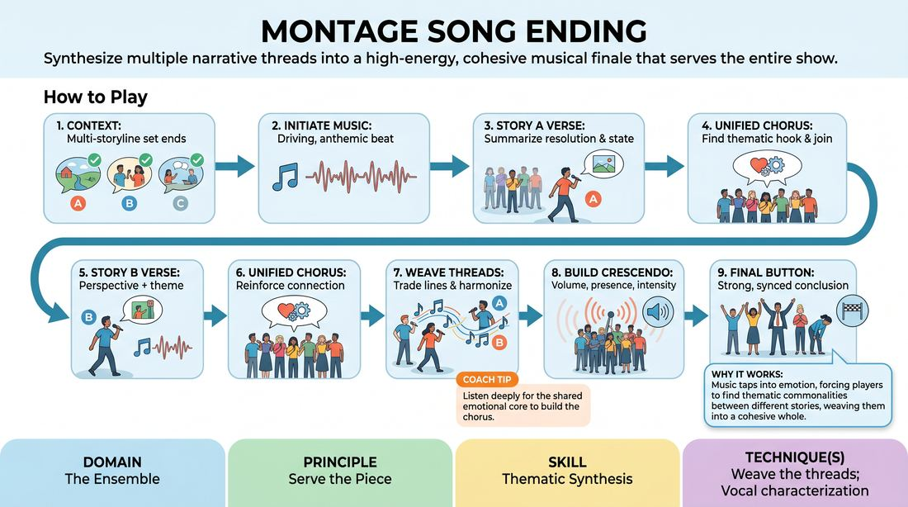

# The Weaving Finale

{ .game-hero }

> Synthesize multiple narrative threads into a high-energy, cohesive musical finale that serves the entire show.

## Overview
This high-energy, collaborative musical game is designed to close a multi-narrative long-form set. Players step forward to sing verses representing different storylines, eventually blending their voices and themes into a unified, satisfying chorus. It challenges the ensemble to listen deeply, synthesize narrative threads, and deliver a cohesive, show-ending climax.

## What It Trains
- **Domain:** D4 — The Ensemble
- **Principle(s):** Commit 100%; Serve the Piece; The Audience Is the Final Scene Partner
- **Skill(s):** Vocal Craft; Thematic Synthesis; Format Literacy; Stage Presence & Clarity
- **Technique(s):** Vocal characterization; Callbacks & Mapping; Weave the threads; Montage
- **Focus:** mixed

**Objective:** To develop thematic synthesis and ensemble cohesion by weaving disparate narrative threads into a singular, satisfying musical conclusion.

## Setup
A performance space with a clear stage area. An accompanist (keyboardist, guitarist, or a designated beatboxer from the ensemble) is highly recommended. The players should have just completed a series of scenes (or a simulated long-form set with two to three distinct storylines) so they have narrative material to draw from.

## How to Play
1. Establish the context: The ensemble has just completed a multi-storyline set or a simulated series of distinct scenes.
2. Initiate the music: The accompanist or a designated player providing a vocal rhythm starts a driving, anthemic, or show-stopping musical beat.
3. Step forward for Storyline A: A player representing the first storyline steps forward to sing a verse summarizing their character's resolution, emotional state, or thematic takeaway.
4. Establish the chorus: The rest of the ensemble listens for a key phrase or thematic hook in the first verse and joins in to sing a repeating, unified chorus that captures the overarching theme of the show.
5. Step forward for Storyline B: A player from the second storyline steps forward during the next verse, singing from their character's perspective while maintaining the established musical rhythm and key.
6. Return to the chorus: The entire ensemble sings the unified chorus again, reinforcing the shared thematic connection between the different stories.
7. Weave the threads: Players from different storylines step forward simultaneously or in rapid succession, trading lines or harmonizing to show how their characters' fates or themes intersect.
8. Build to the crescendo: The ensemble gathers as a full choir, building the vocal volume, physical presence, and emotional intensity.
9. The final button: The song concludes on a strong, synchronized final note or physical pose, providing a clean, definitive button to the entire performance.

## Facilitation Notes
- Side-coaching cue: 'Listen for the shared theme, not just the plot points!'
- Pitfall: Players get bogged down in reciting complex plot details. Fix: Coach them to focus on the emotional truth or a simple, repeating metaphor rather than literal exposition.
- Side-coaching cue: 'Support the singer! If you aren't singing the verse, provide physical backup, harmonies, or rhythmic clapping.'
- Pitfall: The chorus becomes too complex or changes every time. Fix: Keep the chorus simple, repetitive, and easy for the entire ensemble and audience to grasp instantly.
- Side-coaching cue: 'Find the intersection. How does Story A's lesson mirror Story B's struggle?'

## Variations
- The Genre Switch: Change the musical genre of the finale (e.g., hip-hop cipher, operatic tragedy, country ballad) to challenge vocal craft and stylistic adaptability.
- A Cappella Engine: Play without an instrument; the ensemble must build a vocal percussion and harmonic loop engine to support the singers.
- Thematic Tag-Team: Instead of full verses, players rapidly tag each other out, singing only one line at a time to create a fast-paced, woven tapestry of dialogue.

## Debrief
- How did focusing on the overarching theme help us connect storylines that seemed completely unrelated?
- What did it feel like to transition from supporting in the background to leading a verse, and how did the ensemble support that transition?
- How does a musical finale serve the audience's need for closure compared to a standard spoken scene?

## Safety & Inclusion
Ensure players are comfortable with singing; offer non-singing roles (such as rhythmic beatboxing, physical choreography, or spoken-word poetry over the music) so everyone can contribute to the finale without feeling pressured.

## Why It Works
Music bypasses literal logic and taps directly into emotion. By forcing players to sing their resolutions over a shared musical structure, they naturally find the emotional and thematic commonalities between different storylines, weaving them into a unified piece of art.
