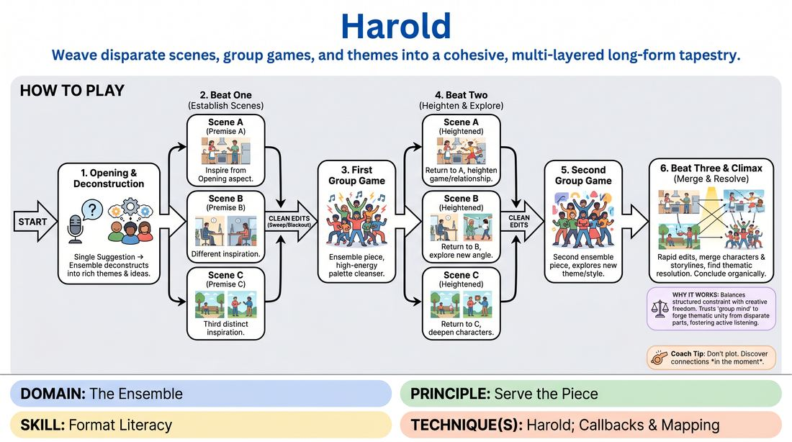

# The Harold

{ .game-hero }

> Weave disparate scenes, group games, and themes into a cohesive, multi-layered long-form tapestry.

## Overview
The Harold is a signature long-form improvisation format where an ensemble uses a single suggestion to build a 25-to-30-minute collage of scenes and group pieces. Players explore themes, establish recurring characters, and weave seemingly unrelated ideas into a unified, satisfying thematic climax. It is a masterclass in group mind, active listening, and structural pacing.

## What It Trains
- **Domain:** D4 — The Ensemble
- **Principle(s):** Serve the Piece; Group Mind; Serve the Story; The Audience Is the Final Scene Partner
- **Skill(s):** Format Literacy; Thematic Synthesis; Pacing & Rhythm; Suggestion Deconstruction (A-to-C); Game Identification; Heightening & Exploration
- **Technique(s):** Harold; Callbacks & Mapping; Weave the threads; Edits (Sweep, Tag-Out, Sound/Light); A-to-C drills
- **Focus:** mixed

**Objective:** Develops advanced format literacy, thematic synthesis, and ensemble cohesion by training players to track multiple narrative threads, identify comedic patterns, and serve the overall piece.

## Setup
An open stage area with at least two chairs on the sides for staging. An ensemble of 6 to 12 players stands in a 'backline' at the rear of the stage, ready to step forward. An audience is present to provide a single-word suggestion.

## How to Play
1. Obtain a single-word suggestion from the audience and have the entire ensemble step forward to perform an 'opening' that deconstructs the suggestion into a rich pool of ideas, themes, and imagery.
2. Initiate Beat One by performing three distinct, unrelated two-person scenes (Scene A, Scene B, and Scene C), each drawing inspiration from a different aspect of the opening.
3. Edit each scene in Beat One using a clean edit, such as a sweep or a blackout, once a clear comedic premise or relationship is established.
4. Execute the First Group Game, where the entire ensemble steps forward to play a high-energy, stylized, or thematic piece that serves as a palette cleanser between narrative beats.
5. Develop Beat Two by returning to the three established scenes in order, heightening the comedic games, exploring the characters in new situations, or introducing time jumps.
6. Execute the Second Group Game, performing another ensemble-driven piece that explores a different thematic angle or continues the style of the first game.
7. Initiate Beat Three, where the three scenes do not need to play sequentially; instead, players rapidly edit, merge characters, resolve storylines, and bring the thematic threads together.
8. Conclude the piece organically when a natural thematic or narrative resolution is reached, signaled by a final group edit or a blackout.

## Facilitation Notes
- Coaching the Opening: Remind players that the opening is not about telling a story, but about generating 'A-to-C' associations. If the suggestion is 'Apple,' avoid just talking about fruit; jump to gravity, teachers, technology, or temptation.
- Pitfall - Narrative Overload: Watch out for players trying to write a complex plot in Beat One. Side-coach them to focus on the relationship and the immediate comedic 'game' of the scene rather than backstory.
- Pacing the Edits: Encourage the backline to be active editors. If a scene has hit its peak or established its premise, someone from the backline must run across the stage to transition to the next scene.
- Weaving vs. Forcing: In Beat Three, warn players against forcing connections that do not make sense. Thematic connection is often more satisfying to an audience than literal plot connection.

## Variations
- The Monologue-Only Opening: The opening consists of a single player telling a true personal story inspired by the suggestion, which the ensemble then deconstructs.
- The Silent Harold: A highly physical variation where the group games and scenes rely heavily on pantomime, environment work, and non-verbal relationships.
- The Invocation: An opening style where the ensemble collectively describes, addresses, and becomes an abstract object or concept inspired by the suggestion.

## Debrief
- How did the themes from our opening manifest differently across the three distinct scene tracks?
- What felt more satisfying: literal narrative connections or thematic/tonal connections? Why?
- How did we support our teammates from the backline through editing, walk-ons, and group games?
- Where did the rhythm of the piece slow down, and how could we have used pacing to re-energize it?

## Safety & Inclusion
Ensure that during high-energy group games and rapid edits, players maintain physical awareness of the stage boundaries and their fellow actors to prevent collisions. Encourage clear verbal or physical cues for edits so players can transition safely.

## Why It Works
The Harold works because it balances structured constraint with absolute creative freedom. By dividing the performance into distinct beats and group games, it forces players to let go of precious storylines and trust the 'group mind.' The repetition and heightening of ideas across different contexts allow the audience to participate in the joy of discovery, recognizing patterns and callbacks that emerge organically.
