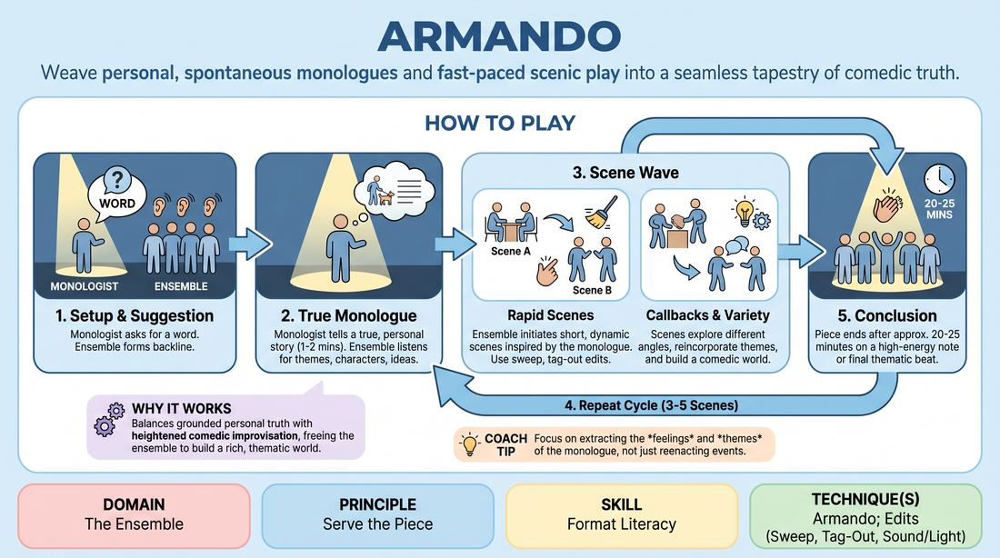

# The Monologist

{ .game-hero }

> Weave personal, spontaneous monologues and fast-paced scenic play into a seamless tapestry of comedic truth.

## Overview
The Monologist is a signature long-form improv format where a storyteller shares true, personal stories based on an audience suggestion, which then inspire a series of rapid-fire, interconnected scenes. The ensemble listens deeply to the monologue, extracting themes, characters, and ideas to build a rich, comedic world. The performance alternates between these personal reflections and dynamic, improvised scenes, creating a cohesive and satisfying show.

## What It Trains
- **Domain:** D4 — The Ensemble
- **Principle(s):** Serve the Piece; Serve the Story; The Audience Is the Final Scene Partner
- **Skill(s):** Format Literacy; Suggestion Deconstruction (A-to-C); Pacing & Rhythm; Game Identification; Audience-Energy Management
- **Technique(s):** Armando; Edits (Sweep, Tag-Out, Sound/Light); What's interesting about this? mining; Breaking the 4th Wall / Direct Address
- **Focus:** mixed

**Objective:** Develops format literacy, active listening, and the ability to deconstruct suggestions using A-to-C association to serve a cohesive, multi-scenic piece.

## Setup
A performance space with a clear stage area, a designated 'backline' for the ensemble, and a spot downstage for the monologist. An audience is present to provide a suggestion. No props are required.

## How to Play
1. Designate one player as the Monologist for the set, while the remaining players form the performing ensemble on the backline.
2. The Monologist steps forward, solicits a single-word suggestion from the audience, and immediately begins a true, personal story inspired by that word.
3. The ensemble stands on the backline, listening intently to the monologue to extract themes, emotional truths, interesting characters, or absurd premises rather than literal plot points.
4. Once the Monologist finishes their first story (usually one to two minutes), they step back, and the ensemble immediately initiates the first scene inspired by the monologue.
5. Players edit scenes dynamically using sweep edits, tag-outs, or cross-fades, keeping the pacing brisk and exploring different comedic angles of the monologue's themes.
6. After a series of three to five scenes, the Monologist steps back downstage to deliver a second monologue, which can be inspired by the previous scenes or another aspect of the original suggestion.
7. The cycle repeats, with the ensemble playing another wave of scenes that may introduce new ideas or call back to characters and themes established in the first wave.
8. The piece concludes after twenty to twenty-five minutes, ideally ending on a high-energy scene or a final button that ties the thematic threads together.

## Facilitation Notes
- Coaching cue: 'Listen for the subtext, not just the plot!' Encourage players to avoid literal reenactments of the monologist's story.
- Pitfall: The ensemble literally acts out the exact story the monologist just told. Fix: Coach players to use 'A-to-C' association—if the monologue is about a bad camping trip, do a scene about extreme survivalists, not the exact trip.
- Coaching cue: 'Vary your scene lengths!' Remind players to mix quick, high-energy run-outs with longer, character-driven scenes to manage audience energy.
- Pitfall: The monologist speaks for too long or invents a fictional story. Fix: Remind the monologist to keep stories grounded, true, and under two minutes to maintain momentum.

## Variations
- Guest Monologist: Invite a non-improviser, such as a local expert or audience member, to be the storyteller, allowing the ensemble to play off fresh, unpredictable perspectives.
- Tag-Team Monologues: Instead of a single designated monologist, different members of the ensemble step forward to tell stories between scene blocks.
- The Deconstruction: A more advanced variation where the first monologue is dissected systematically over three distinct beats, moving from literal interpretation to abstract thematic exploration.

## Debrief
- How did we transition from literal inspiration to thematic, 'A-to-C' association in our scenes?
- What cues did we use to decide when to transition back to the monologist versus continuing the scenic run?
- How did the truth of the monologist's personal stories ground the comedy of our improvised scenes?

## Safety & Inclusion
Since the monologist is sharing true, personal stories, establish a boundary beforehand: players should only share stories they are comfortable having dissected and played with. The ensemble must treat the monologist's vulnerability with respect, satirizing the concepts and themes rather than mocking the storyteller's personal life or trauma.

## Why It Works
This format works because it balances the grounded, relatable truth of personal storytelling with the heightened, imaginative world of comedic improvisation. By using a monologue as the launchpad, the ensemble is freed from the pressure of inventing plot out of thin air, allowing them to focus entirely on thematic exploration, character relationships, and group play.
