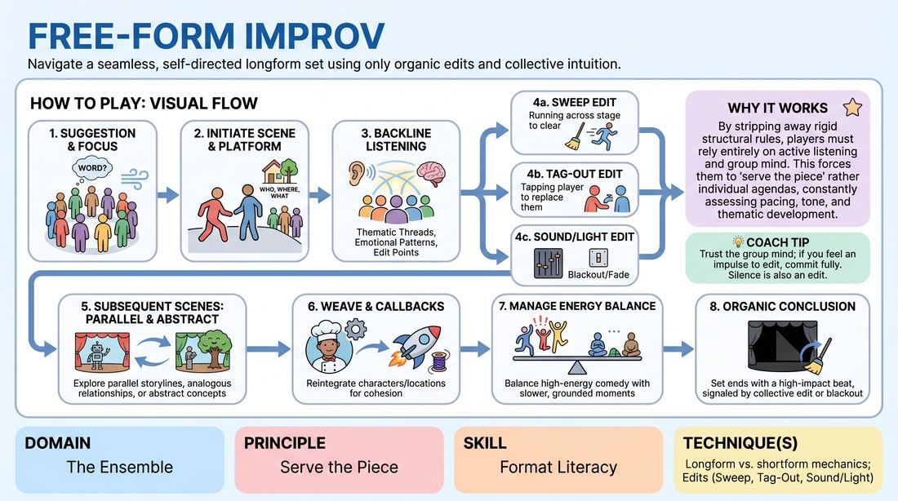

# The Open Canvas

{ .game-hero }

> Navigate a seamless, self-directed longform set using only organic edits and collective intuition.

## Overview
An advanced longform improvisation structure where players perform a continuous, multi-scene set without a predetermined format or host intervention. The ensemble relies entirely on group mind, thematic synthesis, and spontaneous editing techniques to transition between scenes. It is a masterclass in active listening, pacing, and serving the overall piece rather than individual comedic beats.

## What It Trains
- **Domain:** D4 — The Ensemble
- **Principle(s):** Serve the Story; Group Mind; Serve the Piece
- **Skill(s):** Narrative Architecture; Pacing & Rhythm; Thematic Synthesis; Format Literacy
- **Technique(s):** Edits (Sweep, Tag-Out, Sound/Light); Weave the threads; Longform vs. shortform mechanics
- **Focus:** mixed

**Objective:** To develop format literacy and longform mechanics by training players to recognize when to edit, how to transition organically, and how to synthesize themes across disparate scenes without a rigid structural template.

## Setup
A clear stage area with 2-4 chairs placed off to the sides (the wings). The remaining players stand in the backline (upstage) or offstage, ready to enter. No props are needed.

## How to Play
1. The ensemble gathers on stage, obtains a single-word suggestion from the audience, and takes a collective breath to establish focus.
2. One or two players step forward to initiate the first scene, establishing a clear platform (who, where, what) inspired by the suggestion.
3. Players not active in the scene stand in the backline, actively listening for thematic threads, emotional patterns, and potential edit points.
4. Any player in the backline can edit the current scene at any moment using longform mechanics such as a sweep edit (running across the stage to clear it), a tag-out (tapping a player to replace them), or a focus-shift (starting a new scene on the opposite side of the stage).
5. Subsequent scenes do not need to follow a linear narrative; they can explore parallel storylines, analogous relationships, or abstract concepts inspired by the preceding scenes.
6. Players can bring back characters or locations from earlier in the set, weaving them into new contexts to build a cohesive, self-referential piece.
7. The ensemble collectively manages the energy of the set, balancing high-energy comedic scenes with slower, grounded, or dramatic moments.
8. The set concludes organically when a final, high-impact beat or thematic resolution is reached, signaled by a collective sweep edit or a blackout/fade-out initiated by the group's shared intuition.

## Facilitation Notes
- Side-coaching cue: 'Watch the stage, not your feet. Look for the empty spaces and the emotional needs of the current scene.'
- Pitfall: Players edit too quickly out of panic. Fix: Coach the backline to let scenes breathe; challenge them to wait until a scene has reached a clear platform and at least one emotional shift before editing.
- Side-coaching cue: 'Find the connection. How does this new scene comment on or contrast with the last one?'
- Pitfall: The set becomes a series of disconnected shortform games. Fix: Remind players to focus on character relationships and recurring themes rather than quick-joke setups.
- Side-coaching cue: 'Vary the texture. If the last scene was loud and fast, start the next one quiet and slow.'

## Variations
- Monoscene Transition: The entire set must take place in a single location, but players use organic entrances and exits to shift the focus and characters.
- Thematic Anchor: Before starting, the group selects a specific genre or tone (e.g., magical realism, film noir) to maintain throughout the free-form set.
- Silent Edits Only: Players cannot use verbal cues or physical sweeps to edit; transitions must occur purely through physical positioning and lighting-like focus shifts.

## Debrief
- How did we know when a scene was finished without a host or buzzer stopping us?
- What recurring themes or patterns emerged naturally across different scenes?
- How did we balance narrative progression with thematic exploration?
- When did the group mind feel most aligned, and what triggered that alignment?

## Safety & Inclusion
Ensure players are mindful of physical boundaries during high-energy sweep edits or tag-outs. Establish a clear, non-verbal 'pause' signal if physical contact during a tag-out is uncomfortable for any participant. Encourage verbal tags ('Tagging in for Sarah') to accommodate visually impaired players.

## Why It Works
By stripping away rigid structural rules, players must rely entirely on active listening and group mind. This forces them to 'serve the piece' rather than their individual agendas, as they must constantly assess the pacing, tone, and thematic balance of the entire performance in real-time.
