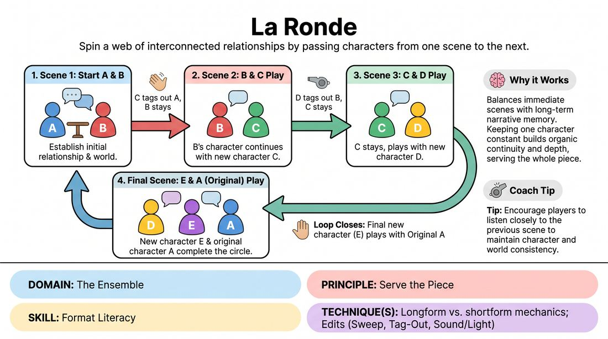

# La Ronde

{ .game-hero }

> Spin a web of interconnected relationships by passing characters from one scene to the next.

## Overview
La Ronde is a classic longform structure where players explore a chain of two-person scenes. Each scene features one character carried over from the previous scene and one brand-new character, eventually looping back to connect the very first and very last characters. It creates a rich, character-driven tapestry of a shared community or world.

## What It Trains
- **Domain:** D4 — The Ensemble
- **Principle(s):** Serve the Piece; Make Your Partner a Genius; Serve the Story
- **Skill(s):** Format Literacy; Pacing & Rhythm; Active Gifting; Narrative Architecture; World-Building
- **Technique(s):** Longform vs. shortform mechanics; Edits (Sweep, Tag-Out, Sound/Light); Endowment-gifting drills; Platform/Tilt; C.R.O.W. (Character, Relationship, Objective, Where)
- **Focus:** narrative

**Objective:** Develops longform format literacy, pacing, and narrative architecture by tracking character history, gifting details to partners, and serving the overall structural arc of the piece.

## Setup
Players stand in a backline or sit in a semi-circle facing the stage area. No props are needed, though two chairs can be available if players wish to use them.

## How to Play
1. Establish a clear player order or allow organic entrances, ensuring that five to eight characters will eventually populate the loop.
2. Player A and Player B step forward to initiate Scene 1, establishing their relationship, environment, and distinct character traits.
3. After a few minutes of exploration, Player C initiates a transition by stepping forward and tagging out Player A.
4. Player B must remain on stage as the same character, while Player C enters as a completely new character to start Scene 2.
5. Player B and Player C play their scene, revealing a different side of Player B's character through this new relationship.
6. Next, Player D steps up and tags out Player B. Player C remains as the same character, and Player D enters as a new character for Scene 3.
7. This pattern continues (C plays with D, D plays with E, etc.) until the final new player has entered and played their scene.
8. To close the loop, the final scene features the newest character and Player A (the very first character who left after Scene 1), completing the circle.

## Facilitation Notes
- Coaching cue: 'Show us a different side!' Remind the remaining player to alter their status or emotional temperature based on who they are talking to.
- Pitfall: Players forgetting who they are or changing their character's core identity between scenes. Fix: Encourage active listening and physical anchoring (remembering your posture/voice).
- Coaching cue: 'Keep the edits clean.' The incoming player should clearly tap out the departing player and immediately initiate the new context.
- Pitfall: Rushing the narrative or trying to solve a plot. Fix: Remind players that this is a character study and relationship exploration, not a plot-driven quest.

## Variations
- Thematic Anchor: Give the entire loop a single location (e.g., a hotel lobby, a local diner) where all these interactions naturally occur.
- Monologue Intro: Start the form with a single monologue from an audience suggestion, from which all players draw inspiration for their characters.
- Speed Run: Play a high-energy, rapid-fire version where scenes last only 45 seconds to practice quick relationship establishment.

## Debrief
- How did your character change when interacting with a friend versus a stranger or rival?
- What did you notice about the pacing of the transitions? Did they feel organic or forced?
- How did we build a cohesive world without a single central plot?

## Safety & Inclusion
Ensure players respect physical boundaries during the tag-out transition. A clear verbal cue or a gentle tap on the shoulder is sufficient; players should establish consent for physical contact beforehand or use a non-contact sweep edit if preferred.

## Why It Works
It forces players to balance immediate scene work with long-term narrative memory. By keeping one character constant across a transition, it naturally builds continuity and depth, teaching players how to serve the piece rather than just their individual comedic impulses.
