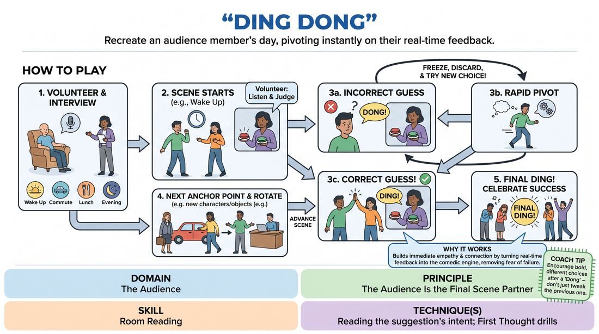

# Ding Dong

{ .game-hero }

> Recreate an audience member's day, pivoting instantly on their real-time feedback.

## Overview
A high-energy performance game where players attempt to reenact a real day in the life of an audience volunteer. The twist is that the volunteer holds the remote control: they call out 'Dong' for every incorrect detail the players improvise, forcing the cast to rapidly cycle through alternative choices until they earn a satisfying 'Ding' to move forward.

## What It Trains
- **Domain:** D5 — The Audience
- **Principle(s):** The Audience Is the Final Scene Partner; Fail Joyfully; Make Your Partner a Genius
- **Skill(s):** Room Reading; Unfiltered Spontaneity; Self-Recovery; Offer Reception; World-Building
- **Technique(s):** Reading the suggestion's intent; First Thought drills; Reframe-the-flub reps; C.R.O.W. (Character, Relationship, Objective, Where)
- **Focus:** comedy_game

**Objective:** To develop active room reading, rapid self-recovery, and deep sensitivity to an audience member's intent by treating their real-time feedback as the ultimate guide for scene progression.

## Setup
A performance space with three to six players on stage. One chair is placed downstage or in the front row for an audience volunteer. No props are needed, but clear physical space is required for active object work and staging.

## How to Play
1. Invite a volunteer from the audience to sit in a prominent, comfortable seat near the stage.
2. Conduct a brief, warm interview with the volunteer, asking for three to four key anchor points of their typical day, such as how they wake up, their commute, a specific task at work, or their evening routine.
3. Instruct the volunteer on their role: whenever the players on stage guess a detail of their day incorrectly, the volunteer must loudly call out 'Dong!'; when the players guess correctly or pivot to the right detail, the volunteer calls out 'Ding!'.
4. Begin the scene with the first anchor point, with players physically initiating the action.
5. When players make an assumption and receive a 'Dong!', they must immediately freeze, discard that choice, and try a completely different choice.
6. Continue this trial-and-error process rapidly, using physical comedy and verbal offers, until the volunteer yells 'Ding!', signaling the players to advance the narrative.
7. Rotate players in and out of the scene to play supporting characters, objects, or environmental elements as the day progresses through the established anchor points.
8. Conclude the scene once the final anchor point of the day is successfully navigated and celebrated with a final 'Ding!'.

## Facilitation Notes
- Coaching Cue: Encourage players to fail joyfully. A 'Dong' is not a mistake; it is a playful gift that redirects the comedy.
- Pitfall: Players getting stuck in a loop of minor variations. Fix: Side-coach them to make wildly different, bold choices rather than tiny incremental adjustments.
- Coaching Cue: Keep your eyes on the volunteer. Read their body language and facial expressions to anticipate their intent before they even say 'Ding' or 'Dong'.
- Pitfall: The volunteer being too polite or hesitant to say 'Dong'. Fix: Warm up the volunteer and the audience beforehand, encouraging them to be strict but playful judges.

## Variations
- Emotional Ding Dong: Instead of physical actions or facts, the volunteer 'Dongs' the emotional reactions of the characters until they hit the exact mood the volunteer felt during that moment.
- Sound Effects Only: The players must perform the entire day silently using only physical object work, while a designated player offstage provides sound effects that get 'Dinged' or 'Donged'.
- The Expert Interview: Instead of a day in the life, the volunteer is an expert in an obscure, made-up field, and the players must explain their job, getting 'Dinged' or 'Donged' on the technical details.

## Debrief
- How did it feel to have your choices instantly rejected, and how did you maintain your energy and joy through those rejections?
- What non-verbal cues did you pick up from the volunteer that helped you guess the correct details?
- How does treating the audience as an active scene partner change the way you build a stage world?

## Safety & Inclusion
Ensure the volunteer feels safe and respected. Never mock their actual routine or make fun of their personal life. If a player makes an offer that feels invasive or uncomfortable, the volunteer has full agency to 'Dong' it immediately, and players must respect that boundary without questioning it.

## Why It Works
This game strips away the fear of blocking by turning rejection into the primary comedic engine. By forcing players to listen to real-time feedback, it builds an immediate, empathetic connection between the stage and the house, training improvisers to read the room and adapt their choices instantly to the audience's energy and intent.
