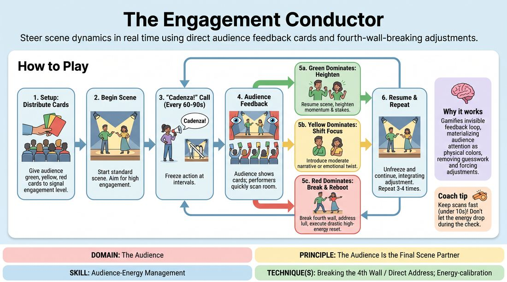

# The Engagement Conductor

{ .game-hero }

> Steer scene dynamics in real time using direct audience feedback cards and fourth-wall-breaking adjustments.

## Overview
An interactive training game where performers navigate a scene while receiving live, color-coded feedback from the audience. At designated intervals, the action pauses for a rapid room-reading assessment, forcing players to immediately adjust their energy, stakes, or narrative focus. If the audience signals disengagement, performers must break the fourth wall to directly address the room and rebuild the connection.

## What It Trains
- **Domain:** D5 — The Audience
- **Principle(s):** The Audience Is the Final Scene Partner
- **Skill(s):** Room Reading; Audience-Energy Management; Stage Presence & Clarity
- **Technique(s):** Energy-calibration; Landing/cushioning a beat; Breaking the 4th Wall / Direct Address
- **Focus:** mixed

**Objective:** To develop real-time audience-energy management and room-reading skills, specifically training performers to confidently break the fourth wall and use direct address as a deliberate tool to recalibrate a scene's connection with the crowd.

## Setup
An performance space with 2-3 players on stage and an audience of 5 or more seated facing them. Each audience member is equipped with three colored cards: Green (highly engaged), Yellow (neutral/holding), and Red (disengaged/needs a shift). The facilitator stands to the side to moderate.

## How to Play
1. Distribute a set of green, yellow, and red cards to every audience member, explaining that these represent their real-time engagement levels rather than a judgment of quality.
2. Instruct the audience to keep their cards down initially and only raise them when a Cadenza check-in is called.
3. Begin a standard scene with two or three performers on stage based on a simple suggestion, with the primary goal of maintaining high audience engagement.
4. At unpredictable intervals (every 60 to 90 seconds), the facilitator or an off-key performer calls out Cadenza! to freeze the action.
5. Upon the call, all audience members immediately and silently hold up the card that matches their current level of engagement.
6. The performers must spend no more than ten seconds scanning the room to read the dominant color distribution.
7. If Green dominates, performers must resume the scene by heightening the current momentum; if Yellow dominates, they must introduce a moderate narrative or emotional shift.
8. If Red dominates, performers must immediately break the fourth wall, directly address the audience to acknowledge the lull, and execute a drastic, high-energy reset upon returning to the scene.
9. Performers instantly unfreeze and continue the scene, seamlessly integrating their chosen energy adjustment into the performance.
10. Repeat this cycle of play, check-in, and adjustment three to four times over a six-to-eight minute scene before concluding.

## Facilitation Notes
- Ensure the audience understands that Red is not a punishment, but a gift of data; encourage them to be honest rather than polite with their card choices.
- Keep the Cadenza pauses incredibly brief (under 15 seconds) to prevent the performers from overthinking or planning complex narrative arcs.
- If performers hesitate during a Red card breakout, side-coach them with: Look them in the eye and tell them what just went wrong!
- Watch out for performers who ignore the feedback and return to the exact same energy level; pause the scene and remind them that the audience is their final scene partner.
- Encourage physical and vocal variety when transitioning out of a Yellow or Red check-in to make the shift undeniable to the audience.

## Variations
- Blind Cadenza: Performers close their eyes during the scene, and the facilitator calls out the dominant color, forcing performers to adjust based purely on auditory cues and the facilitator's report.
- Audience-Initiated: Instead of waiting for a call, audience members can raise their cards at any time, and performers must adjust on the fly without freezing the scene.

## Debrief
- How did it feel to have your internal scene goals overridden by the immediate, visible needs of the audience?
- For the performers, what was the psychological difference between breaking the fourth wall on a Red card versus adjusting subtly on a Yellow?
- For the audience, how did it feel when the performers acknowledged your disengagement and actively changed course to win you back?
- How can we apply this level of room-reading when we do not have physical colored cards to guide us?

## Safety & Inclusion
Ensure audience members know they are not required to participate if holding cards causes physical discomfort, and they can verbally call out colors or pair up with a neighbor if needed. Keep the direct address playful and collaborative, ensuring performers do not target or shame individual audience members who hold up Red cards.

## Why It Works
This game works because it gamifies the invisible feedback loop between the stage and the house. By materializing audience attention as physical colors, it strips away the guesswork of room reading. Forcing a fourth-wall break on low engagement teaches performers that the audience is an active partner to be engaged directly, rather than an obstacle to ignore behind an imaginary wall.
