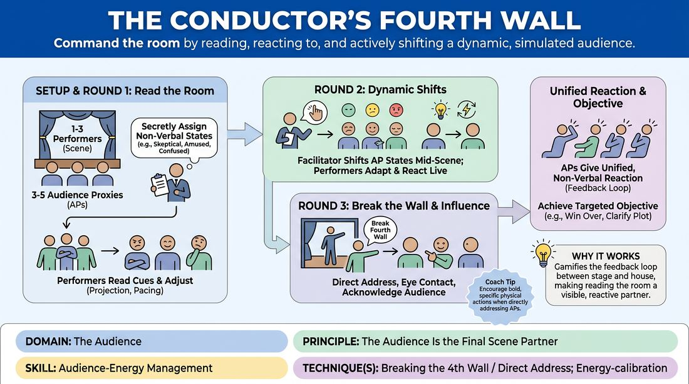

# The Responsive House

{ .game-hero }

> Command the room by reading, reacting to, and actively shifting a dynamic, simulated audience.

## Overview
A training drill where a small group of players acts as a live, reactive audience with secret, shifting emotional states. On-stage performers must read these non-verbal cues in real-time, adjusting their projection, pacing, and stage presence to actively influence the room. By intentionally breaking the fourth wall, players learn to treat the audience as an active scene partner rather than a passive observer.

## What It Trains
- **Domain:** D5 — The Audience
- **Principle(s):** The Audience Is the Final Scene Partner; Play for the Back Row
- **Skill(s):** Room Reading; Audience-Energy Management; Stage Presence & Clarity
- **Technique(s):** Energy-calibration; Tag-running (riding a laugh wave); Landing/cushioning a beat; Breaking the 4th Wall / Direct Address; Cheating out; Projection; Make the choice readable
- **Focus:** skill_drill

**Objective:** To develop audience-energy management and room-reading skills, specifically training performers to recognize audience disconnect and use direct address or physical adjustments to re-engage the room.

## Setup
Set up a clear stage area facing a small semi-circle of chairs for 3 to 5 players who will act as the Audience Proxies. The remaining players stand on stage or observe. No props are required, but the space should allow for clear sightlines between the stage and the proxy seats.

## How to Play
1. Assign 1 to 3 players to step onto the stage to begin an open, relationship-driven scene based on a simple suggestion.
2. Designate 3 to 5 players to sit in the front row as Audience Proxies (APs), representing different segments of a live audience.
3. The facilitator secretly assigns a specific non-verbal Audience State to each AP (such as Highly Skeptical, Easily Amused, Confused, or Distracted).
4. Begin Round 1: The performers play their scene normally while the APs physically embody their assigned states using posture, facial expressions, and subtle, non-verbal sounds like sighs or quiet gasps.
5. Transition to Round 2: The facilitator uses silent hand signals to dynamically shift individual AP states mid-scene, forcing the performers to actively read the room and adjust their performance energy.
6. Introduce Fourth-Wall Negotiation: Performers are encouraged to directly address the APs, make eye contact, or step out of the scene's narrative to acknowledge the audience's energy and attempt to align them.
7. When directly addressed, the APs must collectively offer a unified, non-verbal physical reaction (such as a synchronized nod or a collective lean-back) that reflects their current average sentiment.
8. Progress to Round 3: The facilitator gives the performers a targeted objective, such as winning over the skeptical viewer or clarifying the plot for the confused viewer using direct address or physical adjustments.

## Facilitation Notes
- Coaching Cue: Play to the back row! Remind performers to expand their physical choices and cheat out so even the most distracted proxy can read their choices.
- Pitfall: Audience Proxies becoming too cartoonish or loud, which disrupts the scene's natural flow. Fix: Instruct APs to keep their reactions subtle, realistic, and strictly non-verbal unless directly addressed.
- Coaching Cue: Acknowledge the disconnect! Encourage performers to use direct address immediately when they spot a proxy looking confused or bored, rather than ignoring it.
- Pitfall: Performers getting trapped in their heads trying to analyze the proxies, causing the scene's narrative to stall. Fix: Remind them that the audience is their scene partner; treat the audience's energy as a prompt to inspire the next line.

## Variations
- The Whisper Network: Instead of secret assignments, the APs can vocalize very quiet, one-word subtexts (such as What? or Wow!) to give the performers auditory feedback.
- The Spotlight Shift: Only one performer is allowed to break the fourth wall and address the audience, acting as a narrator or Greek chorus, while the other players freeze in place.

## Debrief
- Performers: How did it feel to actively monitor the audience's physical posture while trying to maintain your scene's narrative?
- Proxies: Did you feel genuinely seen or ignored when the performers adjusted their projection or made direct eye contact with you?
- All: What specific physical or vocal adjustments were most effective at shifting a proxy from a negative state to an engaged one?

## Safety & Inclusion
Ensure all participants understand that Audience States should remain respectful and non-disruptive. If a player feels uncomfortable with direct eye contact or close-proximity address, they can opt to play a proxy state that doesn't require direct gaze, or sit in the back row.

## Why It Works
This game works because it gamifies the feedback loop between the stage and the house. By turning the audience into a visible, reactive partner with clear physical states, it strips away the abstraction of reading a room and teaches performers that the fourth wall is a flexible tool they can manipulate to manage energy and clarity.
