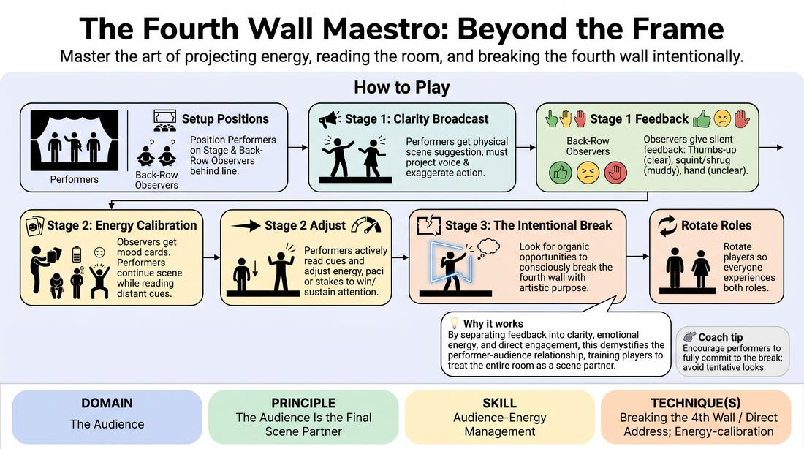

# The Fourth Wall Conductor

{ .game-hero }

> Master the art of projecting energy, reading the room, and breaking the fourth wall intentionally.

## Overview
This progressive training exercise bridges the gap between the stage and the furthest seats in the house. By utilizing dedicated players as distant observers who provide real-time, non-verbal feedback, performers learn to scale their physical and vocal choices, read shifting audience dynamics, and break the fourth wall with deliberate artistic purpose.

## What It Trains
- **Domain:** D5 — The Audience
- **Principle(s):** The Audience Is the Final Scene Partner; Play for the Back Row
- **Skill(s):** Room Reading; Audience-Energy Management; Stage Presence & Clarity; Physicality & Space Work; Vocal Craft
- **Technique(s):** Energy-calibration; Landing/cushioning a beat; Breaking the 4th Wall / Direct Address; Cheating out; Projection; Make the choice readable
- **Focus:** skill_drill

**Objective:** To develop the ability to treat the audience as an active scene partner by mastering physical projection, reading subtle room energy, and executing purposeful direct address to manage audience engagement.

## Setup
Mark a clear 'Back Row Line' at the far end of a large, open room using tape or a row of chairs. Prepare a few index cards with distinct 'Audience Mood Objectives' (e.g., 'Skeptical and Unimpressed', 'Easily Distracted', 'Highly Enthusiastic', 'Confused but Curious'). Divide the group: 2 to 3 players start on stage, 2 to 3 players act as 'Back-Row Observers' behind the line, and the remaining players observe or wait to rotate in.

## How to Play
1. Position the performing players on the stage area and the Back-Row Observers behind the designated line at the far end of the room.
2. Begin Stage 1 (The Clarity Broadcast): Give the performers a highly physical scene suggestion. As they play, they must project their voices and exaggerate their physical choices so they are perfectly readable from the back row without losing realistic motivation.
3. Instruct the Back-Row Observers to give silent, real-time feedback during Stage 1: a thumbs-up for clear moments, a squint or shrug for muddy actions, and a hand cupped behind the ear if they cannot hear.
4. Transition to Stage 2 (The Energy Calibration): Secretly hand each Back-Row Observer a mood card. The performers must continue their scene while the observers silently embody their assigned moods (e.g., checking watches for boredom, leaning forward for curiosity).
5. Direct the performers to actively read these distant physical cues and adjust their performance energy, pacing, or stakes in real-time to win back or sustain the observers' engagement.
6. Progress to Stage 3 (The Intentional Break): Instruct the performers to continue the scene but now look for organic opportunities to consciously break the fourth wall. They can use direct address, shared glances, or spoken asides directed specifically at the back row to clarify a plot point or share an internal thought.
7. Rotate players so everyone experiences being both a performer on stage and an observer at the back-row line.

## Facilitation Notes
- Side-coaching cue: 'Play to the back wall, not just each other!' Remind performers to cheat out their bodies and project their voices without screaming.
- Pitfall: Performers might break the fourth wall constantly or self-indulgently. Fix: Coach them to make breaks brief, purposeful, and designed to serve the audience's understanding rather than just getting an easy laugh.
- Ensure Back-Row Observers remain strictly non-verbal; vocalizing their feedback ruins the challenge of reading physical distance.
- Encourage performers to actively change their tactics in Stage 2 if they notice an observer looking bored or confused, rather than just pushing harder with the same energy.

## Variations
- The Whisper Challenge: Run Stage 1 where performers must keep their characters' volume at a whisper, forcing them to rely entirely on extreme physical clarity and body language to convey the narrative to the back row.
- The Tag-Team Address: In Stage 3, when a performer breaks the fourth wall to deliver an aside, their scene partner must freeze in place, resuming only when the speaker returns to the scene's reality.

## Debrief
- How did it feel to scale your physical and vocal choices specifically for the furthest person in the room?
- What subtle physical cues did you notice from the observers, and how did those cues change your choices on stage?
- When you broke the fourth wall, did it feel like you were inviting the audience in, or did it pull you out of the scene's reality? How do we balance both?

## Safety & Inclusion
Ensure the path between the stage and the back row is clear of obstacles. If any participant has hearing or visual impairments, adjust the distance of the Back Row Line or use larger, more explicit non-verbal signals to ensure the feedback loop remains accessible and effective.

## Why It Works
By separating the audience's feedback into physical clarity, emotional energy, and direct engagement, this game demystifies the performer-audience relationship. It forces players to look beyond their immediate scene partner and treat the entire room as an active participant, turning the abstract concept of 'playing to the back row' into a concrete, physical habit.
