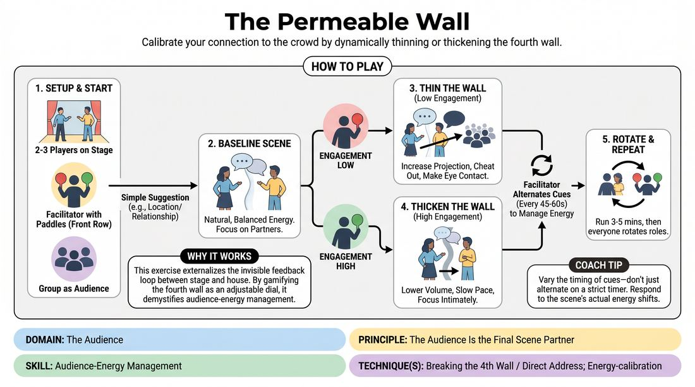

# The Permeable Wall

{ .game-hero }

> Calibrate your connection to the crowd by dynamically thinning or thickening the fourth wall.

## Overview
This exercise trains performers to treat the fourth wall as a flexible membrane rather than a solid barrier. Players perform a scene while a facilitator uses visual cues to represent shifting audience engagement, prompting the actors to dynamically adjust their physical projection, intimacy, and directness. The result is a highly responsive performance style that actively manages the energy of the room.

## What It Trains
- **Domain:** D5 — The Audience
- **Principle(s):** The Audience Is the Final Scene Partner; Play for the Back Row
- **Skill(s):** Room Reading; Audience-Energy Management; Stage Presence & Clarity; Physicality & Space Work; Vocal Craft
- **Technique(s):** Energy-calibration; Tag-running (riding a laugh wave); Landing/cushioning a beat; Breaking the 4th Wall / Direct Address; Cheating out; Projection; Make the choice readable
- **Focus:** skill_drill

**Objective:** To develop the ability to read audience energy and actively manage it using fourth-wall manipulation, vocal projection, and physical staging adjustments.

## Setup
Set up a clear stage area with a designated audience seating area. Prepare two large, double-sided cards or paddles: one labeled 'ENGAGEMENT LOW' and the other labeled 'ENGAGEMENT HIGH'. Two to three players stand on stage to perform, while one facilitator sits in the front row of the audience holding the paddles. The remaining players sit in the audience to observe.

## How to Play
1. Assign roles: select two or three players to start on stage, one facilitator to sit in the front row with the paddles, and the rest of the group to act as the active audience.
2. Obtain a simple suggestion from the audience, such as a location or a relationship, to initiate a standard character-driven scene.
3. Begin the scene with players performing at a natural, balanced baseline level of energy, focusing primarily on their partner and the platform.
4. When the facilitator raises the 'ENGAGEMENT LOW' paddle, the performers must immediately 'thin' the fourth wall by increasing vocal projection, cheating their bodies out toward the audience, raising the emotional stakes, and using pseudo-direct address.
5. When the facilitator raises the 'ENGAGEMENT HIGH' paddle, the performers must 'thicken' the fourth wall by lowering their volume, slowing the pace, focusing eye contact entirely on their scene partner, and creating an intimate, private space.
6. The facilitator should alternate between the paddles every 45 to 60 seconds, or whenever they notice the stage energy stagnating or becoming too chaotic, forcing the performers to transition smoothly between states.
7. Run the scene for 3 to 5 minutes, then rotate players so everyone has a turn on stage and as the feedback facilitator.

## Facilitation Notes
- Coaching cue: Use 'Thin the wall!' to prompt players to share their internal thoughts outward, and 'Thicken the wall!' to pull them back into an intimate, partner-focused bubble.
- Pitfall: Performers completely breaking character or talking directly to the audience like a stand-up comic when the wall is thinned. Fix: Remind them that 'pseudo-direct address' means sharing their character's internal thoughts with the room, not breaking the reality of the scene.
- Pitfall: Performers becoming too quiet or physically closed off when thickening the wall, making them impossible to hear or see. Fix: Coach them to 'play for the back row' even in quiet moments by keeping their articulation high and body angles slightly open.
- Coaching cue: 'Cushion the beat.' Encourage players to let silence land and give the audience time to process high-energy moments when the 'ENGAGEMENT HIGH' paddle is raised.

## Variations
- The Audience Dial: Instead of binary paddles, the facilitator uses a hand gesture like a volume dial to signal a spectrum of engagement from 1 to 10, requiring more granular adjustments.
- Silent Audience Cues: The facilitator does not use paddles; instead, the actual audience is instructed to actively show their engagement by leaning forward or slumping, forcing the performers to read the room directly.
- The Soliloquy Bridge: When the wall is thinned, players can step forward for a brief, Shakespearean-style aside directly to the audience, then step back into the scene's reality when the wall thickens.

## Debrief
- How did it feel to consciously adjust your physical and vocal presence based on the facilitator's cues?
- What specific techniques felt most effective for drawing a disengaged audience back in?
- How does 'thickening the wall' actually help an audience that is feeling overwhelmed or overstimulated?
- How can we apply this dynamic calibration in a regular improv set without explicit paddles?

## Safety & Inclusion
Ensure that when players 'thin the wall' and make eye contact or use pseudo-direct address, they respect personal boundaries. They should not physically enter the audience's personal space or single out individual audience members in an aggressive or uncomfortable manner.

## Why It Works
This exercise externalizes the invisible feedback loop between the stage and the house. By gamifying the fourth wall as a dial that can be adjusted, it demystifies audience-energy management. It teaches competent improvisers that they possess concrete physical and vocal tools to actively shape, guide, and rescue the audience's attention.
