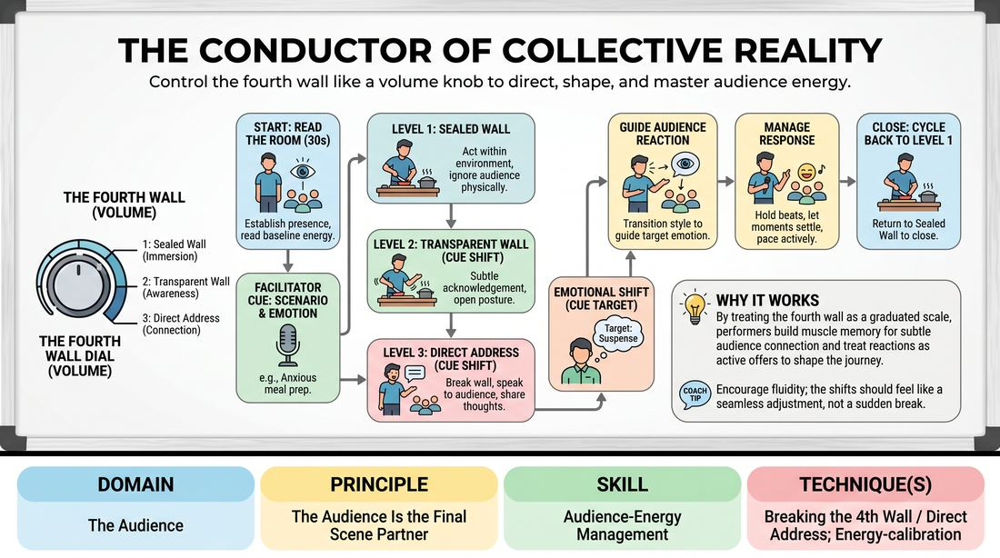

# The Permeability Dial

{ .game-hero }

> Control the fourth wall like a volume knob to direct, shape, and master audience energy.

## Overview
This solo performance drill trains improvisers to treat the fourth wall as an adjustable dial rather than a solid barrier. By shifting fluidly between deep scene immersion, subtle audience awareness, and direct address, the player learns to read the room's energy and actively guide the audience's emotional journey in real time.

## What It Trains
- **Domain:** D5 — The Audience
- **Principle(s):** The Audience Is the Final Scene Partner; Play for the Back Row
- **Skill(s):** Room Reading; Audience-Energy Management; Stage Presence & Clarity; Physicality & Space Work; Vocal Craft
- **Technique(s):** Energy-calibration; Reading the suggestion's intent; Tag-running (riding a laugh wave); Landing/cushioning a beat; Breaking the 4th Wall / Direct Address; Cheating out; Projection; Make the choice readable
- **Focus:** skill_drill

**Objective:** To develop precise control over fourth-wall permeability, enabling performers to read audience cues, manage room energy, and treat the audience as an active, live scene partner.

## Setup
A clear stage area facing an audience. The facilitator sits in the audience with a bell or buzzer. Prepare a list of simple emotional prompts and target emotional shifts.

## How to Play
1. The solo player takes the stage in silence, spending 30 seconds establishing presence and making eye contact to read the baseline energy of the room.
2. The facilitator calls out a starting scenario and an initial emotion, such as preparing a meal while feeling anxious.
3. The player begins in a Sealed Wall state (Level 1), acting entirely within their imaginary environment, ignoring the audience physically while maintaining vocal projection.
4. On the facilitator's cue, the player shifts to a Transparent Wall state (Level 2), continuing the scene but subtly acknowledging the audience through open body language and shared glances.
5. On the next cue, the player opens the dial to Direct Address (Level 3), breaking the fourth wall completely to speak directly to the audience, sharing internal thoughts or asking rhetorical questions.
6. To execute an emotional shift, the facilitator calls out a target audience emotion, such as shifting them to suspense.
7. The player transitions their performance style using physical pacing, vocal modulation, and direct eye contact to guide the audience's reaction to that target emotion.
8. The player actively manages the audience's response, holding beats to let laughter peak before continuing, or slowing down to let heavy moments settle.
9. The player cycles back down the dial to Level 1 to bring the scene to a controlled, clean close.

## Facilitation Notes
- When shifting emotions, instruct players to use physical pacing (slowing down for suspense, speeding up for excitement) and vocal modulation to infect the audience with that feeling rather than just stating it.
- Coaching cue: Ride the laugh wave. Do not speak over the peak of their reaction; wait for it to start descending, then catch it with your next line.
- Ensure players do not treat the dial as a binary switch. Emphasize Level 2 (Transparent) where the character is aware of the audience but remains grounded in their world.
- Coaching cue: Play to the back row. Your physical gestures and vocal projection must reach the furthest person in the room to keep them engaged.

## Variations
- Virtual Adaptation: Play on a video call. Level 1 has the player looking off-camera. Level 2 has them glancing at the camera lens occasionally. Level 3 has them speaking directly into the lens, using gallery view to read facial expressions and chat reactions.
- The Audience Thermostat: An audience member uses a silent hand gesture (high for high energy, low for low) to signal their engagement; the player must adjust their performance to keep the hand high.
- The Rapid Fire Dial: The facilitator calls out numbers 1 to 3 rapidly, forcing the player to instantly adjust their permeability level mid-sentence.

## Debrief
- How did shifting between the three levels of the dial change your physical and vocal choices?
- What specific techniques did you use to transition the audience from one emotional state to another?
- How does treating the audience as an active scene partner change your relationship to silence or laughter?

## Safety & Inclusion
Ensure direct address is inviting and non-confrontational. Players should avoid singling out individual audience members for intense interrogation or physical contact. Establish a pass signal if an audience member prefers not to be directly addressed. For virtual play, respect those with cameras off by focusing direct address on the collective screen rather than specific individuals.

## Why It Works
By breaking down the fourth wall into a graduated scale rather than a binary choice, performers build muscle memory for subtle audience connection. It teaches them to treat audience reactions not as interruptions, but as active offers that dictate the pacing, volume, and emotional temperature of the performance.
