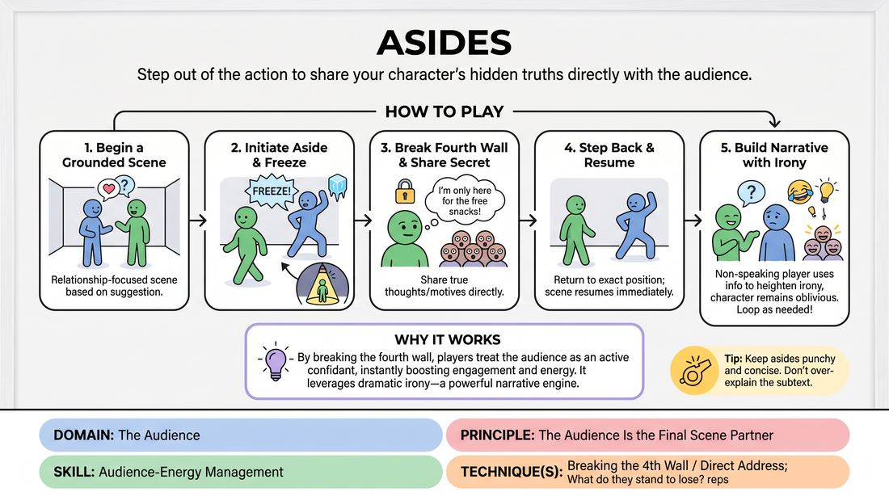

# Inner Monologue Asides

{ .game-hero }

> Step out of the action to share your character's hidden truths directly with the audience.

## Overview
In this scene-based game, players can freeze the action at any moment to step forward and deliver a direct-address monologue to the audience. These secret thoughts reveal hidden motives, subtext, or hilarious distractions. While the other characters remain oblivious in-universe, the improvisers use this shared information to heighten the dramatic irony and drive the narrative.

## What It Trains
- **Domain:** D5 — The Audience
- **Principle(s):** The Audience Is the Final Scene Partner; Serve the Story; Make Your Partner a Genius
- **Skill(s):** Audience-Energy Management; Stakes / The 'Want'; Offer Reception; Active Gifting
- **Technique(s):** Breaking the 4th Wall / Direct Address; What do they stand to lose? reps; Endowment-acceptance; Endowment-gifting drills
- **Focus:** mixed

**Objective:** To master breaking the fourth wall, manage audience energy through direct address, and use dramatic irony as a powerful narrative engine.

## Setup
A simple performance space. The players not currently in the scene sit close by, acting as the active audience. No props or set pieces are required.

## How to Play
1. Two players step into the performance space to begin a grounded, relationship-focused scene based on a simple suggestion.
2. At any point during the scene, any player can call 'Freeze!' or simply step forward toward the audience to initiate an aside.
3. When a player steps forward, the other player must freeze instantly in their current physical posture, becoming completely unaware of their partner's actions.
4. The active player breaks the fourth wall, makes direct eye contact with the audience, and shares their character's true, unspoken thoughts or secret motives.
5. After delivering the aside, the player steps back into their exact physical position in the scene, and the action resumes immediately.
6. The non-speaking character must remain completely oblivious to the secret in-universe, but the improviser playing them must use this new information to make choices that heighten the comedic tension.
7. Players continue alternating between realistic scene work and theatrical direct address, building the narrative until a natural conclusion is reached.

## Facilitation Notes
- Coaching cue: 'Speak directly to us!' Encourage players to make genuine eye contact with the audience during their asides to build intimacy and manage the room's energy.
- Pitfall: Players using the aside to comment on the quality of the scene (meta-commentary) rather than their character's internal state. Fix: Remind them that asides must reveal character subtext, not player opinions.
- Coaching cue: 'Play the dramatic irony!' Encourage the partner to lean into the secret without letting their character explicitly 'know' it, making their partner look like a genius.
- Pitfall: Overusing asides so frequently that the baseline reality of the scene never gets established. Fix: Coach players to let the scene breathe for at least two or three lines of dialogue between asides.

## Variations
- Off-Stage Consciences: Off-stage players call freeze and step up to deliver the aside for an active player, acting as their inner voice or alter ego.
- The Contrast Challenge: Force the aside to be the exact opposite of what the character is saying out loud, highlighting extreme subtext.
- Audience Choice: The watching players/audience can shout 'Aside!' to force a specific character to reveal their inner thoughts at a high-stakes moment.

## Debrief
- How did knowing your partner's secret thoughts change how you played your own character, even though your character couldn't hear them?
- What was the effect of making direct eye contact with the audience during your asides? How did that shift the energy in the room?
- How does revealing subtext early help drive the narrative forward rather than keeping secrets hidden?

## Safety & Inclusion
Ensure that secrets shared during asides remain within the established boundaries of the group's safety agreements. Since characters are sharing 'dark' or 'hidden' thoughts, remind players to keep the content playful and collaborative rather than genuinely distressing.

## Why It Works
By breaking the fourth wall, players treat the audience as an active confidant, instantly boosting engagement and energy. It leverages dramatic irony—a powerful narrative engine—allowing the audience and the players to share a secret that the characters do not, which naturally builds comedic tension and satisfying payoffs.
