# 🎲 Emotional Fluidity — games

Games whose primary skill is **Emotional Fluidity** (`D1.S2`), grouped by technique. Full faceted search on the [Games List](../index.md).

## Core / general

### Degrees of Connection

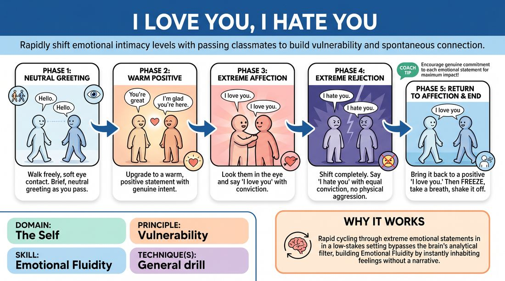{ .cat-game-img loading=lazy }

[Open full game card »](../D1_P3_S2_T0_G733__i-love-you-i-hate-you.md){target=_blank rel=noopener}

### The Emotional Compass

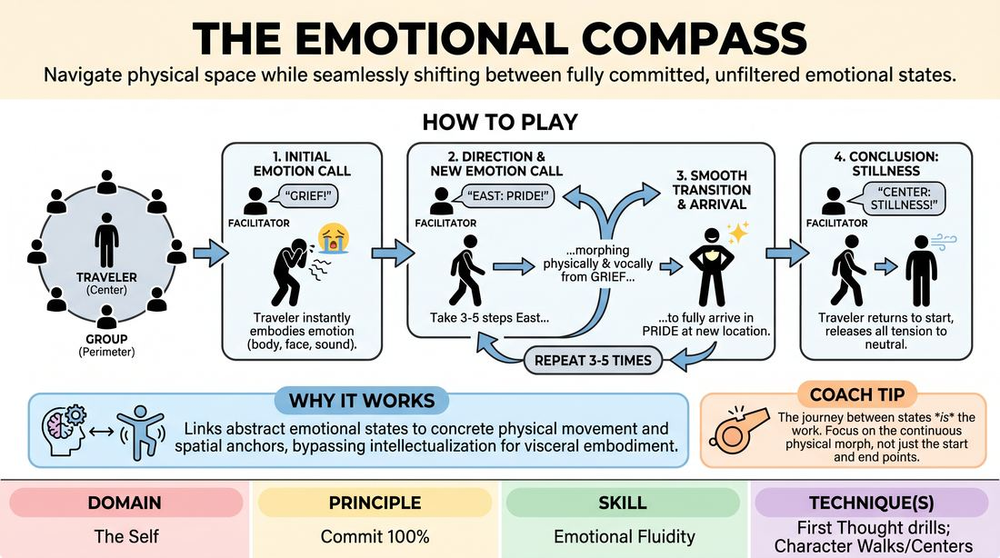{ .cat-game-img loading=lazy }

[Open full game card »](../D1_P1_S2_T0_G261__the-emotional-compass.md){target=_blank rel=noopener}

## The Emotional Dial (1→10)

### Continuing Emotions

{ .cat-game-img loading=lazy }

[Open full game card »](../D1_P1_S2_T1_G1000__continuing-emotions.md){target=_blank rel=noopener}

### Director's Cut

{ .cat-game-img loading=lazy }

[Open full game card »](../D1_P1_S2_T1_G1021__director-s-cut.md){target=_blank rel=noopener}

### Emotional Dial Jump

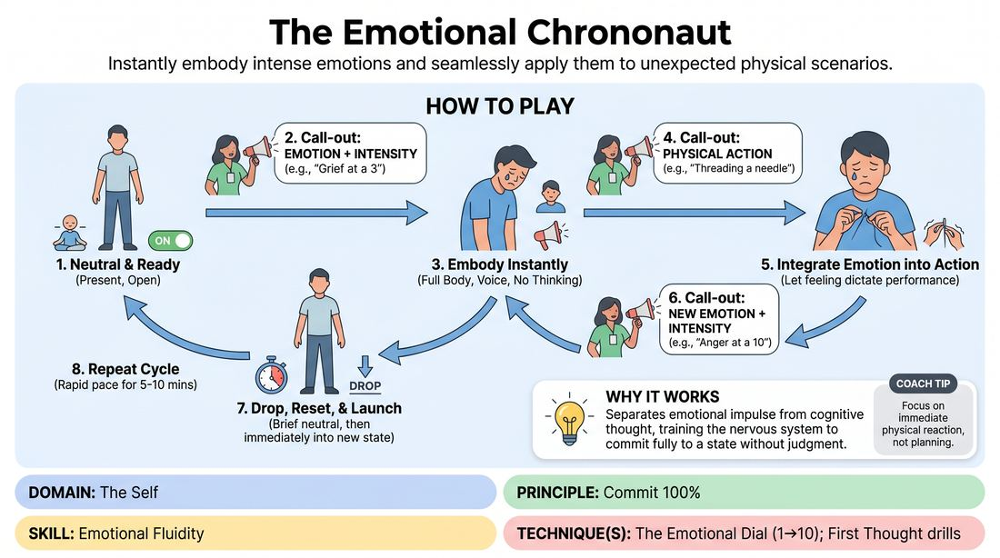{ .cat-game-img loading=lazy }

[Open full game card »](../D1_P1_S2_T1_G550__the-emotional-chrononaut.md){target=_blank rel=noopener}

### Emotional Echo

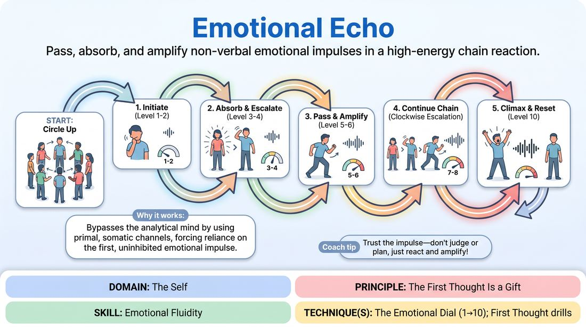{ .cat-game-img loading=lazy }

[Open full game card »](../D1_P4_S2_T1_G469__emotional-echo.md){target=_blank rel=noopener}

### Emotional Pulse

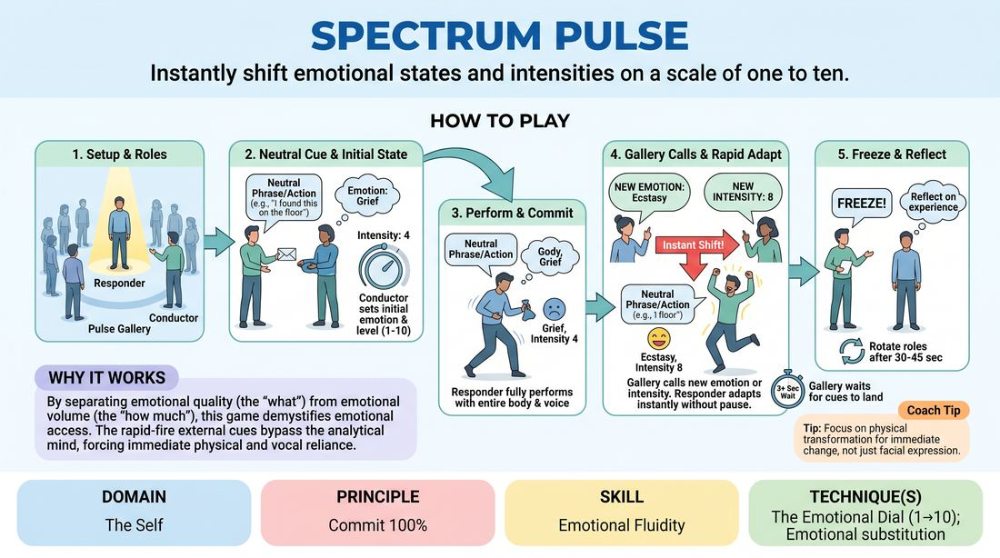{ .cat-game-img loading=lazy }

[Open full game card »](../D1_P1_S2_T1_G448__spectrum-pulse.md){target=_blank rel=noopener}

### Emotional Quadrants

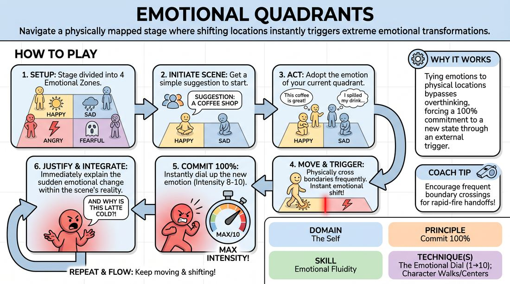{ .cat-game-img loading=lazy }

[Open full game card »](../D1_P1_S2_T1_G1047__emotional-quadrants.md){target=_blank rel=noopener}

### Emotional Soundtrack

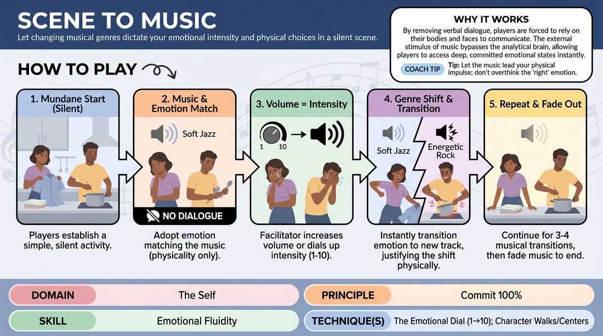{ .cat-game-img loading=lazy }

[Open full game card »](../D1_P1_S2_T1_G1267__scene-to-music.md){target=_blank rel=noopener}

### Impulse and Pivot

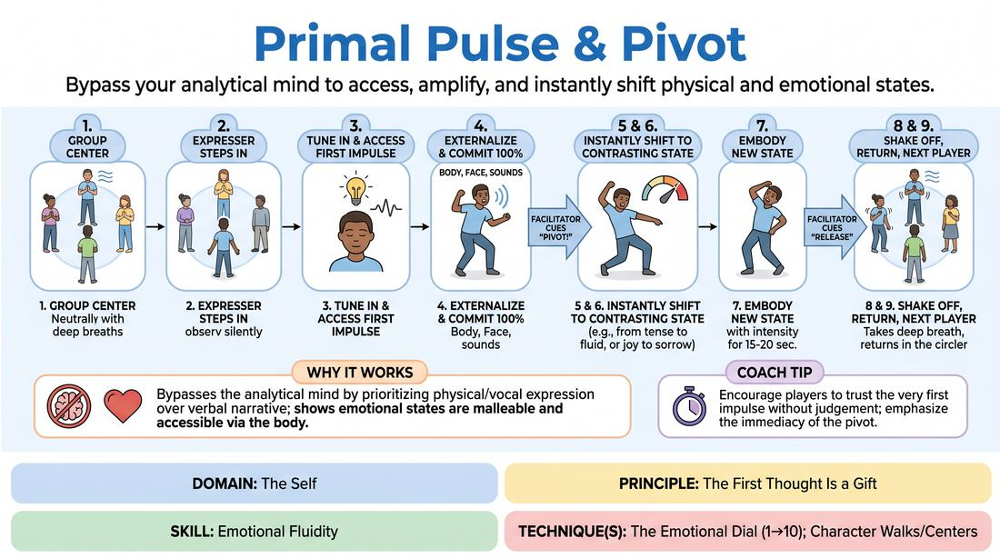{ .cat-game-img loading=lazy }

[Open full game card »](../D1_P4_S2_T1_G272__primal-pulse-pivot.md){target=_blank rel=noopener}

### Incremental Character Dial

{ .cat-game-img loading=lazy }

[Open full game card »](../D1_P1_S2_T1_G657__character-dial-up.md){target=_blank rel=noopener}

### Inside Out Amplification

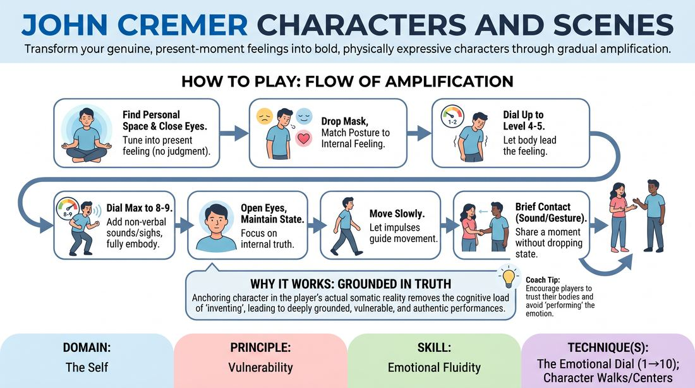{ .cat-game-img loading=lazy }

[Open full game card »](../D1_P3_S2_T1_G748__john-cremer-characters-and-scenes.md){target=_blank rel=noopener}

### Instant Character Shift

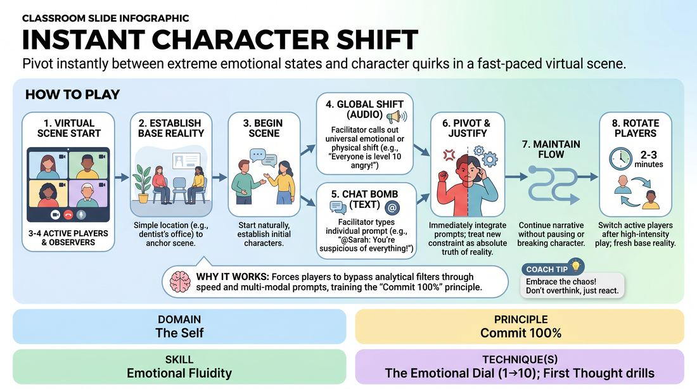{ .cat-game-img loading=lazy }

[Open full game card »](../D1_P1_S2_T1_G246__instant-character-shift.md){target=_blank rel=noopener}

### Internal Weather System

{ .cat-game-img loading=lazy }

[Open full game card »](../D1_P3_S2_T1_G020__the-internal-weather-system.md){target=_blank rel=noopener}

### Melodrama

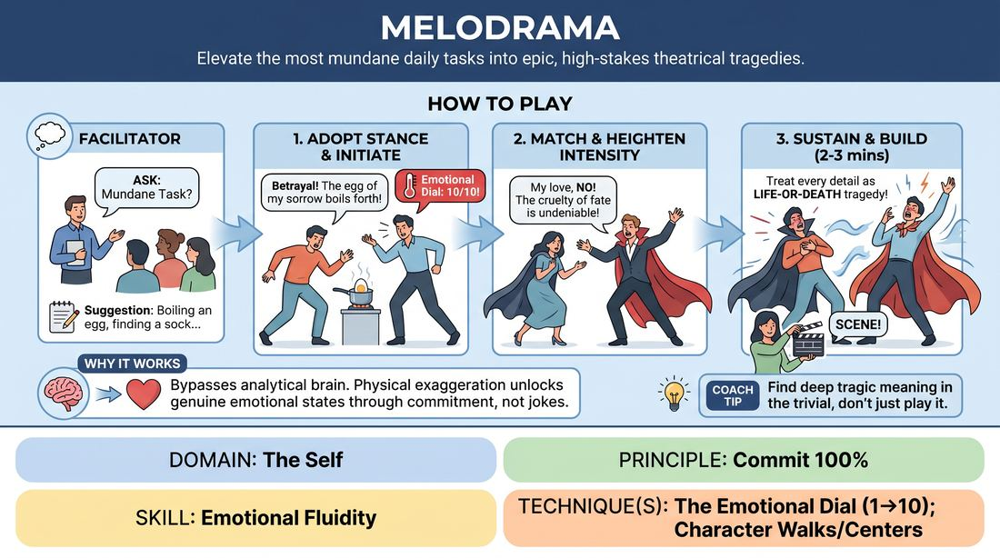{ .cat-game-img loading=lazy }

[Open full game card »](../D1_P1_S2_T1_G767__melodrama.md){target=_blank rel=noopener}

### Resonance Shift

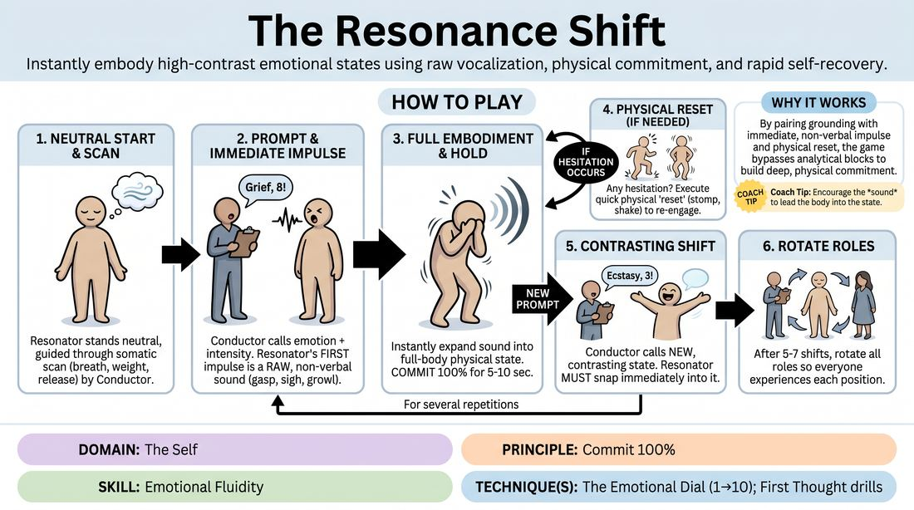{ .cat-game-img loading=lazy }

[Open full game card »](../D1_P1_S2_T1_G221__the-resonance-shift.md){target=_blank rel=noopener}

### Resonant Emotional Dial

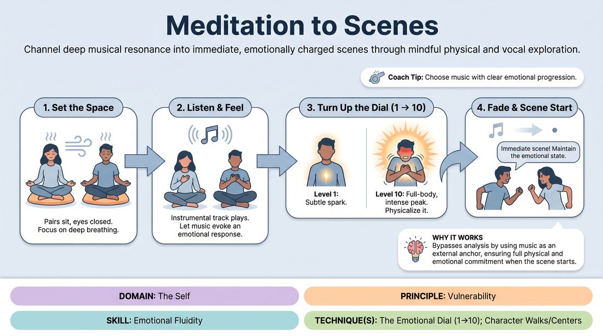{ .cat-game-img loading=lazy }

[Open full game card »](../D1_P3_S2_T1_G765__meditation-to-scenes.md){target=_blank rel=noopener}

### Somatic Impulse Dial

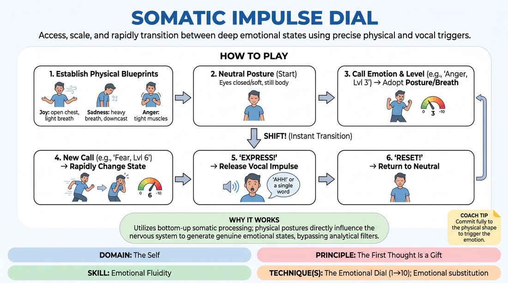{ .cat-game-img loading=lazy }

[Open full game card »](../D1_P4_S2_T1_G136__somatic-impulse-dial.md){target=_blank rel=noopener}

### Somatic Weather Systems

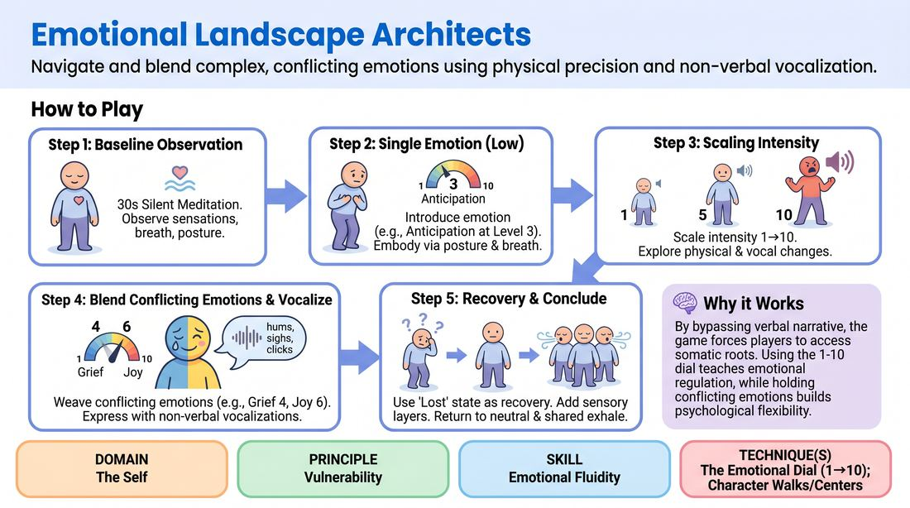{ .cat-game-img loading=lazy }

[Open full game card »](../D1_P3_S2_T1_G146__emotional-landscape-architects.md){target=_blank rel=noopener}

### The Adjective Dial

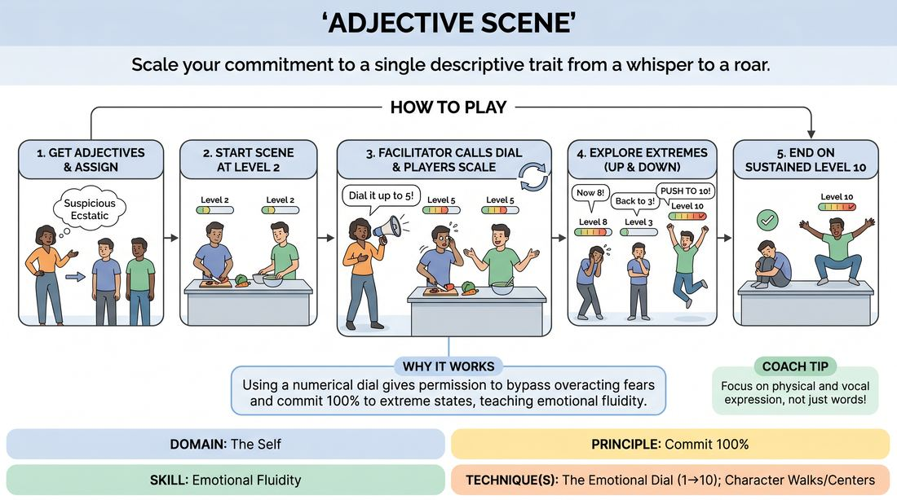{ .cat-game-img loading=lazy }

[Open full game card »](../D1_P1_S2_T1_G919__adjective-scene.md){target=_blank rel=noopener}

### The Conductor's Coil

{ .cat-game-img loading=lazy }

[Open full game card »](../D1_P1_S2_T1_G408__the-conductor-s-coil.md){target=_blank rel=noopener}

### The Core Current

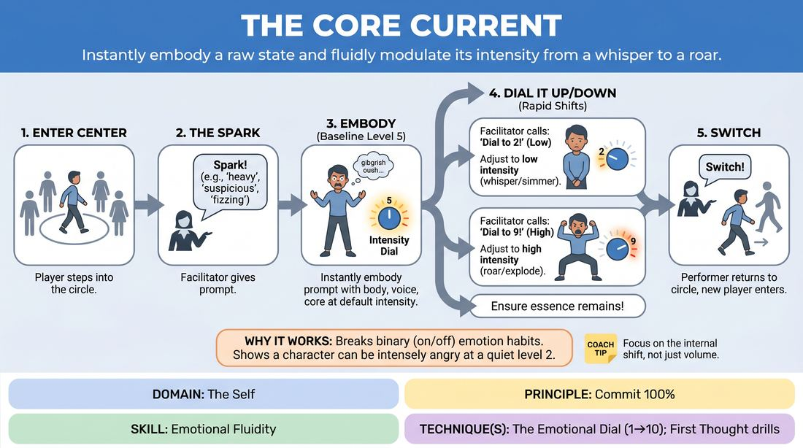{ .cat-game-img loading=lazy }

[Open full game card »](../D1_P1_S2_T1_G240__the-core-current.md){target=_blank rel=noopener}

### The Emotional Crucible

{ .cat-game-img loading=lazy }

[Open full game card »](../D1_P1_S2_T1_G182__the-chronos-synaptic-forge.md){target=_blank rel=noopener}

### The Emotional Maelstrom

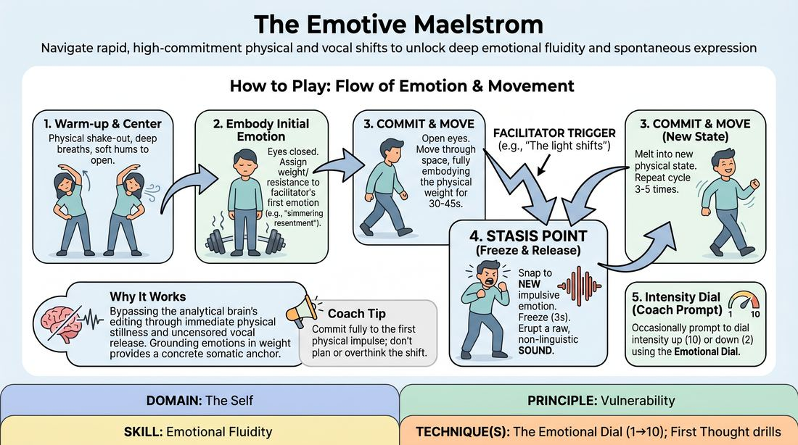{ .cat-game-img loading=lazy }

[Open full game card »](../D1_P3_S2_T1_G302__the-emotive-maelstrom-refined.md){target=_blank rel=noopener}

### The Emotional Pivot

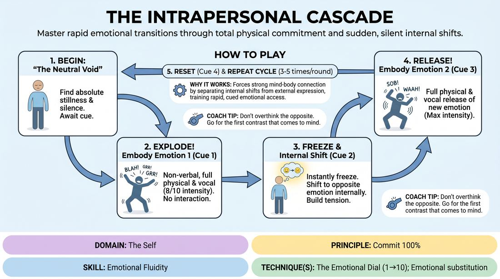{ .cat-game-img loading=lazy }

[Open full game card »](../D1_P1_S2_T1_G400__the-intrapersonal-cascade.md){target=_blank rel=noopener}

### The Emotional Resonance Dial

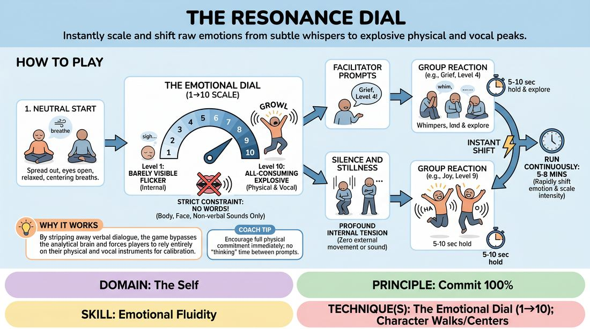{ .cat-game-img loading=lazy }

[Open full game card »](../D1_P1_S2_T1_G487__the-resonance-dial.md){target=_blank rel=noopener}

### The Emotional Resonance Walk

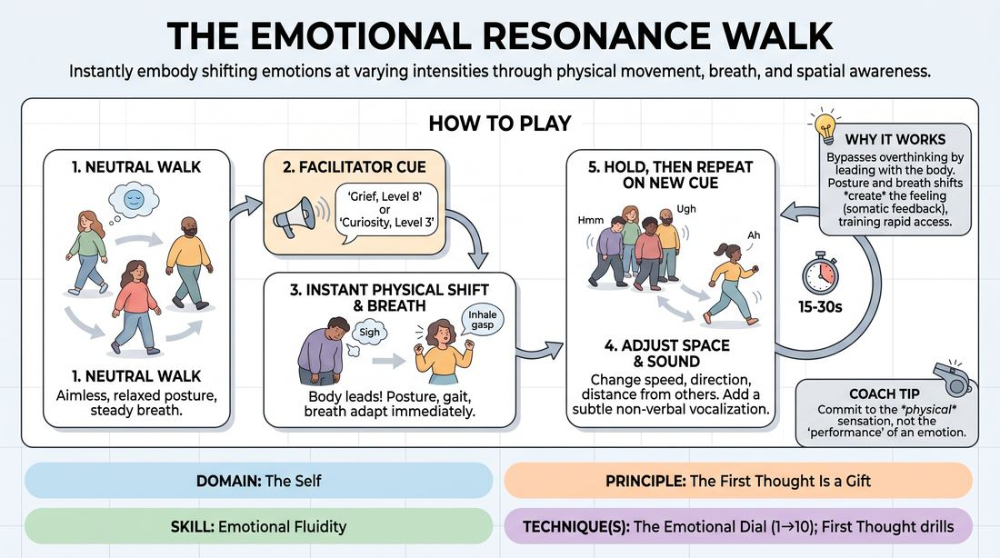{ .cat-game-img loading=lazy }

[Open full game card »](../D1_P4_S2_T1_G499__the-emotional-resonance-walk.md){target=_blank rel=noopener}

### The Emotional Seismograph

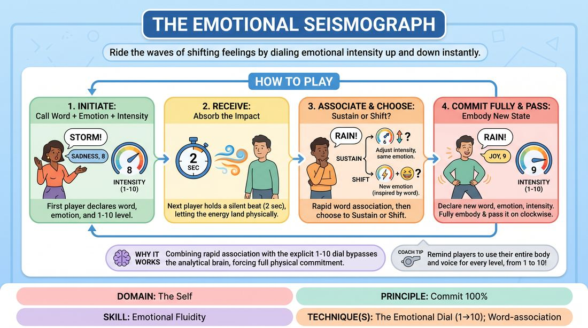{ .cat-game-img loading=lazy }

[Open full game card »](../D1_P1_S2_T1_G493__the-emotional-seismograph.md){target=_blank rel=noopener}

### The Epic Mundane

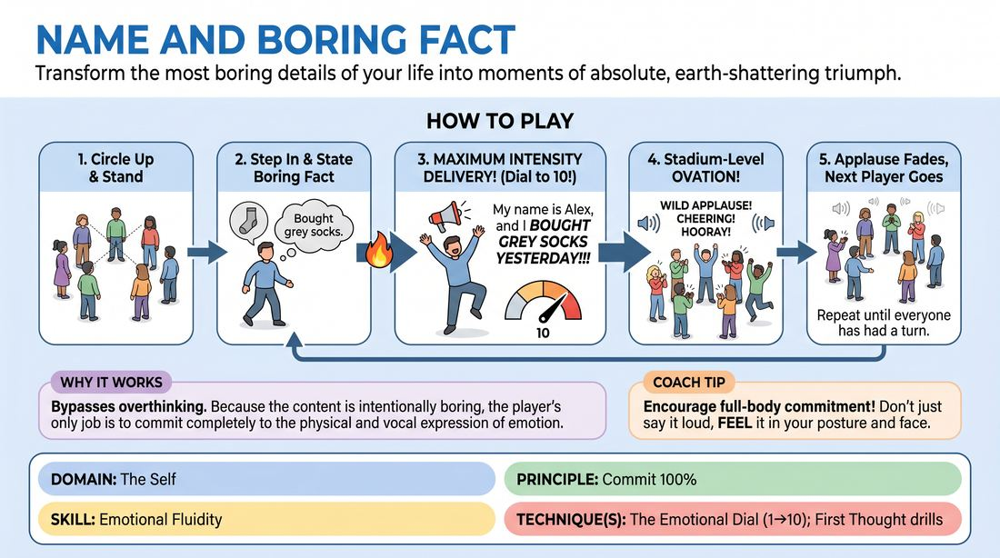{ .cat-game-img loading=lazy }

[Open full game card »](../D1_P1_S2_T1_G778__name-and-boring-fact.md){target=_blank rel=noopener}

### The Inner Cadence

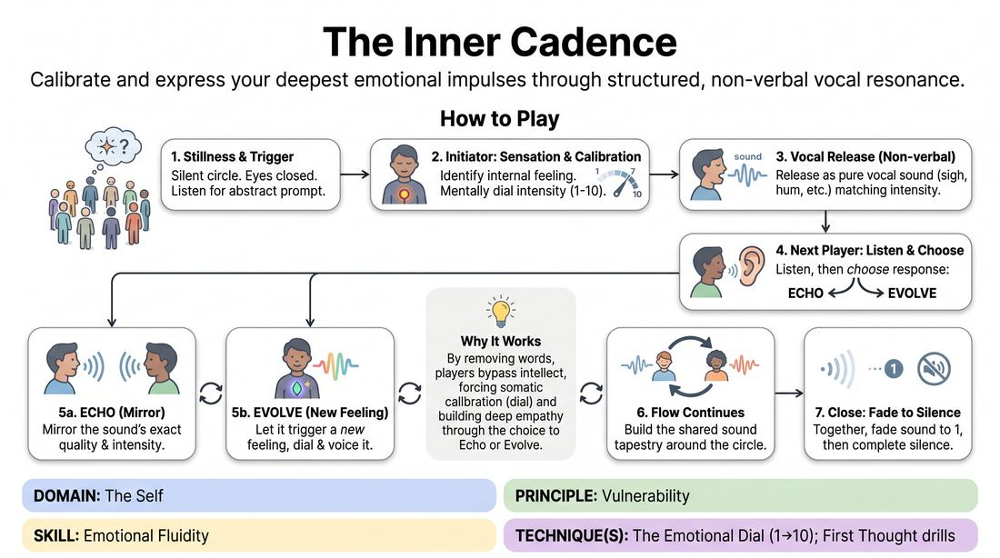{ .cat-game-img loading=lazy }

[Open full game card »](../D1_P3_S2_T1_G332__the-inner-cadence.md){target=_blank rel=noopener}

### The Primal Dial

{ .cat-game-img loading=lazy }

[Open full game card »](../D1_P1_S2_T1_G270__the-primal-dial.md){target=_blank rel=noopener}

### The Resonance Chamber

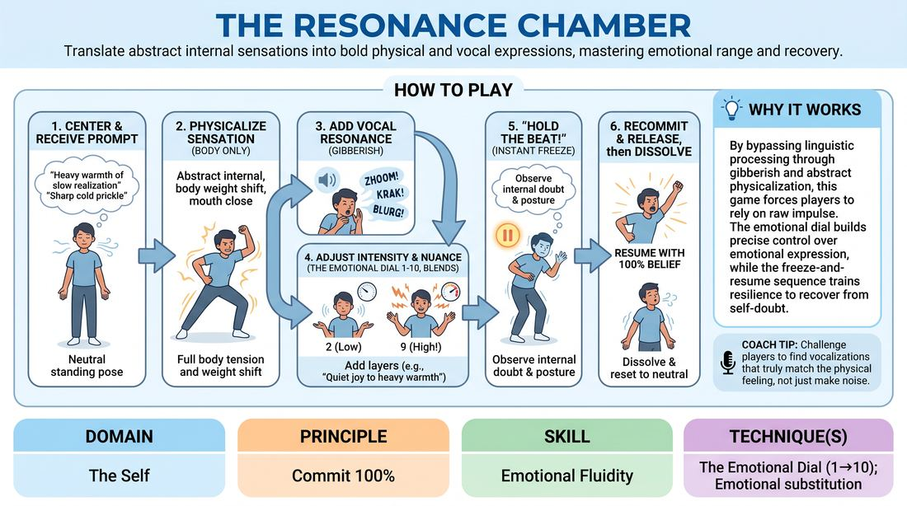{ .cat-game-img loading=lazy }

[Open full game card »](../D1_P1_S2_T1_G229__the-resonance-chamber.md){target=_blank rel=noopener}

### The Resonance Chamber

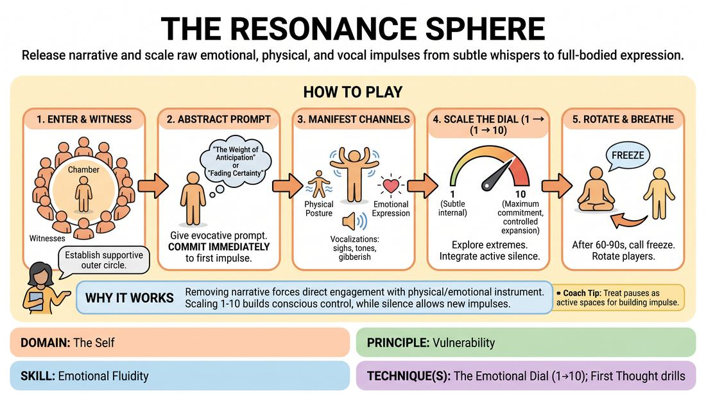{ .cat-game-img loading=lazy }

[Open full game card »](../D1_P3_S2_T1_G432__the-resonance-sphere.md){target=_blank rel=noopener}

### The Resonance Dial

{ .cat-game-img loading=lazy }

[Open full game card »](../D1_P3_S2_T1_G527__the-aetheric-resonance-protocol.md){target=_blank rel=noopener}

### The Resonance Forge

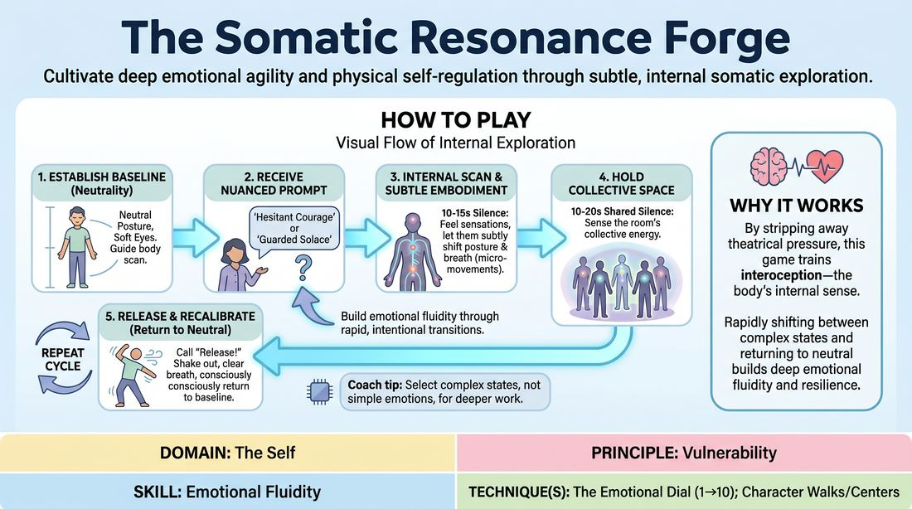{ .cat-game-img loading=lazy }

[Open full game card »](../D1_P3_S2_T1_G291__the-somatic-resonance-forge.md){target=_blank rel=noopener}

### The Resonance Path

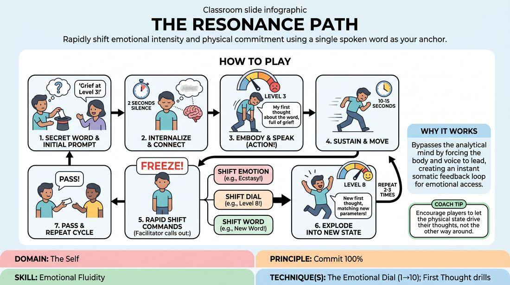{ .cat-game-img loading=lazy }

[Open full game card »](../D1_P1_S2_T1_G375__the-resonance-path.md){target=_blank rel=noopener}

### The Resonance Vessel

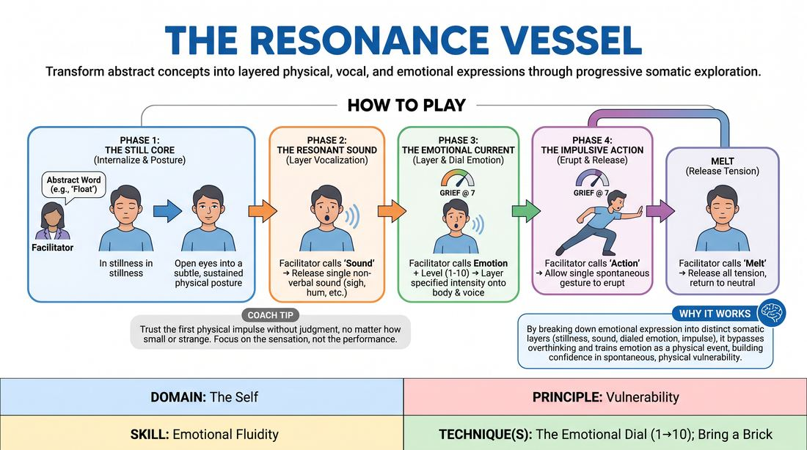{ .cat-game-img loading=lazy }

[Open full game card »](../D1_P3_S2_T1_G285__the-resonance-vessel.md){target=_blank rel=noopener}

### The Somatic Blueprint

{ .cat-game-img loading=lazy }

[Open full game card »](../D1_P3_S2_T1_G035__the-somatic-architect-internal-blueprint.md){target=_blank rel=noopener}

### The Somatic Impulse Dial

{ .cat-game-img loading=lazy }

[Open full game card »](../D1_P4_S2_T1_G127__the-spectrum-filter.md){target=_blank rel=noopener}

### The Somatic Impulse Dial

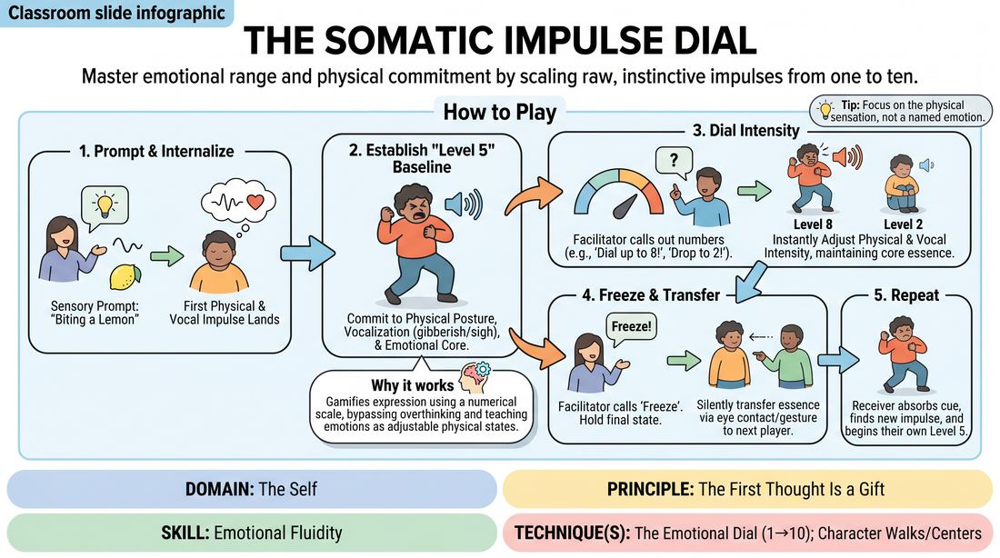{ .cat-game-img loading=lazy }

[Open full game card »](../D1_P4_S2_T1_G355__the-somatic-impulse-dial.md){target=_blank rel=noopener}

### The Spectrum Filter

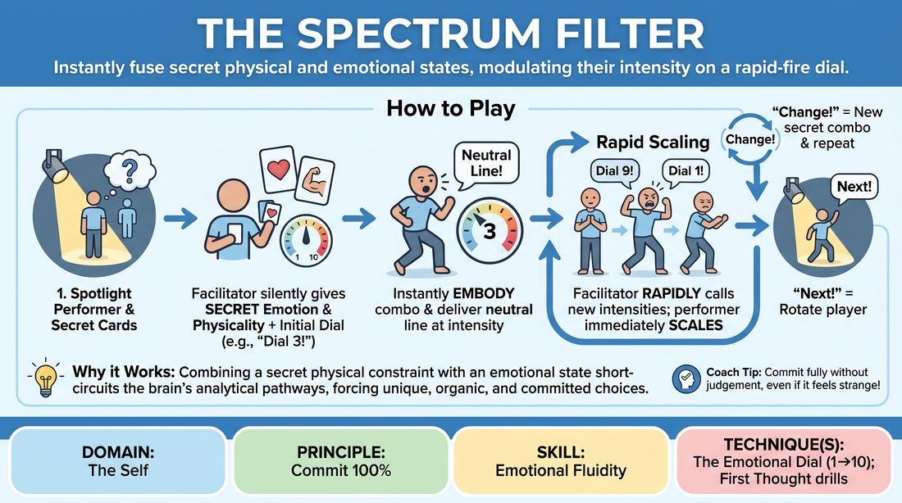{ .cat-game-img loading=lazy }

[Open full game card »](../D1_P1_S2_T1_G117__the-spectrum-filter.md){target=_blank rel=noopener}

### The Spectrum Filter

{ .cat-game-img loading=lazy }

[Open full game card »](../D1_P1_S2_T1_G122__the-spectrum-filter.md){target=_blank rel=noopener}

### The Triple-Channel Dial

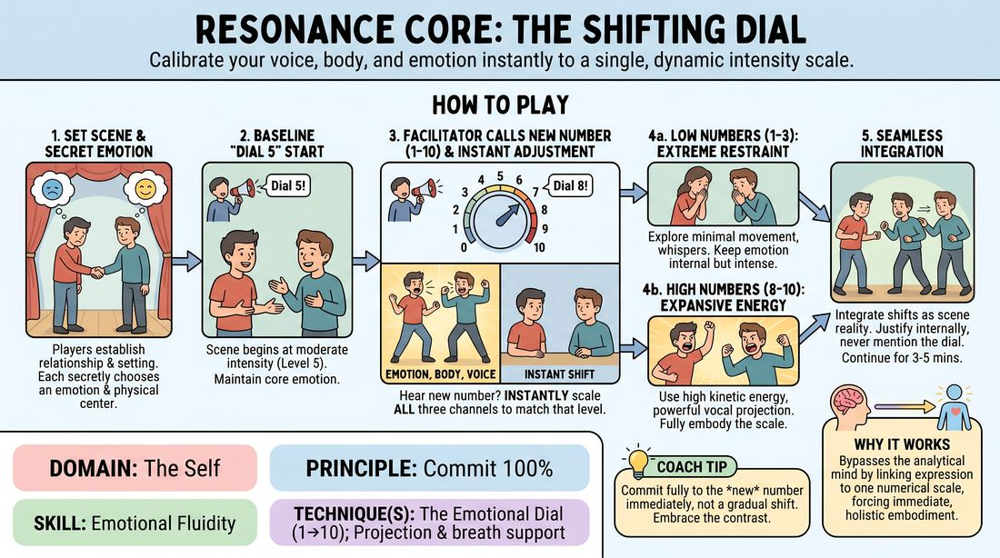{ .cat-game-img loading=lazy }

[Open full game card »](../D1_P1_S2_T1_G343__resonance-core-the-shifting-dial.md){target=_blank rel=noopener}

## Emotional substitution

### Emotional Glitch

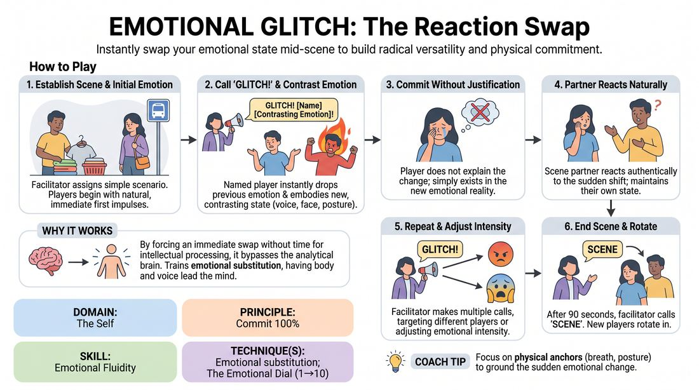{ .cat-game-img loading=lazy }

[Open full game card »](../D1_P1_S2_T2_G245__emotional-glitch-the-reaction-swap.md){target=_blank rel=noopener}

### Internal Mantra

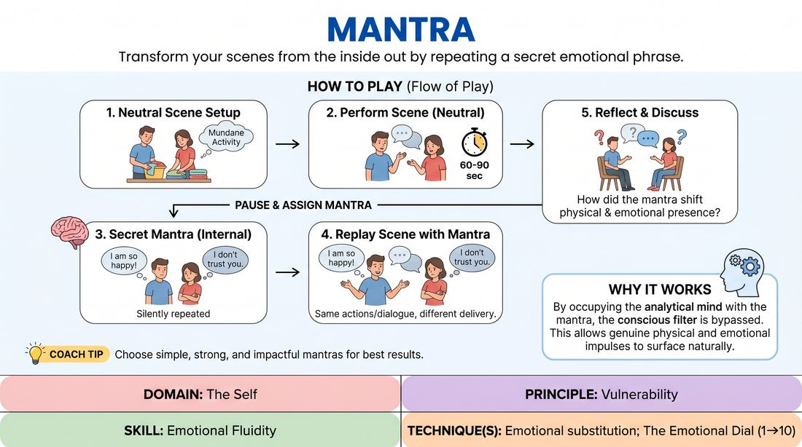{ .cat-game-img loading=lazy }

[Open full game card »](../D1_P3_S2_T2_G1169__mantra.md){target=_blank rel=noopener}

### Resonant States

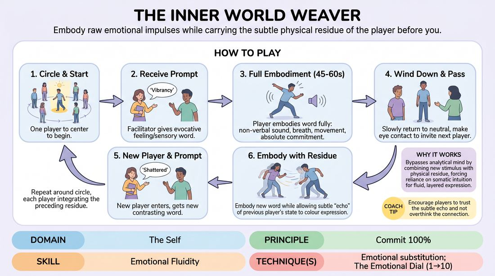{ .cat-game-img loading=lazy }

[Open full game card »](../D1_P1_S2_T2_G467__the-inner-world-weaver.md){target=_blank rel=noopener}

### Stereotype to Soul

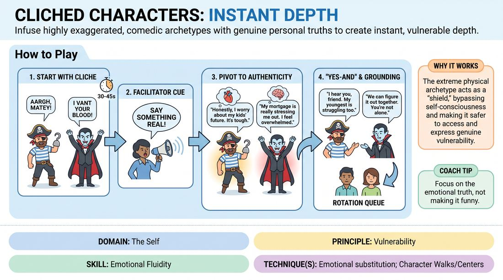{ .cat-game-img loading=lazy }

[Open full game card »](../D1_P3_S2_T2_G669__cliched-characters-instant-depth.md){target=_blank rel=noopener}

### The Alchemy Cascade

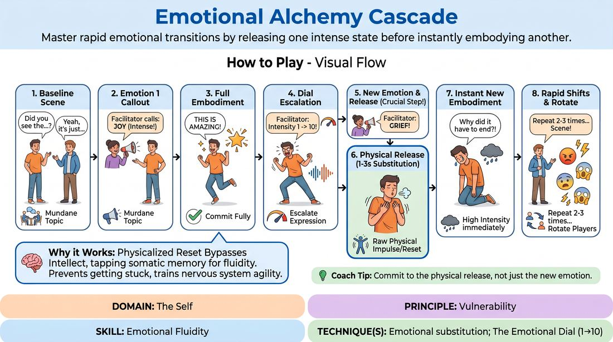{ .cat-game-img loading=lazy }

[Open full game card »](../D1_P3_S2_T2_G419__emotional-alchemy-cascade.md){target=_blank rel=noopener}

### The Emotional Dialect

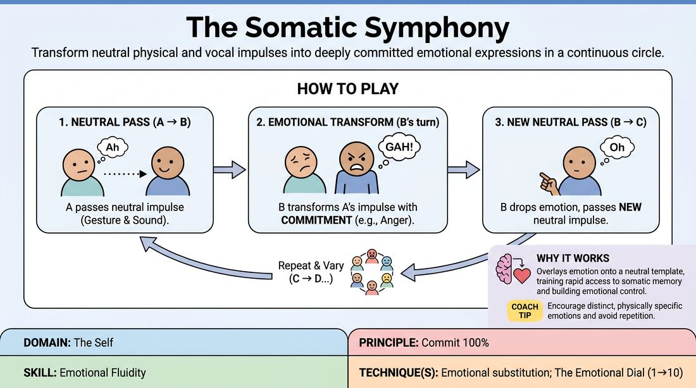{ .cat-game-img loading=lazy }

[Open full game card »](../D1_P1_S2_T2_G103__the-somatic-symphony.md){target=_blank rel=noopener}

### The Emotional Echo

{ .cat-game-img loading=lazy }

[Open full game card »](../D1_P1_S2_T2_G094__the-internal-dialect.md){target=_blank rel=noopener}

