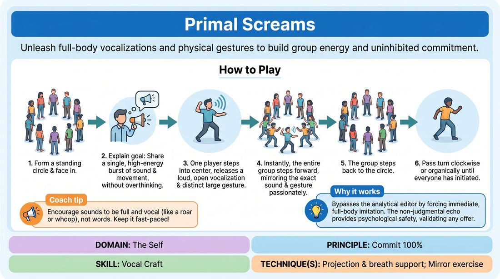
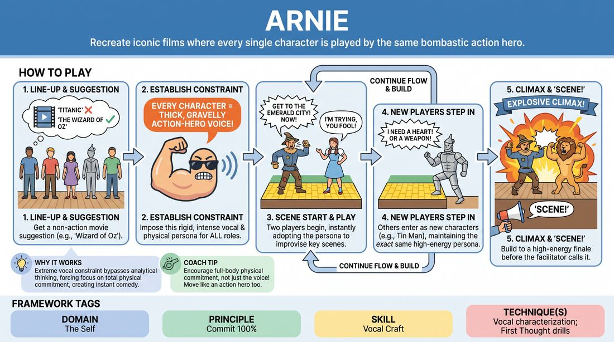
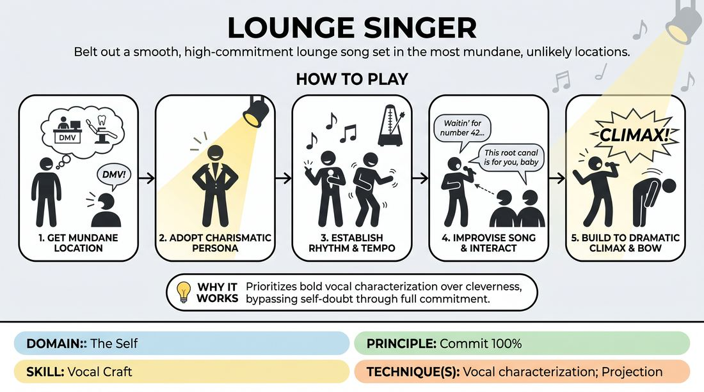
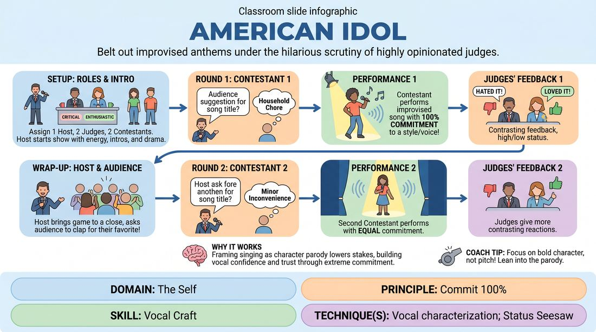
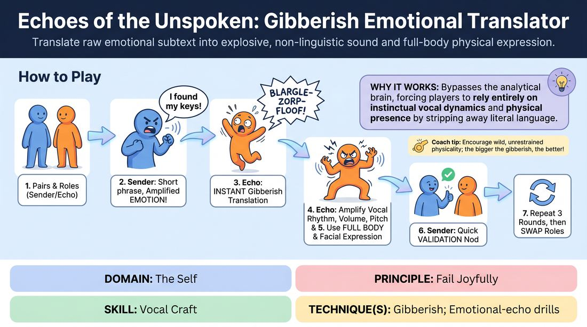
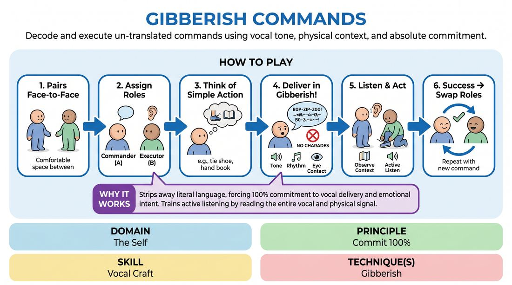
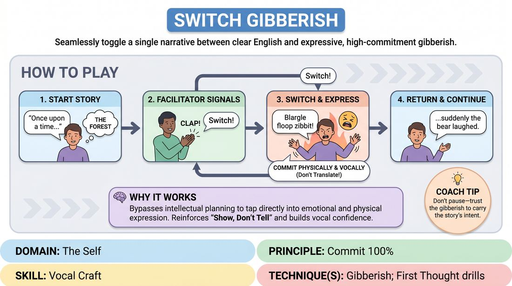
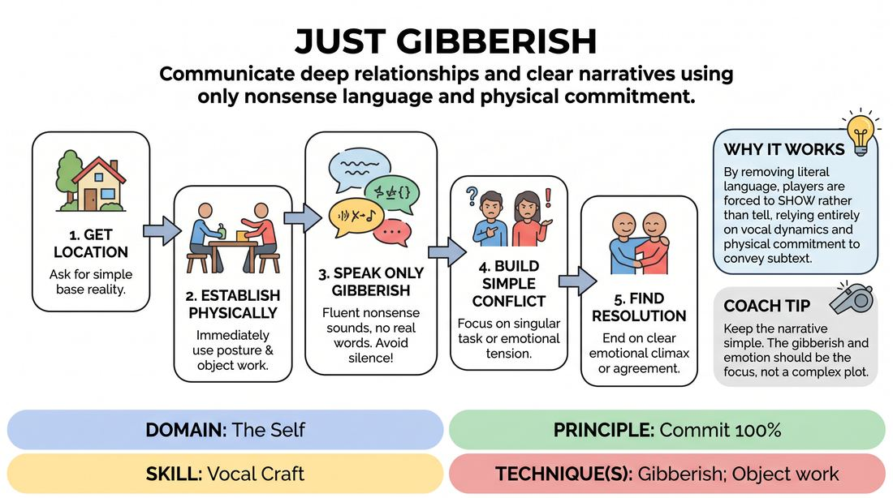

# 🎲 Vocal Craft — games

Games whose primary skill is **Vocal Craft** (`D1.S4`), grouped by technique. Full faceted search on the [Games List](../index.md).

## Core / general

### Smart Fellas

{ .cat-game-img loading=lazy }

[Open full game card »](../D1_P2_S4_T0_G1286__smart-fellas.md){target=_blank rel=noopener}

## Projection & breath support

### Primal Echo

{ .cat-game-img loading=lazy }

[Open full game card »](../D1_P1_S4_T1_G1243__primal-screams.md){target=_blank rel=noopener}

## Vocal characterization

### Arnie's Cinema

{ .cat-game-img loading=lazy }

[Open full game card »](../D1_P1_S4_T2_G636__arnie.md){target=_blank rel=noopener}

### Lounge Legend

{ .cat-game-img loading=lazy }

[Open full game card »](../D1_P1_S4_T2_G1161__lounge-singer.md){target=_blank rel=noopener}

### The Blues Jam

{ .cat-game-img loading=lazy }

[Open full game card »](../D1_P1_S4_T2_G968__blues-jam.md){target=_blank rel=noopener}

### The Rallying Cry

{ .cat-game-img loading=lazy }

[Open full game card »](../D1_P1_S4_T2_G771__motivational-speaker.md){target=_blank rel=noopener}

### The Ultimate Audition

{ .cat-game-img loading=lazy }

[Open full game card »](../D1_P1_S4_T2_G929__american-idol.md){target=_blank rel=noopener}

### Vocal Resonance Ripple

{ .cat-game-img loading=lazy }

[Open full game card »](../D1_P4_S4_T2_G316__the-echo-chamber-of-self.md){target=_blank rel=noopener}

## Gibberish

### Emotional Gibberish Echo

{ .cat-game-img loading=lazy }

[Open full game card »](../D1_P2_S4_T3_G559__echoes-of-the-unspoken-gibberish-emotional-translator.md){target=_blank rel=noopener}

### Gibberish Commands

{ .cat-game-img loading=lazy }

[Open full game card »](../D1_P1_S4_T3_G1093__gibberish-commands.md){target=_blank rel=noopener}

### Gibberish Replay

{ .cat-game-img loading=lazy }

[Open full game card »](../D1_P1_S4_T3_G1255__replay-gibberish.md){target=_blank rel=noopener}

### Gibberish Switch

{ .cat-game-img loading=lazy }

[Open full game card »](../D1_P1_S4_T3_G1315__switch-gibberish.md){target=_blank rel=noopener}

### Pure Gibberish

{ .cat-game-img loading=lazy }

[Open full game card »](../D1_P1_S4_T3_G1141__just-gibberish.md){target=_blank rel=noopener}

### Sonic Self-Sculpture

{ .cat-game-img loading=lazy }

[Open full game card »](../D1_P4_S4_T3_G069__the-aural-architect-sonic-self-sculpture.md){target=_blank rel=noopener}

### State Shifter

{ .cat-game-img loading=lazy }

[Open full game card »](../D1_P1_S4_T3_G1205__non-sequitor.md){target=_blank rel=noopener}

