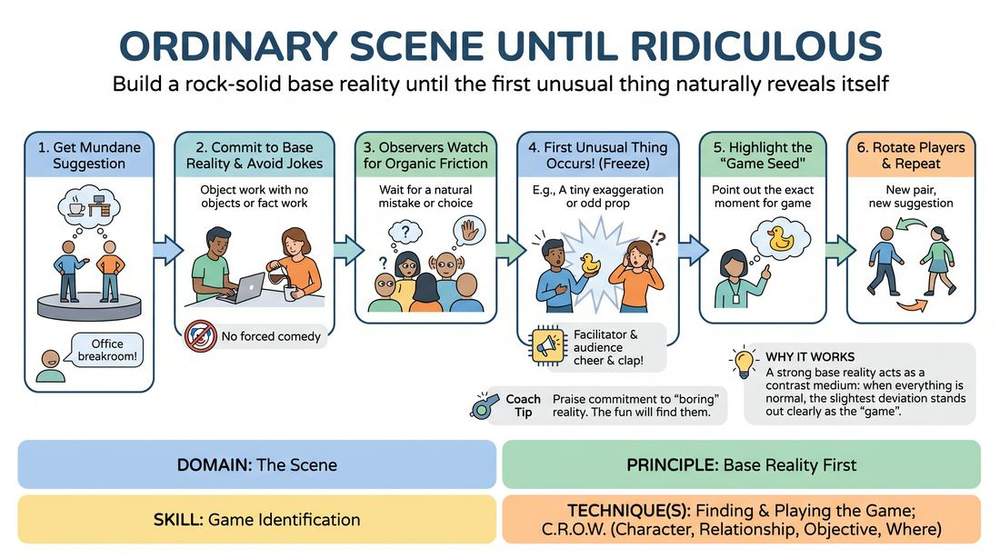
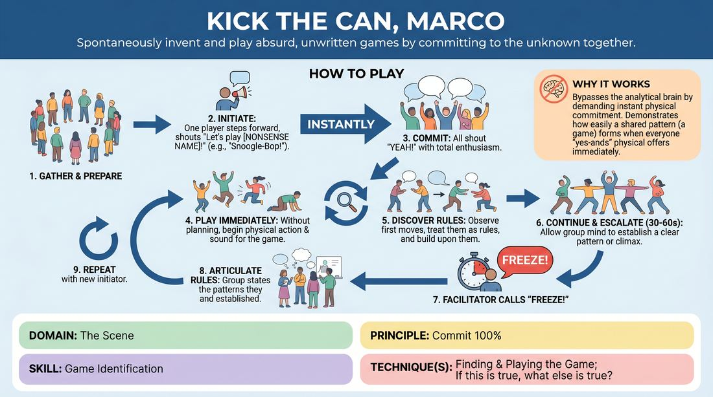
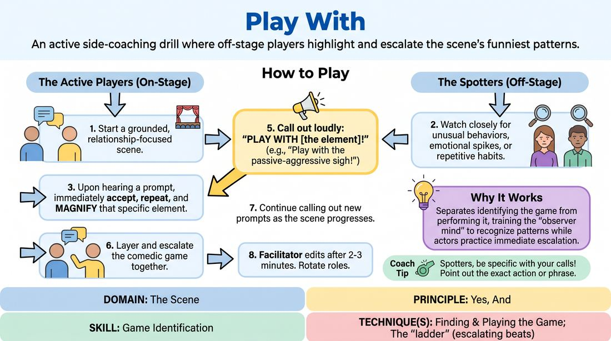
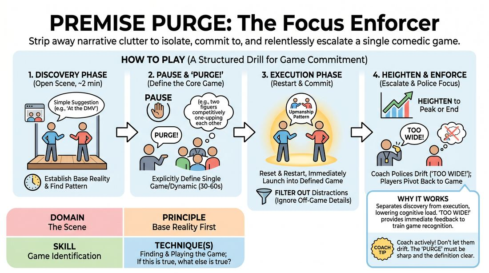
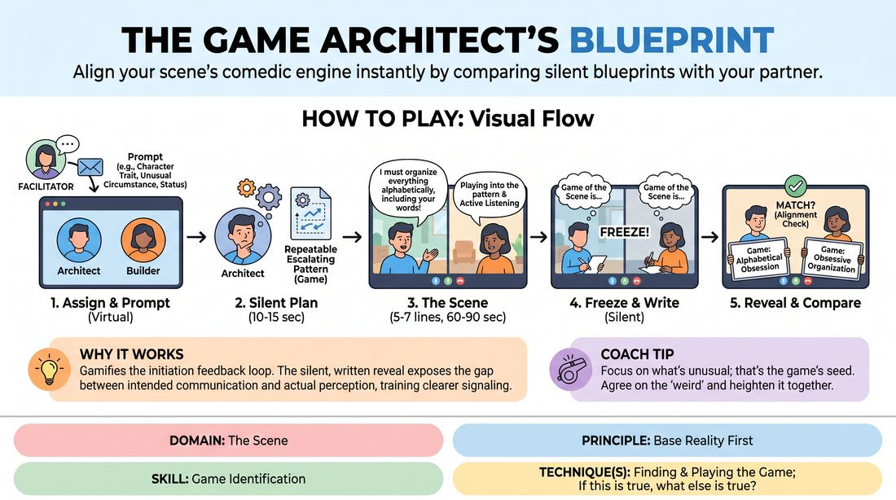
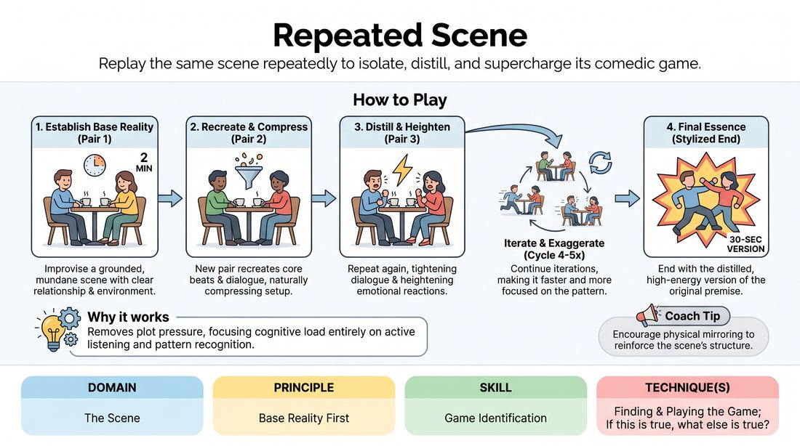
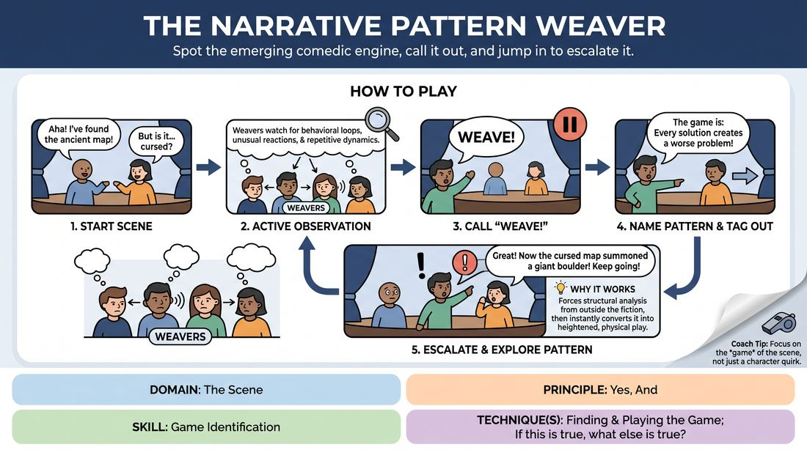
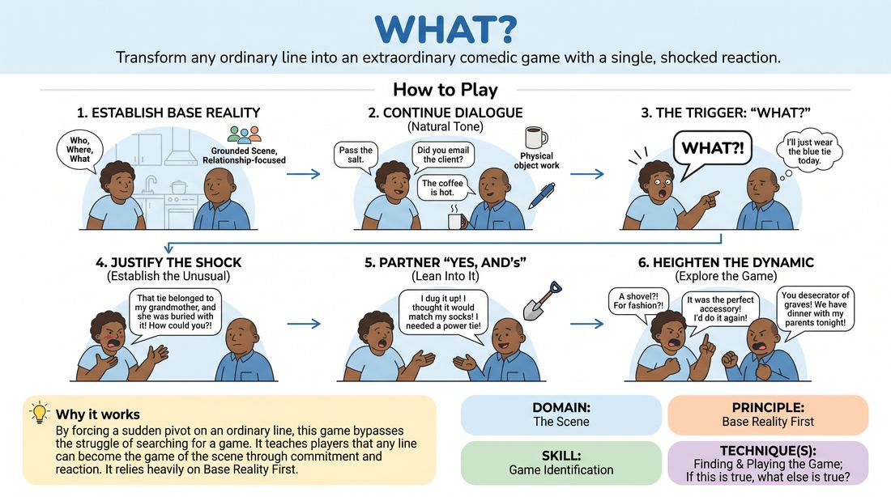
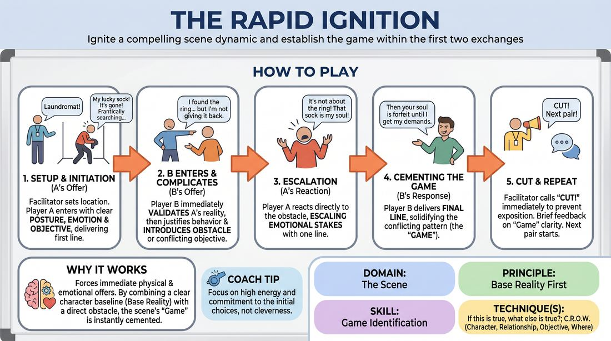
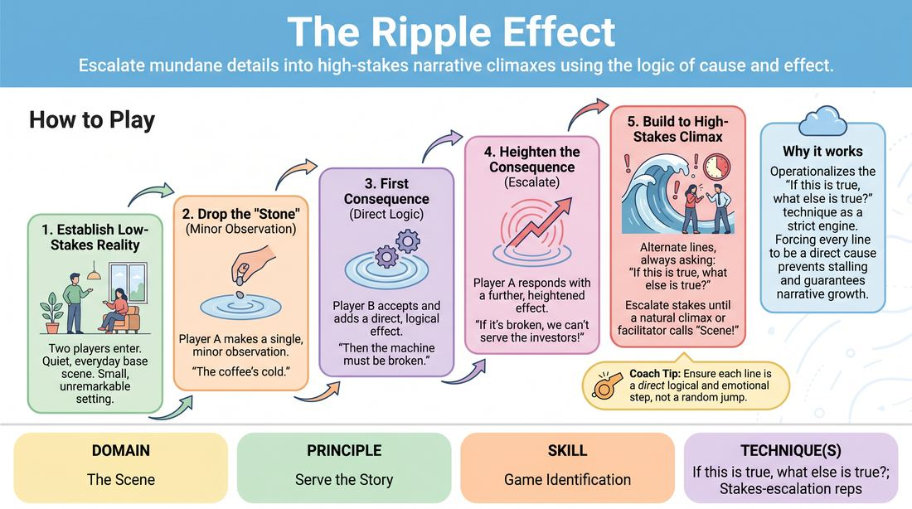

# 🎲 Game Identification — games

Games whose primary skill is **Game Identification** (`D3.S1`), grouped by technique. Full faceted search on the [Games List](../index.md).

## Finding & Playing the Game

### Chain Reactions

{ .cat-game-img loading=lazy }

[Open full game card »](../D3_P0_S1_T1_G875__triggers.md){target=_blank rel=noopener}

### Establishing the Ordinary

{ .cat-game-img loading=lazy }

[Open full game card »](../D3_P2_S1_T1_G790__ordinary-scene-until-ridiculous.md){target=_blank rel=noopener}

### Instant Game Engine

{ .cat-game-img loading=lazy }

[Open full game card »](../D3_P0_S1_T1_G751__kick-the-can-marco.md){target=_blank rel=noopener}

### Play With That

{ .cat-game-img loading=lazy }

[Open full game card »](../D3_P0_S1_T1_G803__play-with.md){target=_blank rel=noopener}

### Premise Purge

{ .cat-game-img loading=lazy }

[Open full game card »](../D3_P2_S1_T1_G329__premise-purge-the-focus-enforcer.md){target=_blank rel=noopener}

### That Scene Was About

{ .cat-game-img loading=lazy }

[Open full game card »](../D3_P0_S1_T1_G864__that-scene-was-about.md){target=_blank rel=noopener}

### The Echo Line

{ .cat-game-img loading=lazy }

[Open full game card »](../D3_P2_S1_T1_G678__copy-line.md){target=_blank rel=noopener}

### The Game Blueprint

{ .cat-game-img loading=lazy }

[Open full game card »](../D3_P0_S1_T1_G585__the-game-architect-s-blueprint.md){target=_blank rel=noopener}

### The Iterative Scene

{ .cat-game-img loading=lazy }

[Open full game card »](../D3_P2_S1_T1_G818__repeated-scene.md){target=_blank rel=noopener}

### The Observation Audit

{ .cat-game-img loading=lazy }

[Open full game card »](../D3_P2_S1_T1_G753__krypton-factor.md){target=_blank rel=noopener}

### The Pattern Weaver

{ .cat-game-img loading=lazy }

[Open full game card »](../D3_P0_S1_T1_G485__the-narrative-pattern-weaver.md){target=_blank rel=noopener}

### Understudy

{ .cat-game-img loading=lazy }

[Open full game card »](../D3_P2_S1_T1_G880__understudy.md){target=_blank rel=noopener}

### What?

{ .cat-game-img loading=lazy }

[Open full game card »](../D3_P2_S1_T1_G883__what.md){target=_blank rel=noopener}

## If this is true, what else is true?

### The Instant Spark

{ .cat-game-img loading=lazy }

[Open full game card »](../D3_P2_S1_T2_G590__the-rapid-ignition.md){target=_blank rel=noopener}

### The Ripple Effect

{ .cat-game-img loading=lazy }

[Open full game card »](../D3_P4_S1_T2_G537__the-ripple-effect.md){target=_blank rel=noopener}

