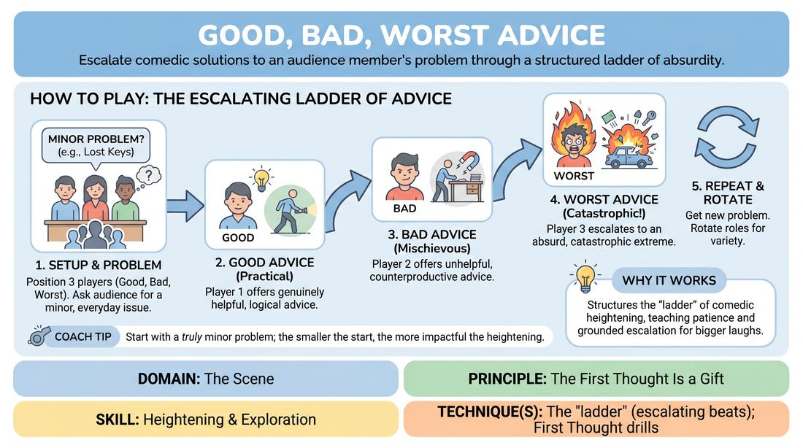
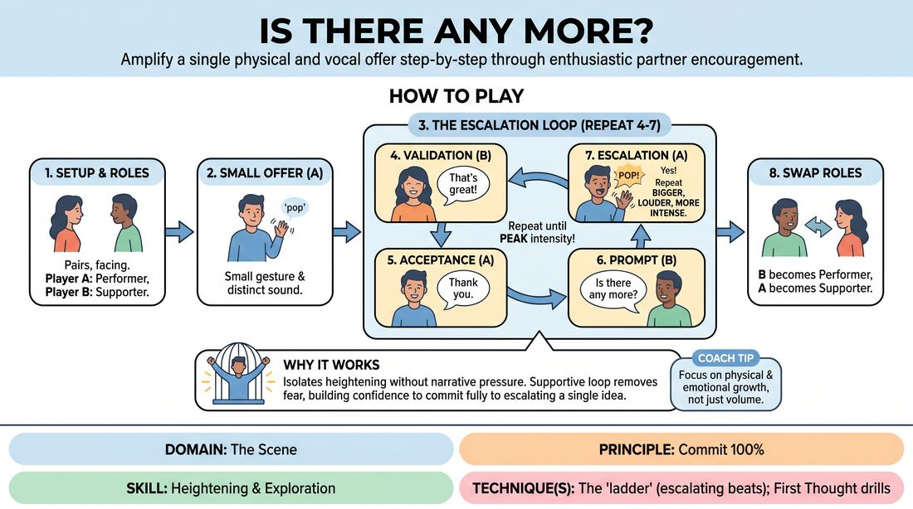
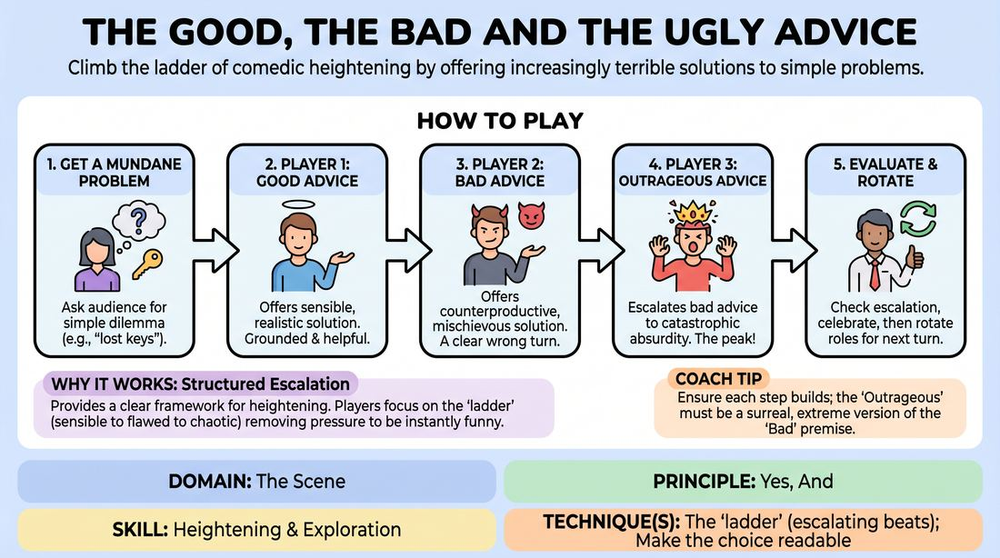
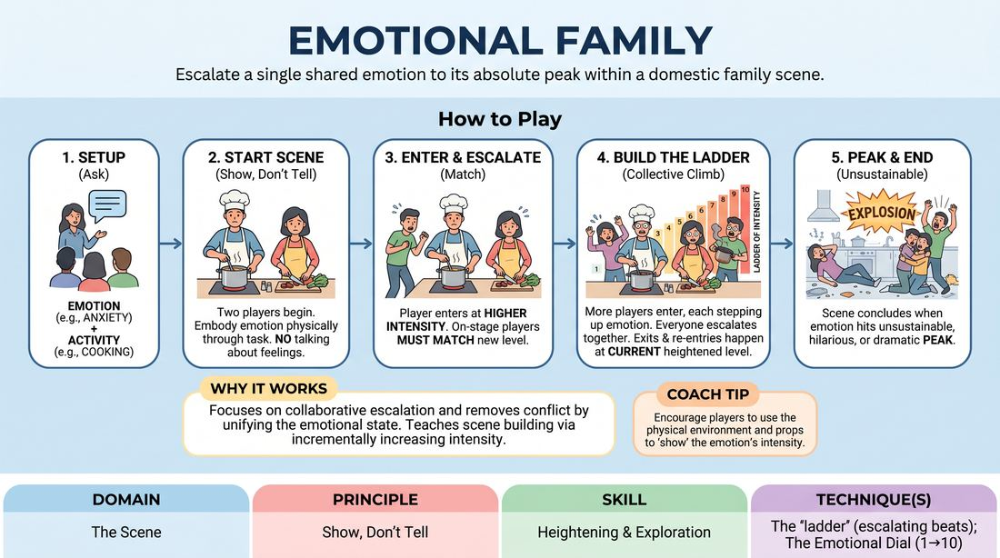
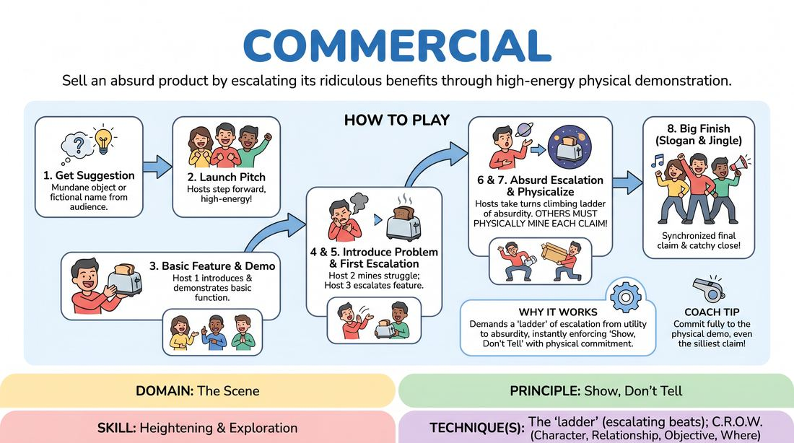
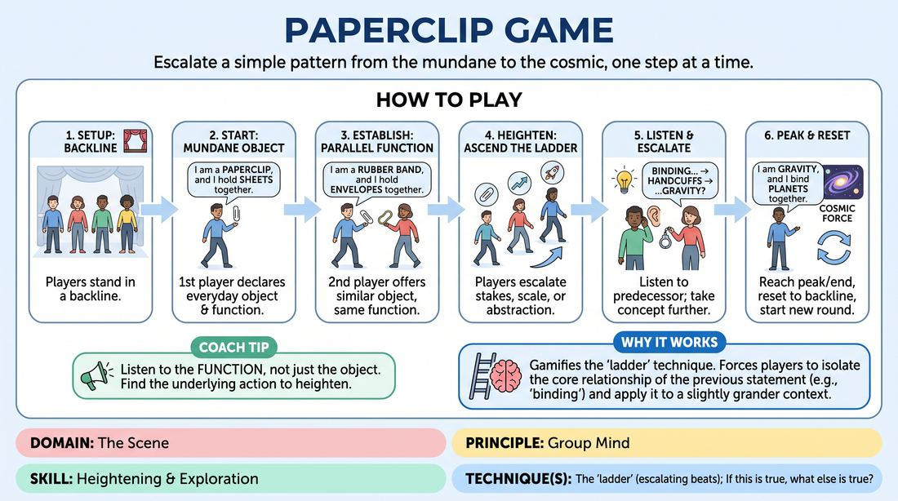
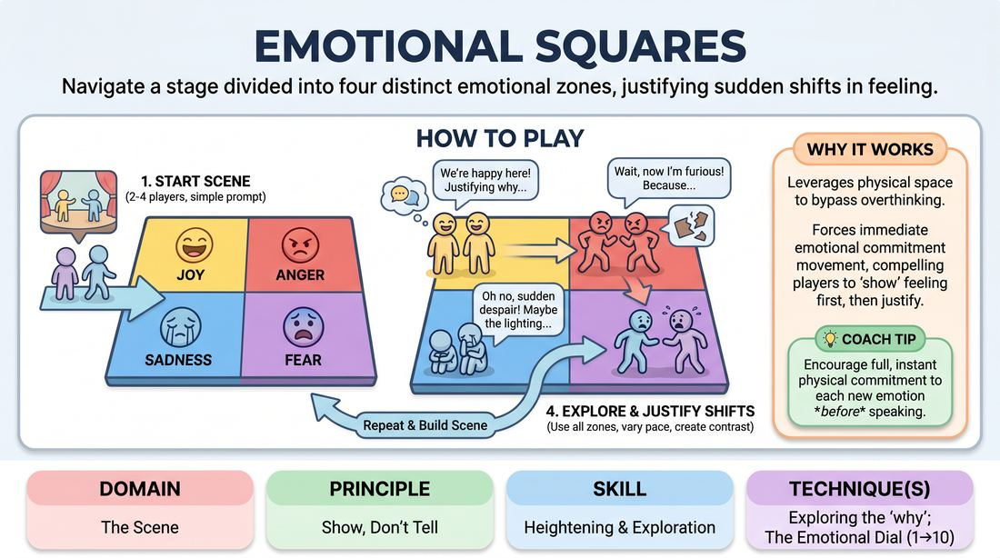

# 🎲 Heightening & Exploration — games

Games whose primary skill is **Heightening & Exploration** (`D3.S2`), grouped by technique. Full faceted search on the [Games List](../index.md).

## Core / general

### Genre Rewind

{ .cat-game-img loading=lazy }

[Open full game card »](../D3_P2_S2_T0_G827__scene-replay.md){target=_blank rel=noopener}

### The Replay Matrix

{ .cat-game-img loading=lazy }

[Open full game card »](../D3_P2_S2_T0_G1266__scene-replay.md){target=_blank rel=noopener}

## The 'ladder' (escalating beats)

### Biographical Beats

{ .cat-game-img loading=lazy }

[Open full game card »](../D3_P4_S2_T1_G759__life-times.md){target=_blank rel=noopener}

### Good, Bad, Worst Advice

{ .cat-game-img loading=lazy }

[Open full game card »](../D3_P0_S2_T1_G715__good-bad-worst-advice.md){target=_blank rel=noopener}

### Is There Any More?

{ .cat-game-img loading=lazy }

[Open full game card »](../D3_P0_S2_T1_G744__is-there-any-more.md){target=_blank rel=noopener}

### Mundane Rituals

{ .cat-game-img loading=lazy }

[Open full game card »](../D3_P2_S2_T1_G1259__rituals.md){target=_blank rel=noopener}

### Pan Left

{ .cat-game-img loading=lazy }

[Open full game card »](../D3_P3_S2_T1_G793__pan-left.md){target=_blank rel=noopener}

### Pattern Escalator

{ .cat-game-img loading=lazy }

[Open full game card »](../D3_P0_S2_T1_G1227__patterns.md){target=_blank rel=noopener}

### The Advice Ladder

{ .cat-game-img loading=lazy }

[Open full game card »](../D3_P0_S2_T1_G1326__the-good-the-bad-and-the-ugly-advice.md){target=_blank rel=noopener}

### The Emotional Household

{ .cat-game-img loading=lazy }

[Open full game card »](../D3_P1_S2_T1_G695__emotional-family.md){target=_blank rel=noopener}

### The Heightening Accelerator

{ .cat-game-img loading=lazy }

[Open full game card »](../D3_P2_S2_T1_G610__the-scene-dynamics-accelerator.md){target=_blank rel=noopener}

### The Infomercial

{ .cat-game-img loading=lazy }

[Open full game card »](../D3_P1_S2_T1_G995__commercial.md){target=_blank rel=noopener}

### The Paperclip Ladder

{ .cat-game-img loading=lazy }

[Open full game card »](../D3_P0_S2_T1_G1222__paperclip-game.md){target=_blank rel=noopener}

### The Soundtrack Shop

{ .cat-game-img loading=lazy }

[Open full game card »](../D3_P1_S2_T1_G982__cd-shop.md){target=_blank rel=noopener}

## Exploring the 'why'

### Emotional Squares

{ .cat-game-img loading=lazy }

[Open full game card »](../D3_P1_S2_T2_G696__emotional-squares.md){target=_blank rel=noopener}

