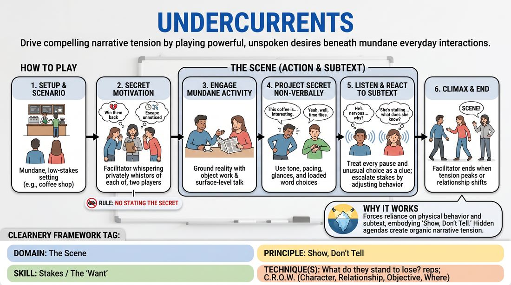

# 🎲 Stakes / The 'Want' — games

Games whose primary skill is **Stakes / The 'Want'** (`D3.S4`), grouped by technique. Full faceted search on the [Games List](../index.md).

## Core / general

### Want and Wall

{ .cat-game-img loading=lazy }

[Open full game card »](../D3_P4_S4_T0_G397__want-wall.md){target=_blank rel=noopener}

## What do they stand to lose? reps

### The Shifting Want

{ .cat-game-img loading=lazy }

[Open full game card »](../D3_P4_S4_T1_G404__the-shifting-want.md){target=_blank rel=noopener}

### Undercurrents

{ .cat-game-img loading=lazy }

[Open full game card »](../D3_P1_S4_T1_G565__undercurrents.md){target=_blank rel=noopener}

