# 🎲 Support Work — games

Games whose primary skill is **Support Work** (`D4.S2`), grouped by technique. Full faceted search on the [Games List](../index.md).

## Core / general

### Circle of Support

{ .cat-game-img loading=lazy }

[Open full game card »](../D4_P1_S2_T0_G1083__free-falling.md){target=_blank rel=noopener}

### Collective Chairs

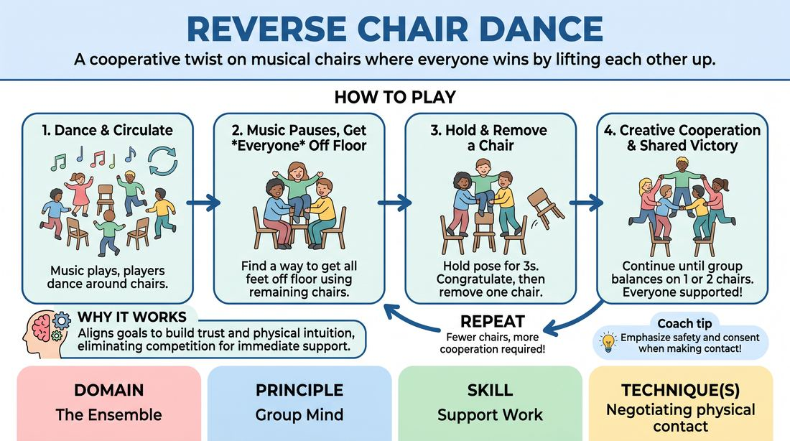{ .cat-game-img loading=lazy }

[Open full game card »](../D4_P1_S2_T0_G1256__reverse-chair-dance.md){target=_blank rel=noopener}

### Dynamic Weighting

{ .cat-game-img loading=lazy }

[Open full game card »](../D4_P3_S2_T0_G100__the-ensemble-crucible-dynamic-weighting.md){target=_blank rel=noopener}

### I'm Great, You're Great

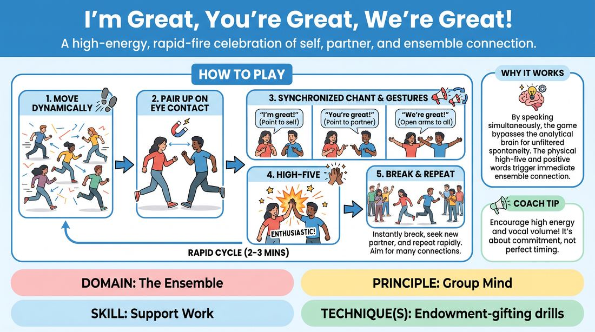{ .cat-game-img loading=lazy }

[Open full game card »](../D4_P1_S2_T0_G735__i-m-great-you-re-great-we-re-great.md){target=_blank rel=noopener}

### The Appreciation Seat

{ .cat-game-img loading=lazy }

[Open full game card »](../D4_P1_S2_T0_G809__positive-chair.md){target=_blank rel=noopener}

### The Balladeer

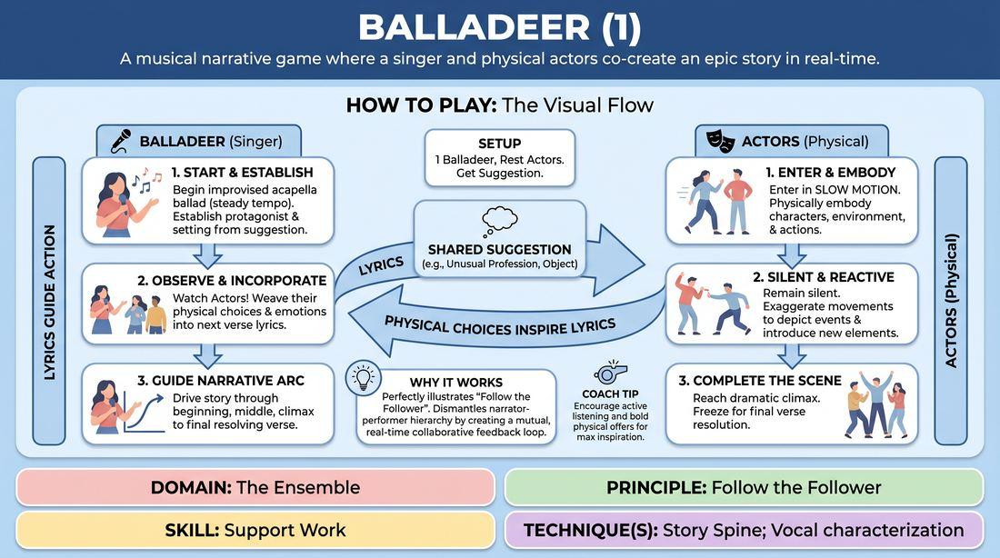{ .cat-game-img loading=lazy }

[Open full game card »](../D4_P2_S2_T0_G942__balladeer-1.md){target=_blank rel=noopener}

### The Director's Cut

{ .cat-game-img loading=lazy }

[Open full game card »](../D4_P1_S2_T0_G774__movie-director-interview.md){target=_blank rel=noopener}

### The Ensemble Sway

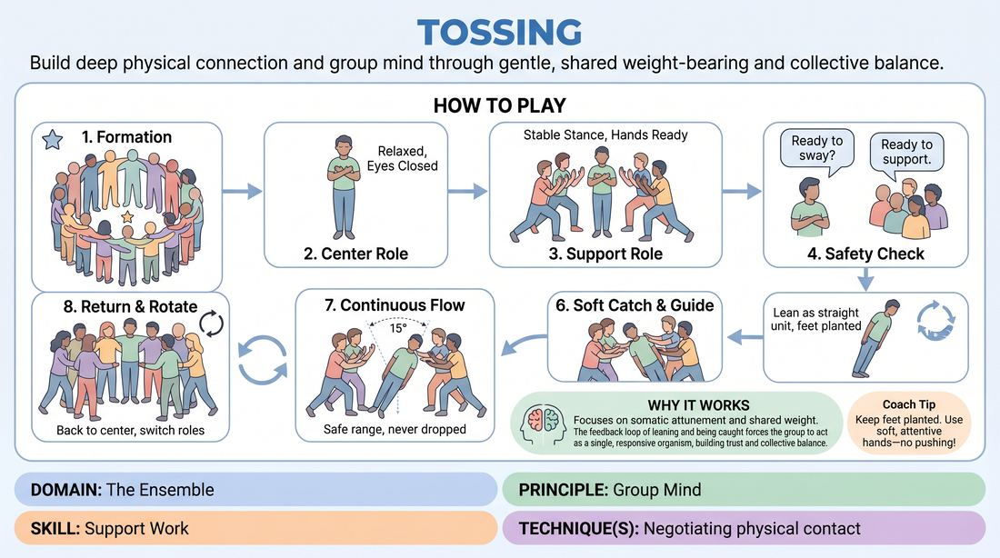{ .cat-game-img loading=lazy }

[Open full game card »](../D4_P1_S2_T0_G1341__tossing.md){target=_blank rel=noopener}

### The Memory Cauldron

{ .cat-game-img loading=lazy }

[Open full game card »](../D4_P1_S2_T0_G667__circle-of-awesome.md){target=_blank rel=noopener}

### The Welcome Ovation

{ .cat-game-img loading=lazy }

[Open full game card »](../D4_P1_S2_T0_G777__name-and-applause.md){target=_blank rel=noopener}

### Vocal Symphony

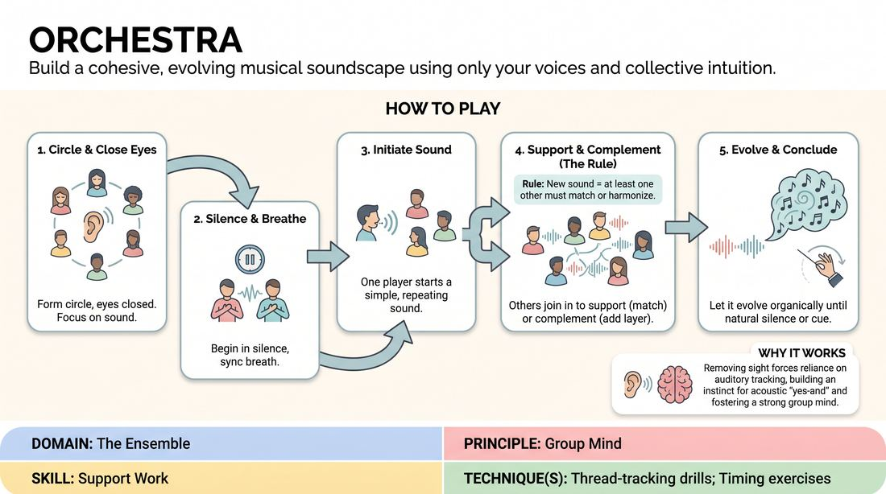{ .cat-game-img loading=lazy }

[Open full game card »](../D4_P1_S2_T0_G788__orchestra.md){target=_blank rel=noopener}

### You're Amazing

{ .cat-game-img loading=lazy }

[Open full game card »](../D4_P1_S2_T0_G909__you-re-amazing.md){target=_blank rel=noopener}

## Walk-ons

### Instant Support Rush

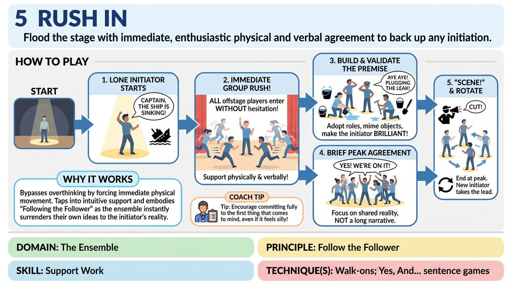{ .cat-game-img loading=lazy }

[Open full game card »](../D4_P2_S2_T1_G622__5-rush-in.md){target=_blank rel=noopener}

### Streaming Queue

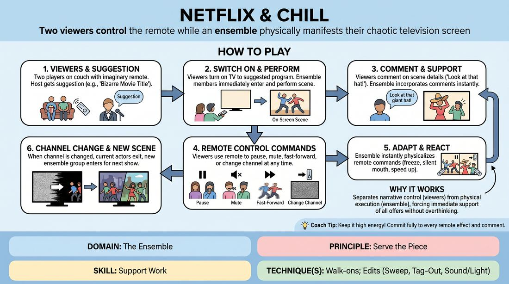{ .cat-game-img loading=lazy }

[Open full game card »](../D4_P3_S2_T1_G780__netflix-chill.md){target=_blank rel=noopener}

### The Interloper

{ .cat-game-img loading=lazy }

[Open full game card »](../D4_P3_S2_T1_G741__interloper.md){target=_blank rel=noopener}

## Tap-ins

### Character Relay

{ .cat-game-img loading=lazy }

[Open full game card »](../D4_P1_S2_T2_G1277__simple-continuation.md){target=_blank rel=noopener}

### Echo Tag

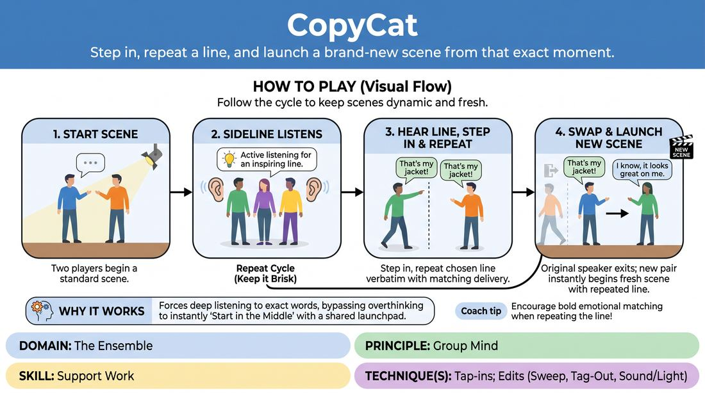{ .cat-game-img loading=lazy }

[Open full game card »](../D4_P1_S2_T2_G1002__copycat.md){target=_blank rel=noopener}

### Freeze Tag

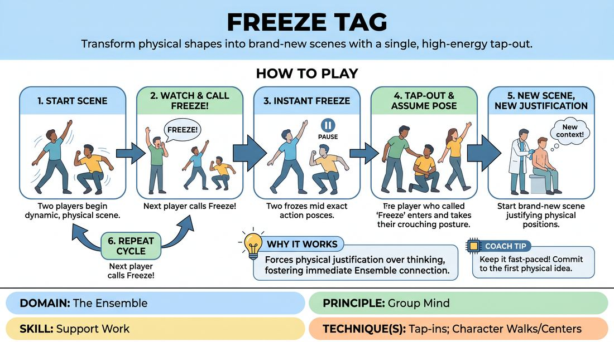{ .cat-game-img loading=lazy }

[Open full game card »](../D4_P1_S2_T2_G1084__freeze-tag.md){target=_blank rel=noopener}

### Greatest Hits

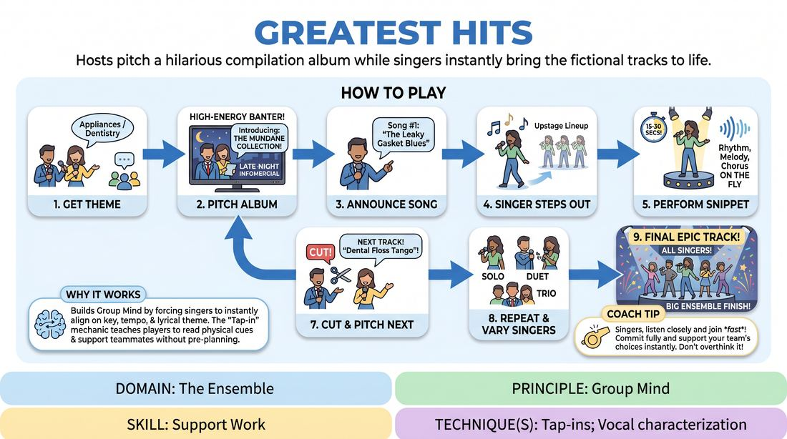{ .cat-game-img loading=lazy }

[Open full game card »](../D4_P1_S2_T2_G720__greatest-hits.md){target=_blank rel=noopener}

### Hot Spot

{ .cat-game-img loading=lazy }

[Open full game card »](../D4_P1_S2_T2_G1123__hot-spot.md){target=_blank rel=noopener}

### Hot Spot

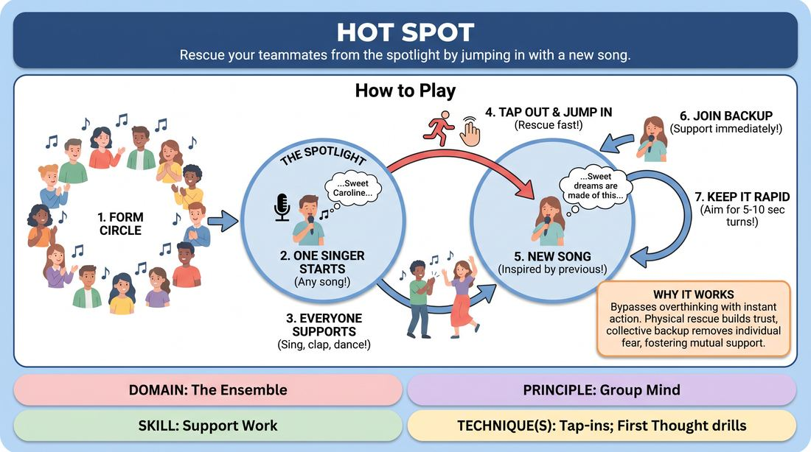{ .cat-game-img loading=lazy }

[Open full game card »](../D4_P1_S2_T2_G728__hot-spot.md){target=_blank rel=noopener}

### Shared Monologue

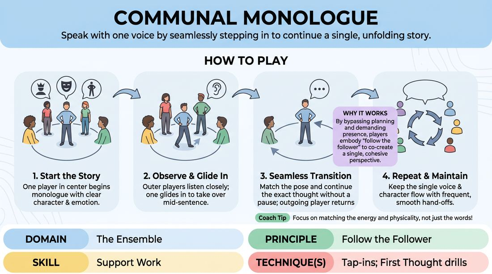{ .cat-game-img loading=lazy }

[Open full game card »](../D4_P2_S2_T2_G996__communal-monologue.md){target=_blank rel=noopener}

### Stunt Double

{ .cat-game-img loading=lazy }

[Open full game card »](../D4_P3_S2_T2_G1307__stunt-double.md){target=_blank rel=noopener}

## Playing architecture/objects

### Bippity Boppity Build

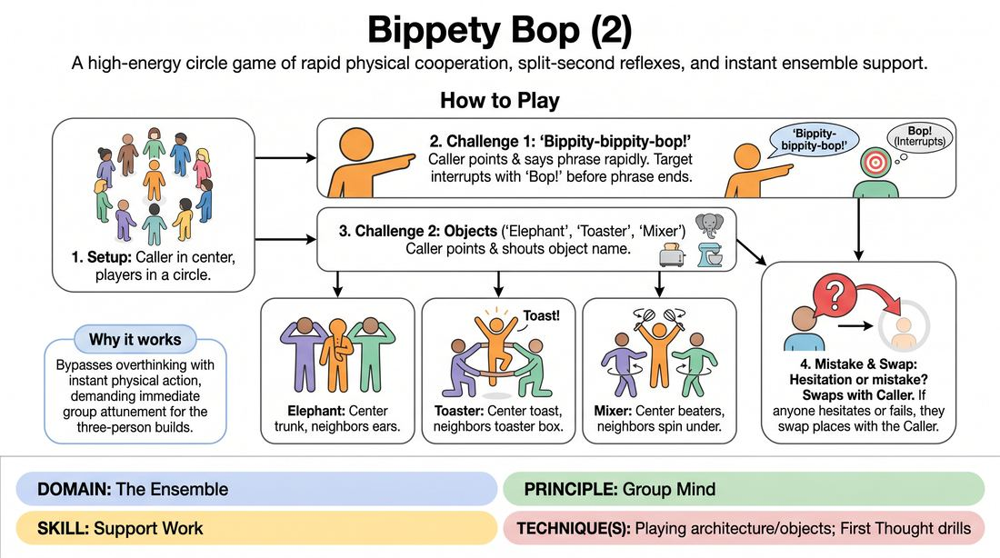{ .cat-game-img loading=lazy }

[Open full game card »](../D4_P1_S2_T3_G958__bippety-bop-2.md){target=_blank rel=noopener}

### Echoed Architecture

{ .cat-game-img loading=lazy }

[Open full game card »](../D4_P1_S2_T3_G328__echo-weave-the-blind-architect-s-blueprint.md){target=_blank rel=noopener}

### Ecosystem

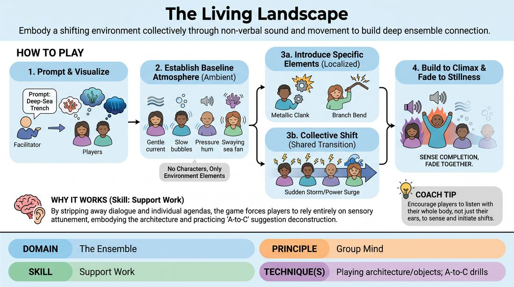{ .cat-game-img loading=lazy }

[Open full game card »](../D4_P1_S2_T3_G569__the-living-landscape.md){target=_blank rel=noopener}

### Ensemble Architecture

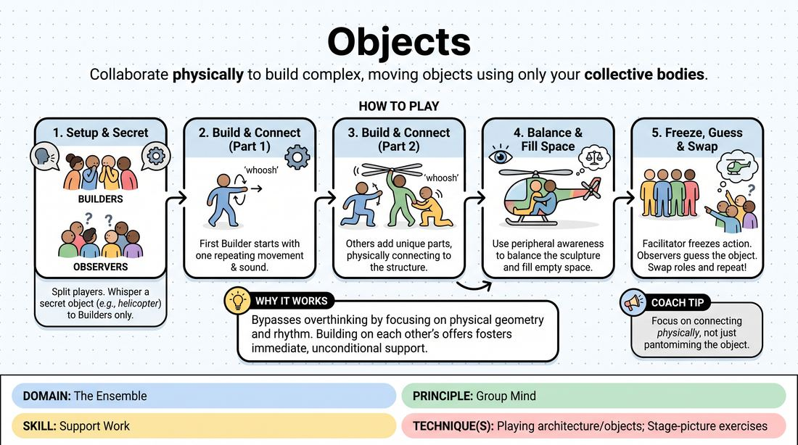{ .cat-game-img loading=lazy }

[Open full game card »](../D4_P1_S2_T3_G1209__objects.md){target=_blank rel=noopener}

### Ensemble Machine

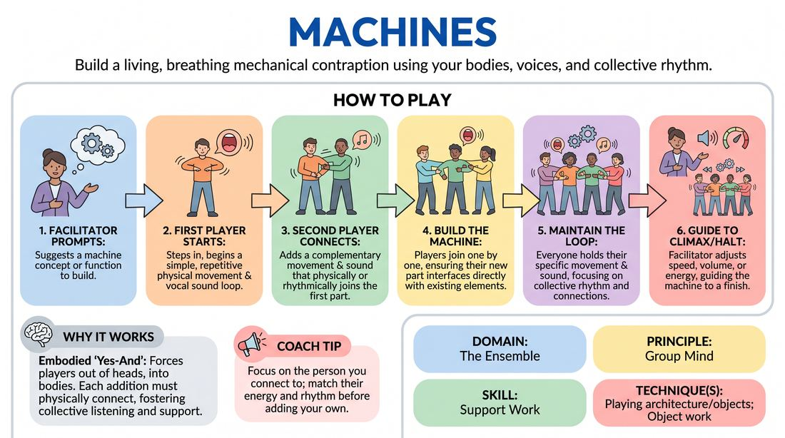{ .cat-game-img loading=lazy }

[Open full game card »](../D4_P1_S2_T3_G1163__machines.md){target=_blank rel=noopener}

### Instant Architecture

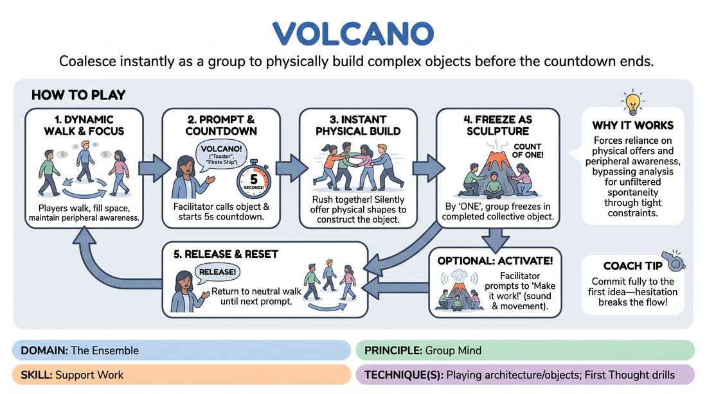{ .cat-game-img loading=lazy }

[Open full game card »](../D4_P1_S2_T3_G881__volcano.md){target=_blank rel=noopener}

### Living Props

{ .cat-game-img loading=lazy }

[Open full game card »](../D4_P1_S2_T3_G1126__human-props.md){target=_blank rel=noopener}

### Living Props

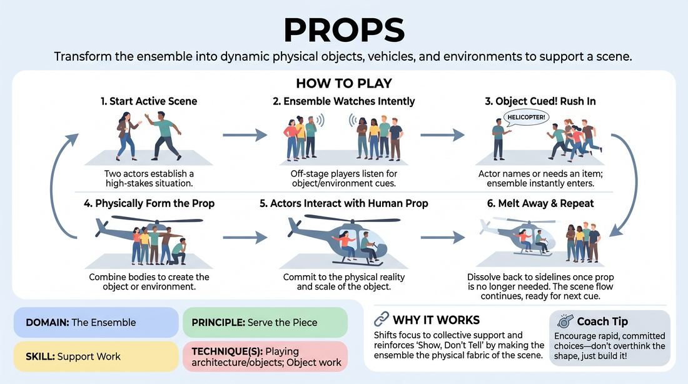{ .cat-game-img loading=lazy }

[Open full game card »](../D4_P3_S2_T3_G812__props.md){target=_blank rel=noopener}

### Pop-Up Book

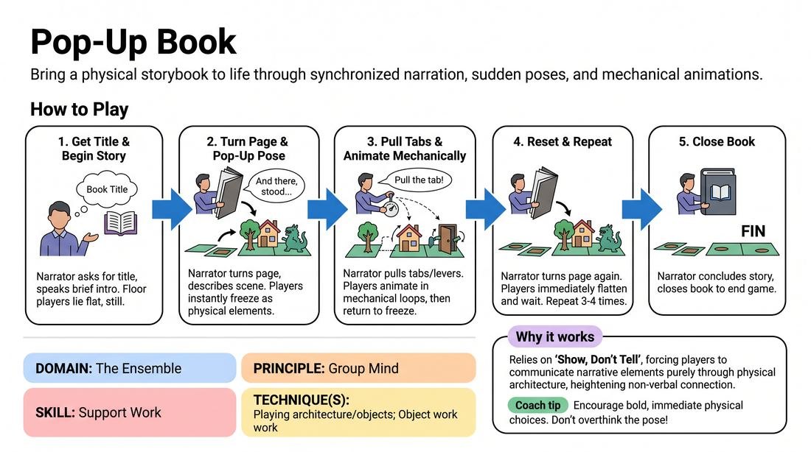{ .cat-game-img loading=lazy }

[Open full game card »](../D4_P1_S2_T3_G808__pop-up-book.md){target=_blank rel=noopener}

### Pop-Up Storybook

{ .cat-game-img loading=lazy }

[Open full game card »](../D4_P1_S2_T3_G1238__pop-up-storybook.md){target=_blank rel=noopener}

### Reality Architects

{ .cat-game-img loading=lazy }

[Open full game card »](../D4_P1_S2_T3_G224__reality-forgers-collaborative-world-building-with-zoom-featu.md){target=_blank rel=noopener}

### Symbiotic Environments

{ .cat-game-img loading=lazy }

[Open full game card »](../D4_P1_S2_T3_G049__threaded-architecture.md){target=_blank rel=noopener}

### The Human Machine

{ .cat-game-img loading=lazy }

[Open full game card »](../D4_P1_S2_T3_G763__machine.md){target=_blank rel=noopener}

### The Living Atmosphere

{ .cat-game-img loading=lazy }

[Open full game card »](../D4_P1_S2_T3_G241__the-echoing-environment.md){target=_blank rel=noopener}

### The Living Canvas

{ .cat-game-img loading=lazy }

[Open full game card »](../D4_P1_S2_T3_G492__the-confluence-canvas.md){target=_blank rel=noopener}

### Three-Part Tableau

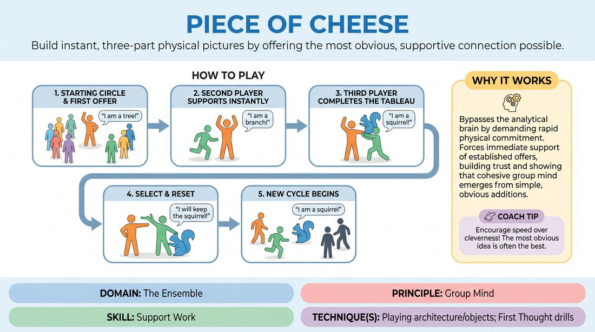{ .cat-game-img loading=lazy }

[Open full game card »](../D4_P1_S2_T3_G802__piece-of-cheese.md){target=_blank rel=noopener}

