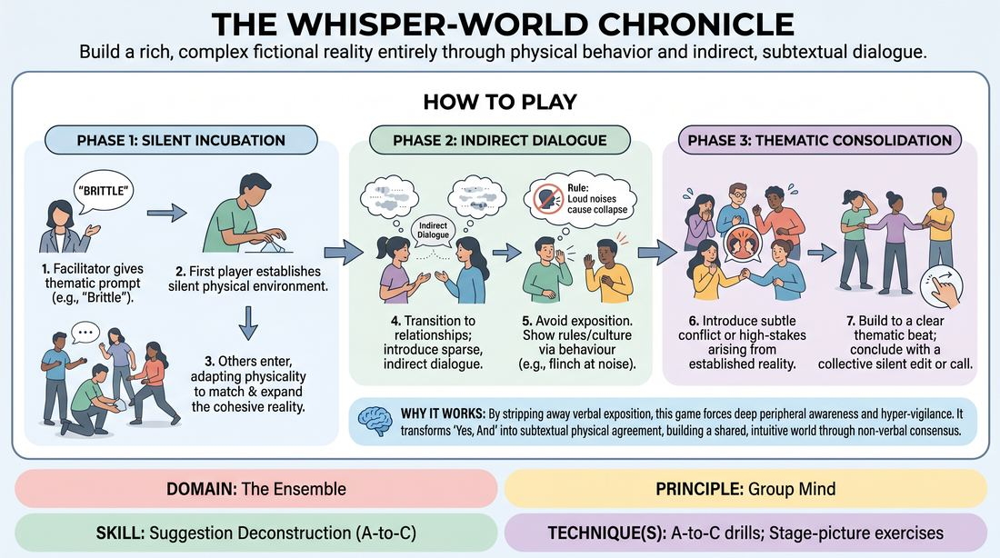
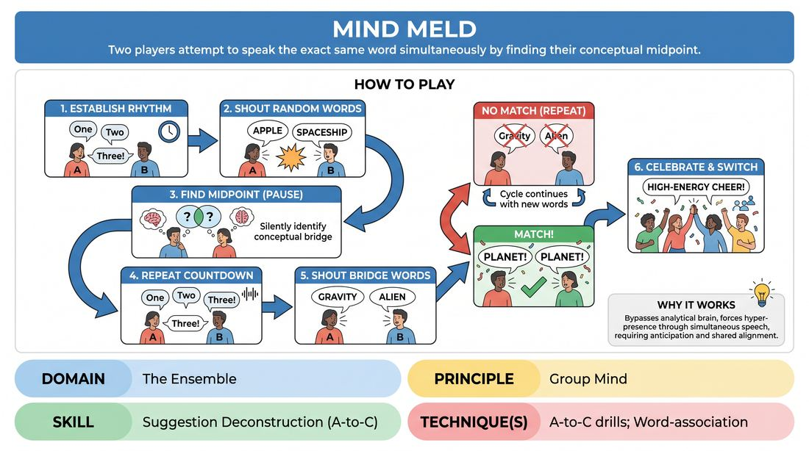
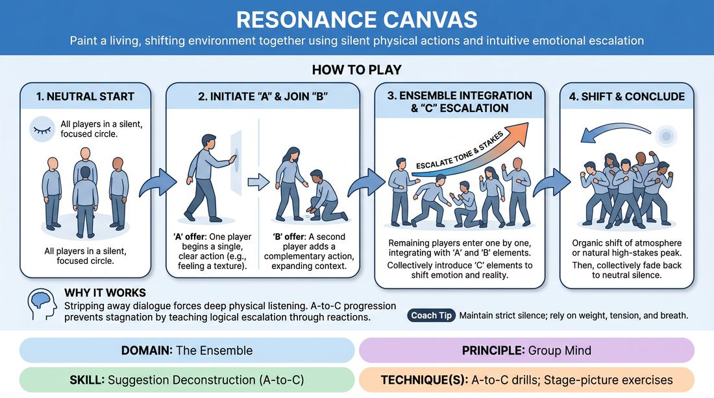
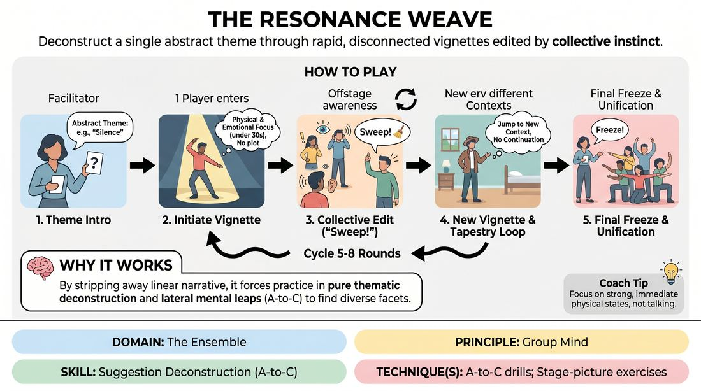
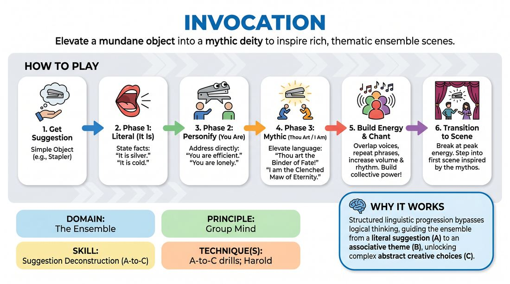
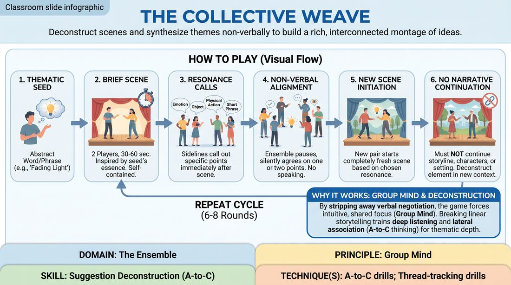
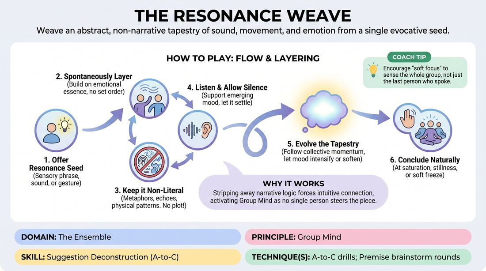
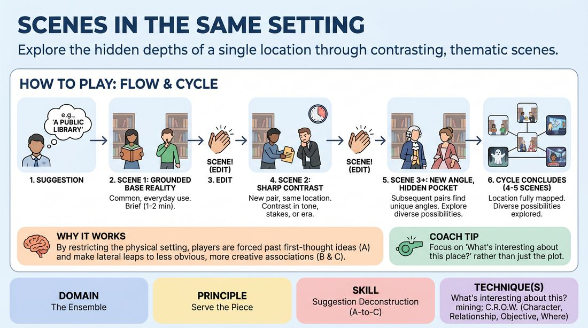

# 🎲 Suggestion Deconstruction (A-to-C) — games

Games whose primary skill is **Suggestion Deconstruction (A-to-C)** (`D4.S3`), grouped by technique. Full faceted search on the [Games List](../index.md).

## A-to-C drills

### Echoes of the Unspoken

{ .cat-game-img loading=lazy }

[Open full game card »](../D4_P1_S3_T1_G481__the-whisper-world-chronicle.md){target=_blank rel=noopener}

### Mind Meld

{ .cat-game-img loading=lazy }

[Open full game card »](../D4_P1_S3_T1_G769__mind-meld.md){target=_blank rel=noopener}

### Polarity Shift

{ .cat-game-img loading=lazy }

[Open full game card »](../D4_P1_S3_T1_G573__the-conceptual-catalyst.md){target=_blank rel=noopener}

### Resonance Canvas

{ .cat-game-img loading=lazy }

[Open full game card »](../D4_P1_S3_T1_G561__resonance-canvas.md){target=_blank rel=noopener}

### Symphony of Sentience

{ .cat-game-img loading=lazy }

[Open full game card »](../D4_P1_S3_T1_G096__the-symphony-of-sentience.md){target=_blank rel=noopener}

### The Essence Weave

{ .cat-game-img loading=lazy }

[Open full game card »](../D4_P1_S3_T1_G347__the-resonance-weave.md){target=_blank rel=noopener}

### The Invocation

{ .cat-game-img loading=lazy }

[Open full game card »](../D4_P1_S3_T1_G1136__invocation.md){target=_blank rel=noopener}

### The Resonance Canvas

{ .cat-game-img loading=lazy }

[Open full game card »](../D4_P1_S3_T1_G235__the-resonance-canvas.md){target=_blank rel=noopener}

### The Resonance Tapestry

{ .cat-game-img loading=lazy }

[Open full game card »](../D4_P1_S3_T1_G470__the-collective-weave.md){target=_blank rel=noopener}

### The Resonance Weave

{ .cat-game-img loading=lazy }

[Open full game card »](../D4_P1_S3_T1_G582__the-resonance-weave.md){target=_blank rel=noopener}

## Premise brainstorm rounds

### Premise Kaleidoscope

{ .cat-game-img loading=lazy }

[Open full game card »](../D4_P1_S3_T2_G384__deep-dive-premise-weave.md){target=_blank rel=noopener}

## What's interesting about this? mining

### Setting Kaleidoscope

{ .cat-game-img loading=lazy }

[Open full game card »](../D4_P3_S3_T3_G831__scenes-in-the-same-setting.md){target=_blank rel=noopener}

