# 🎲 Thematic Synthesis — games

Games whose primary skill is **Thematic Synthesis** (`D4.S5`), grouped by technique. Full faceted search on the [Games List](../index.md).

## Callbacks & Mapping

### Resonance Ripples

{ .cat-game-img loading=lazy }

[Open full game card »](../D4_P3_S5_T1_G441__ripple-effect-storytelling.md){target=_blank rel=noopener}

### Resonant Threads

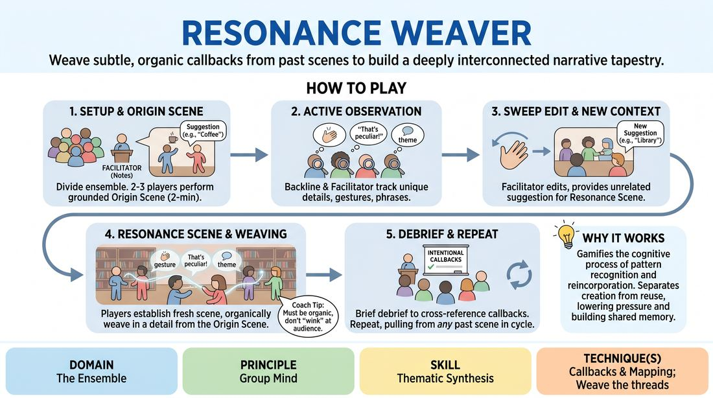{ .cat-game-img loading=lazy }

[Open full game card »](../D4_P1_S5_T1_G517__resonance-weaver.md){target=_blank rel=noopener}

### Synthesis Freeze

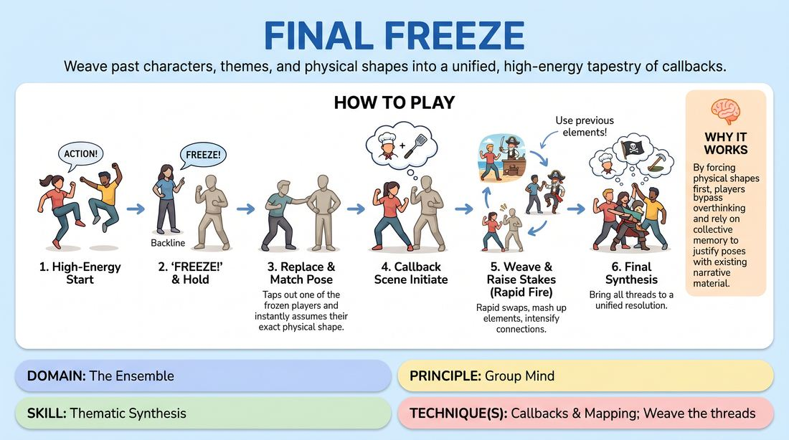{ .cat-game-img loading=lazy }

[Open full game card »](../D4_P1_S5_T1_G1065__final-freeze.md){target=_blank rel=noopener}

### The Conscious Universe

{ .cat-game-img loading=lazy }

[Open full game card »](../D4_P1_S5_T1_G212__the-ensemble-s-deep-dive.md){target=_blank rel=noopener}

### Thematic Architects

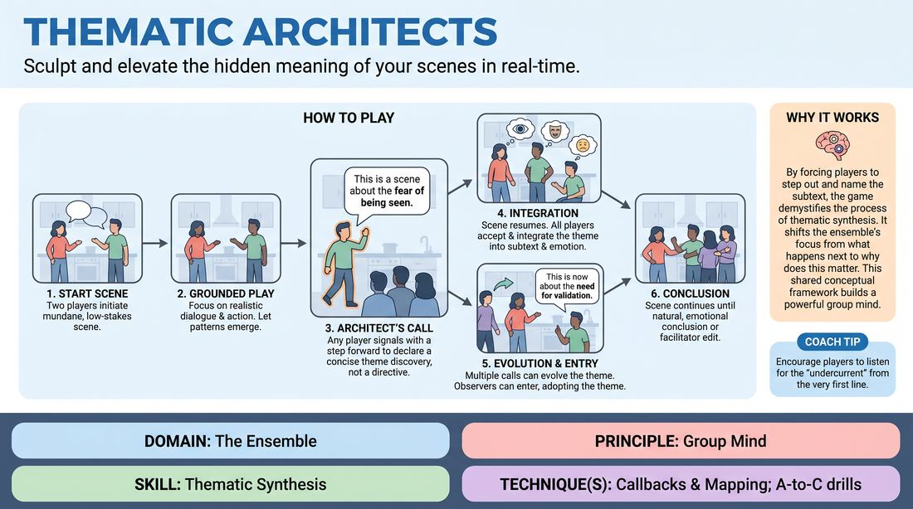{ .cat-game-img loading=lazy }

[Open full game card »](../D4_P1_S5_T1_G075__thematic-architects.md){target=_blank rel=noopener}

## Weave the threads

### Braided Narratives

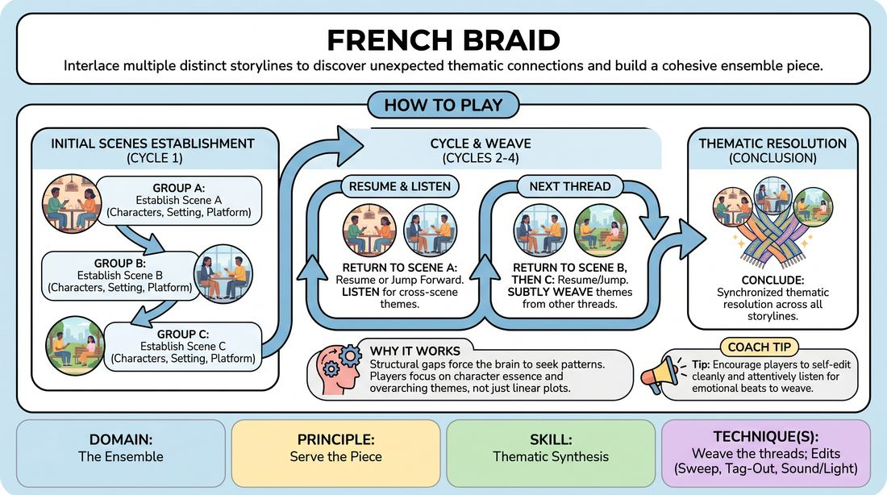{ .cat-game-img loading=lazy }

[Open full game card »](../D4_P3_S5_T2_G1085__french-braid.md){target=_blank rel=noopener}

### Channel Surfing

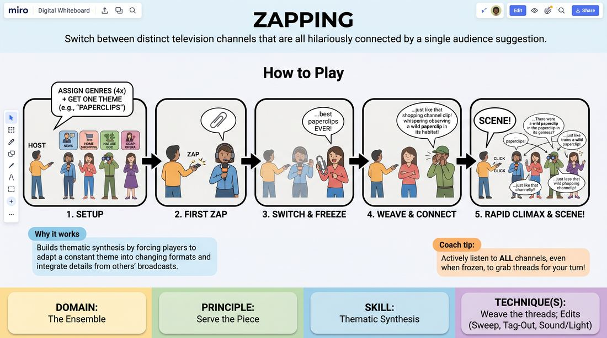{ .cat-game-img loading=lazy }

[Open full game card »](../D4_P3_S5_T2_G1381__zapping.md){target=_blank rel=noopener}

### Cocktail Party

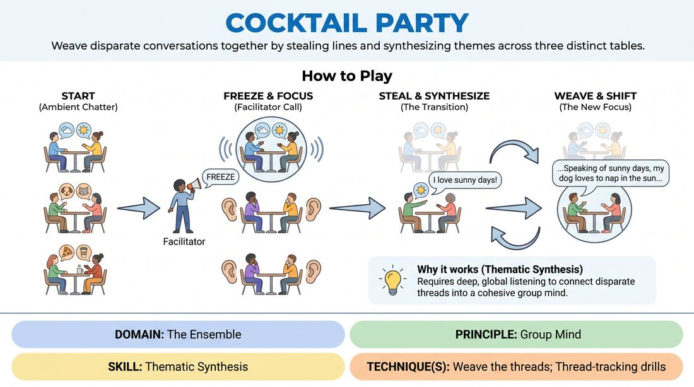{ .cat-game-img loading=lazy }

[Open full game card »](../D4_P1_S5_T2_G671__cocktail-party.md){target=_blank rel=noopener}

### Deconstruction

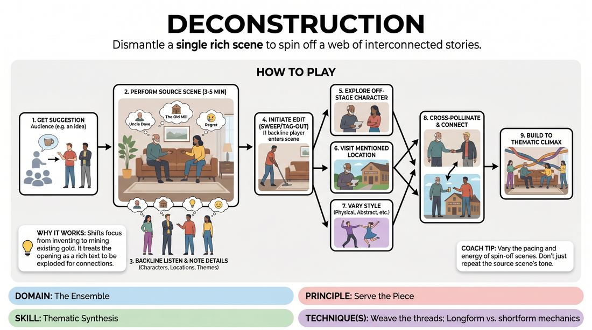{ .cat-game-img loading=lazy }

[Open full game card »](../D4_P3_S5_T2_G1016__deconstruction.md){target=_blank rel=noopener}

### Departed Voices

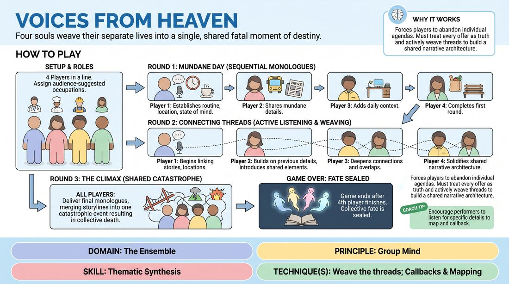{ .cat-game-img loading=lazy }

[Open full game card »](../D4_P1_S5_T2_G1353__voices-from-heaven.md){target=_blank rel=noopener}

### Echo Weave

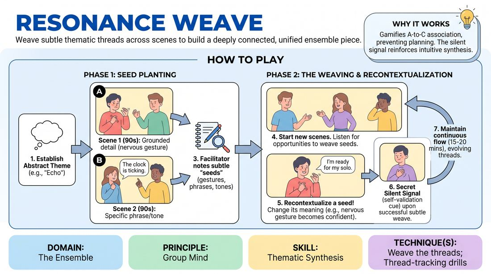{ .cat-game-img loading=lazy }

[Open full game card »](../D4_P1_S5_T2_G377__resonance-weave.md){target=_blank rel=noopener}

### Echoes of the Valley

{ .cat-game-img loading=lazy }

[Open full game card »](../D4_P3_S5_T2_G1098__goon-river.md){target=_blank rel=noopener}

### Emergent Landscapes

{ .cat-game-img loading=lazy }

[Open full game card »](../D4_P1_S5_T2_G170__the-emergent-landscape.md){target=_blank rel=noopener}

### Five-Four-Three-Two-One

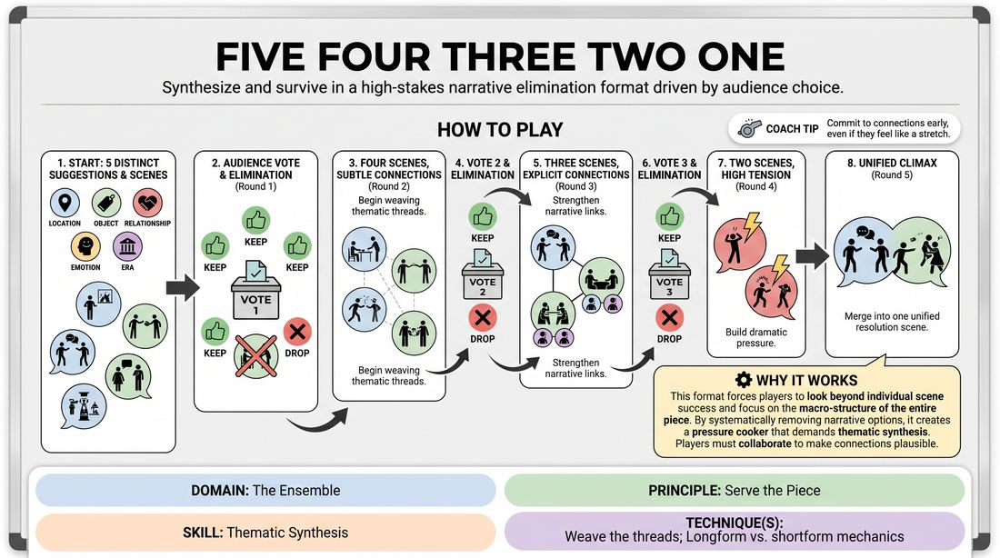{ .cat-game-img loading=lazy }

[Open full game card »](../D4_P3_S5_T2_G1069__five-four-three-two-one.md){target=_blank rel=noopener}

### Nested Epochs

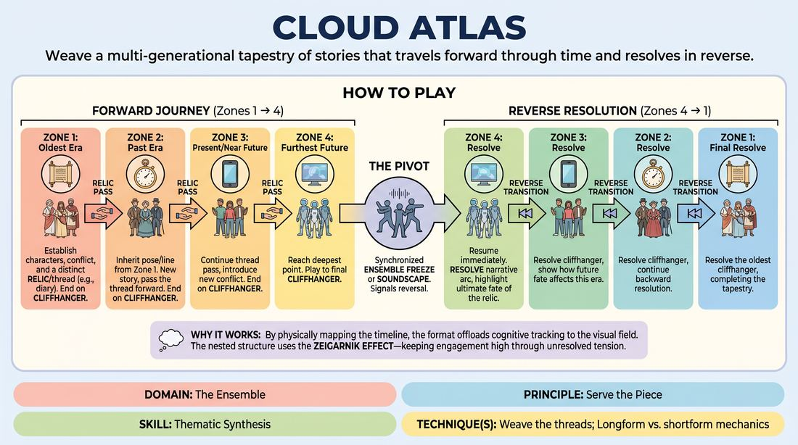{ .cat-game-img loading=lazy }

[Open full game card »](../D4_P3_S5_T2_G991__cloud-atlas.md){target=_blank rel=noopener}

### Parallel Realities

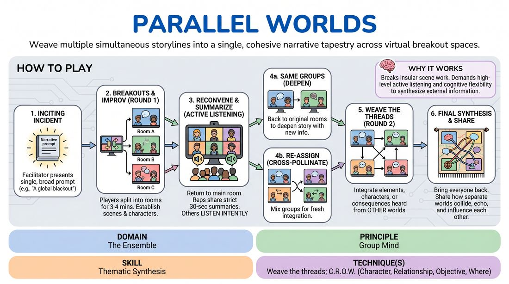{ .cat-game-img loading=lazy }

[Open full game card »](../D4_P1_S5_T2_G476__parallel-worlds.md){target=_blank rel=noopener}

### Resonant Tapestry

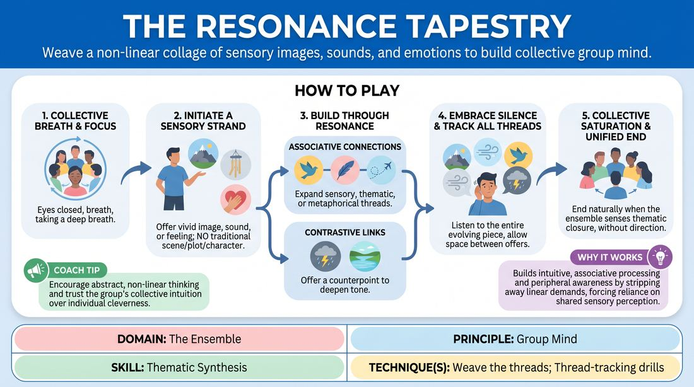{ .cat-game-img loading=lazy }

[Open full game card »](../D4_P1_S5_T2_G304__the-resonance-tapestry.md){target=_blank rel=noopener}

### Resonant Threads

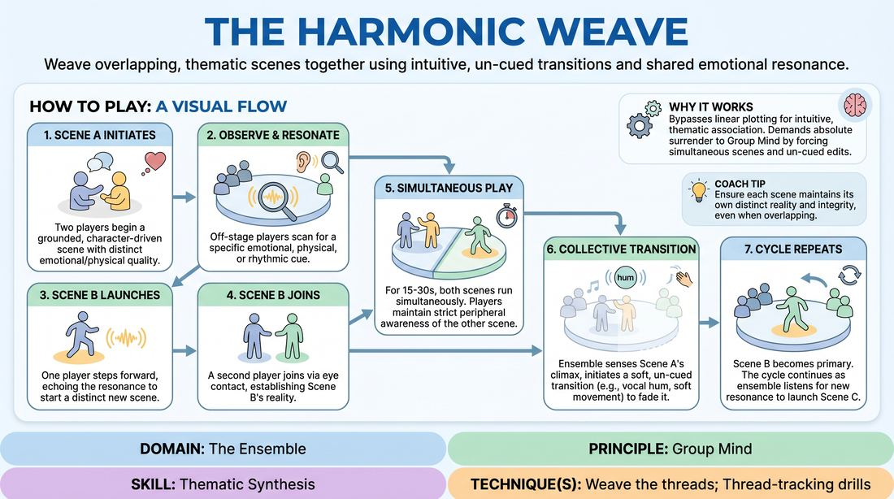{ .cat-game-img loading=lazy }

[Open full game card »](../D4_P1_S5_T2_G423__the-harmonic-weave.md){target=_blank rel=noopener}

### The Conceptual Weave

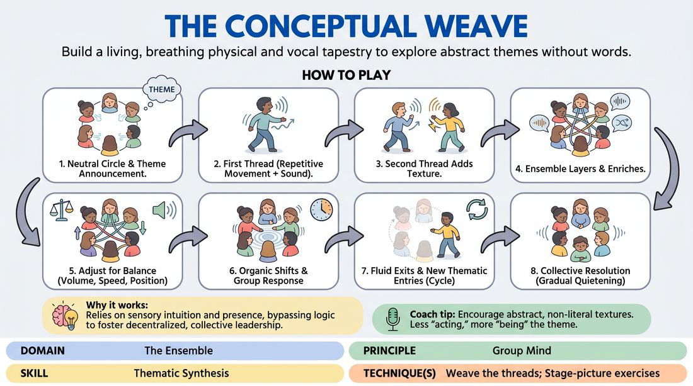{ .cat-game-img loading=lazy }

[Open full game card »](../D4_P1_S5_T2_G315__the-conceptual-weave.md){target=_blank rel=noopener}

### The Crescendo Finale

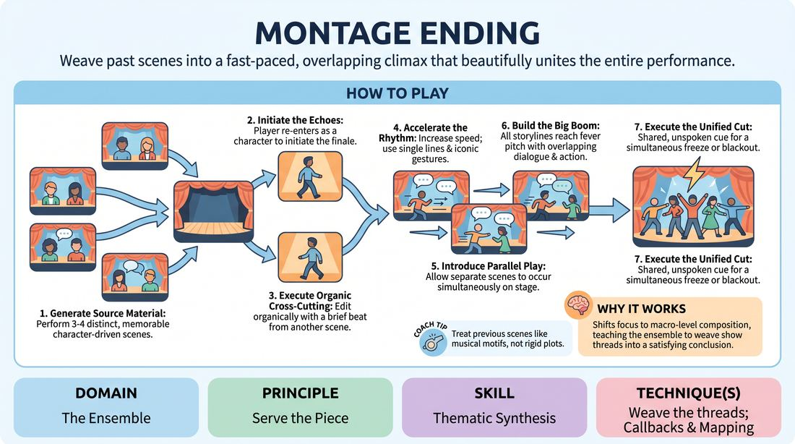{ .cat-game-img loading=lazy }

[Open full game card »](../D4_P3_S5_T2_G1186__montage-ending.md){target=_blank rel=noopener}

### The Echo Chamber Weave

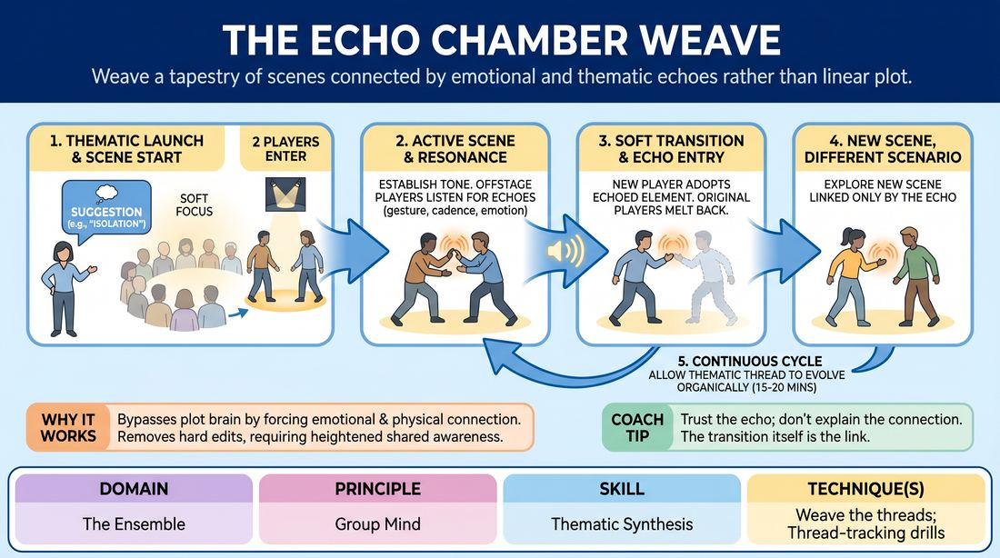{ .cat-game-img loading=lazy }

[Open full game card »](../D4_P1_S5_T2_G436__the-echo-chamber-weave.md){target=_blank rel=noopener}

### The Harmonic Loom

{ .cat-game-img loading=lazy }

[Open full game card »](../D4_P1_S5_T2_G077__the-harmonic-loom.md){target=_blank rel=noopener}

### The Loom

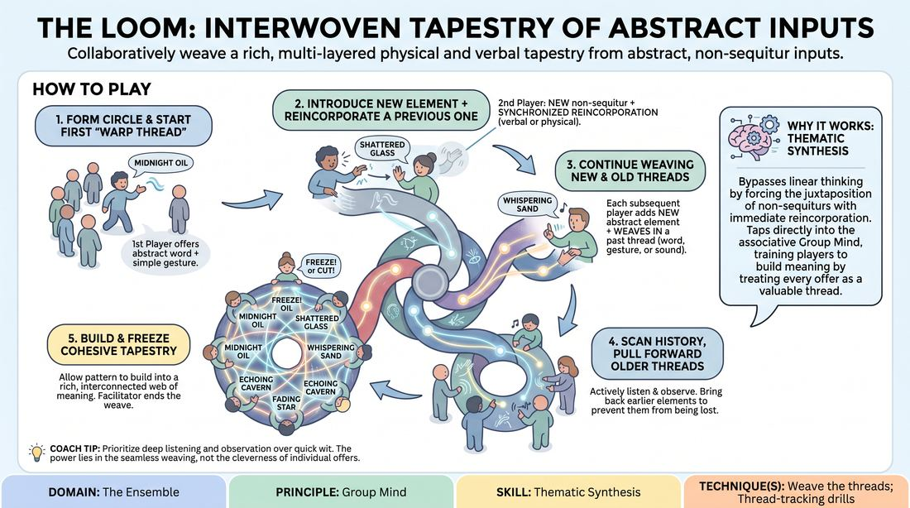{ .cat-game-img loading=lazy }

[Open full game card »](../D4_P1_S5_T2_G283__the-loom-interwoven-tapestry-of-abstract-inputs.md){target=_blank rel=noopener}

### The Loom Room

{ .cat-game-img loading=lazy }

[Open full game card »](../D4_P1_S5_T2_G360__the-loom-room.md){target=_blank rel=noopener}

### The Lotus

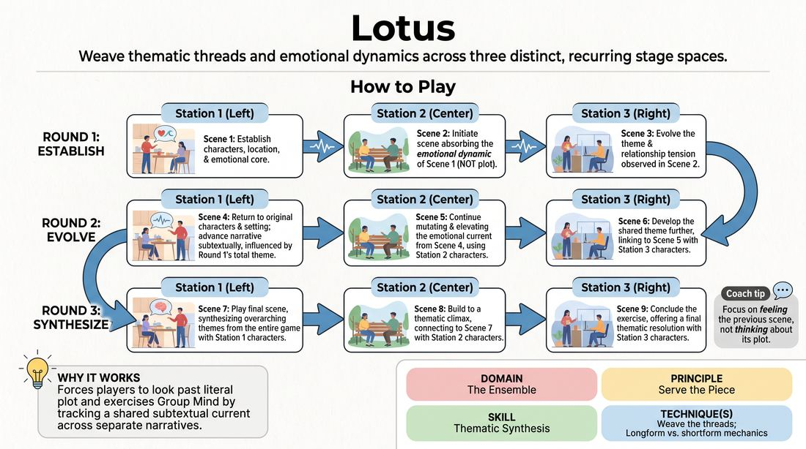{ .cat-game-img loading=lazy }

[Open full game card »](../D4_P3_S5_T2_G1160__lotus.md){target=_blank rel=noopener}

### The Narrative Loom

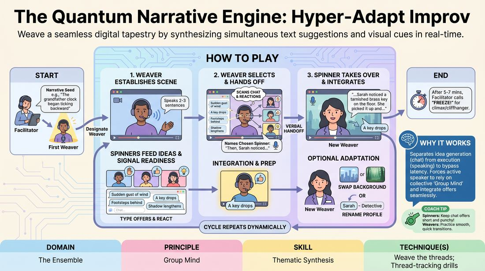{ .cat-game-img loading=lazy }

[Open full game card »](../D4_P1_S5_T2_G543__the-quantum-narrative-engine-hyper-adapt-improv.md){target=_blank rel=noopener}

### The Narrative Weaver

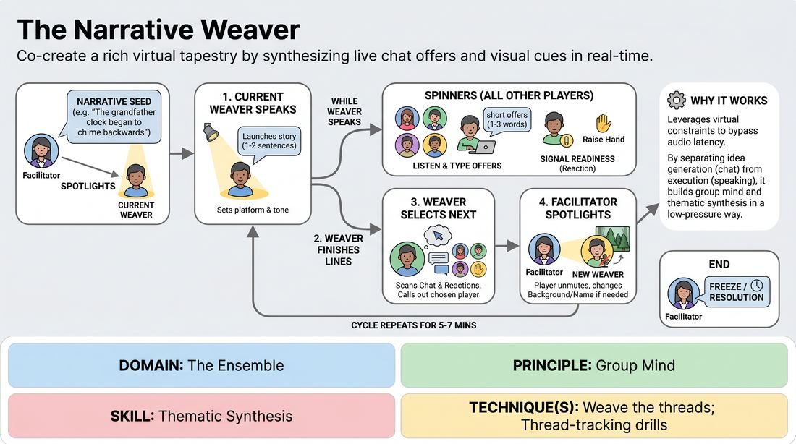{ .cat-game-img loading=lazy }

[Open full game card »](../D4_P1_S5_T2_G535__the-narrative-weaver.md){target=_blank rel=noopener}

### The Resonance Chamber

{ .cat-game-img loading=lazy }

[Open full game card »](../D4_P1_S5_T2_G417__the-resonance-chamber.md){target=_blank rel=noopener}

### The Resonance Engine

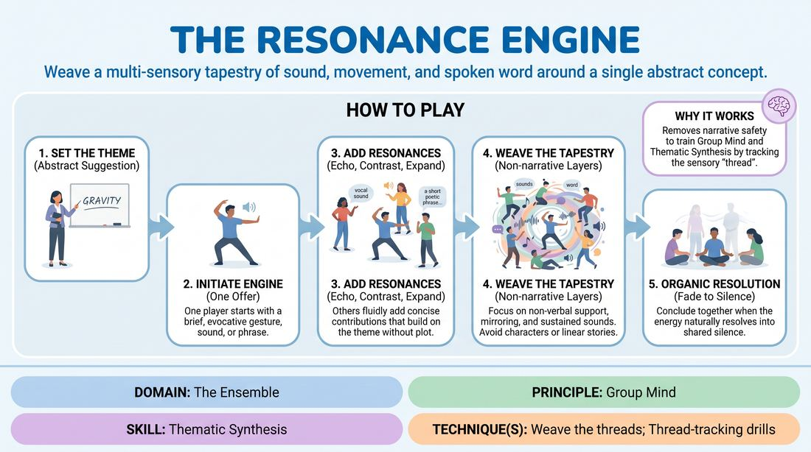{ .cat-game-img loading=lazy }

[Open full game card »](../D4_P1_S5_T2_G220__the-resonance-engine.md){target=_blank rel=noopener}

### The Resonance Loom

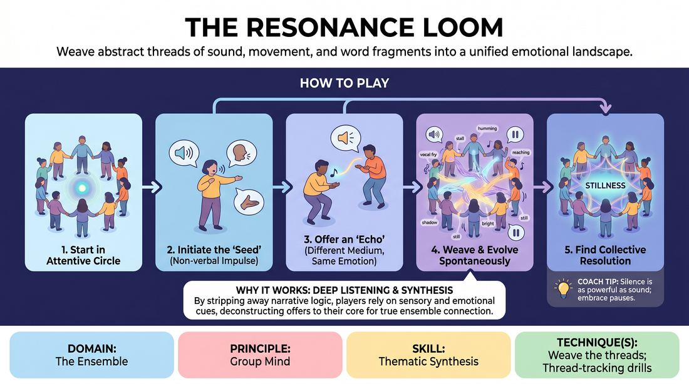{ .cat-game-img loading=lazy }

[Open full game card »](../D4_P1_S5_T2_G341__the-resonance-loom.md){target=_blank rel=noopener}

### The Resonance Weave

{ .cat-game-img loading=lazy }

[Open full game card »](../D4_P1_S5_T2_G085__the-enso-weave.md){target=_blank rel=noopener}

### The Sonic Loom

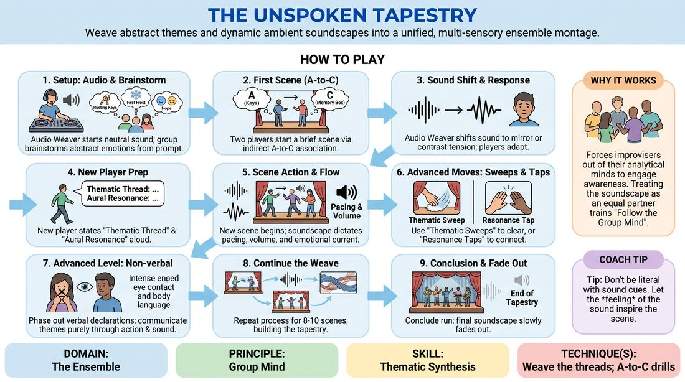{ .cat-game-img loading=lazy }

[Open full game card »](../D4_P1_S5_T2_G151__the-unspoken-tapestry.md){target=_blank rel=noopener}

### The Weaving Finale

{ .cat-game-img loading=lazy }

[Open full game card »](../D4_P3_S5_T2_G1187__montage-song-ending.md){target=_blank rel=noopener}

### Thematic Loom

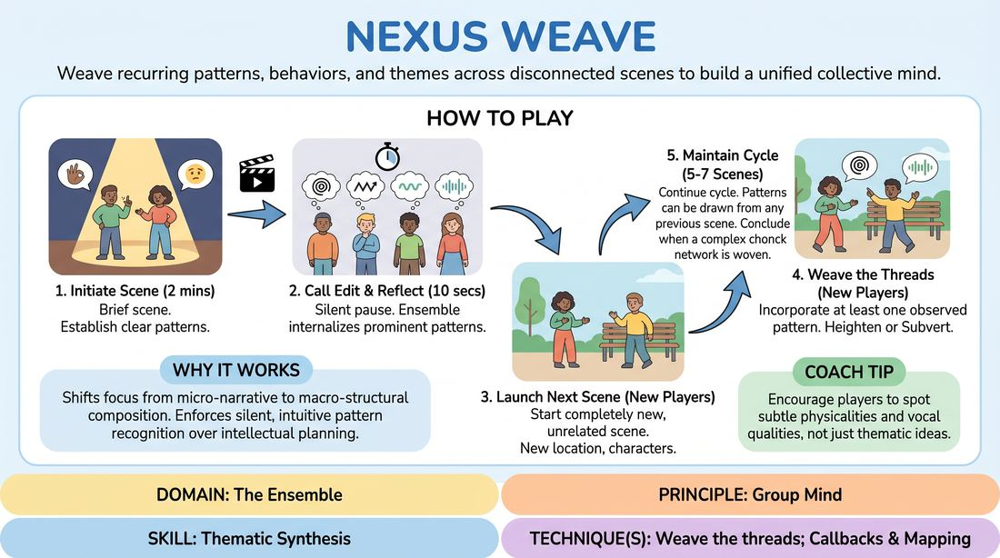{ .cat-game-img loading=lazy }

[Open full game card »](../D4_P1_S5_T2_G426__nexus-weave.md){target=_blank rel=noopener}

### Thematic Resonance Weave

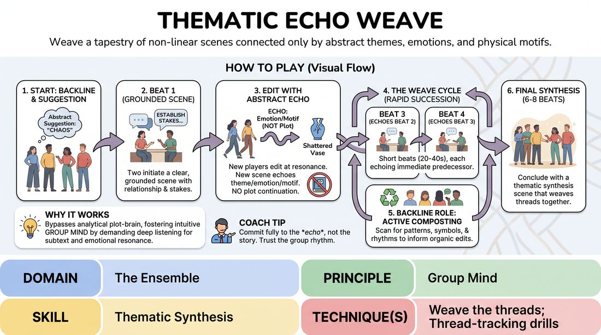{ .cat-game-img loading=lazy }

[Open full game card »](../D4_P1_S5_T2_G558__thematic-echo-weave.md){target=_blank rel=noopener}

### Theme Tapestry

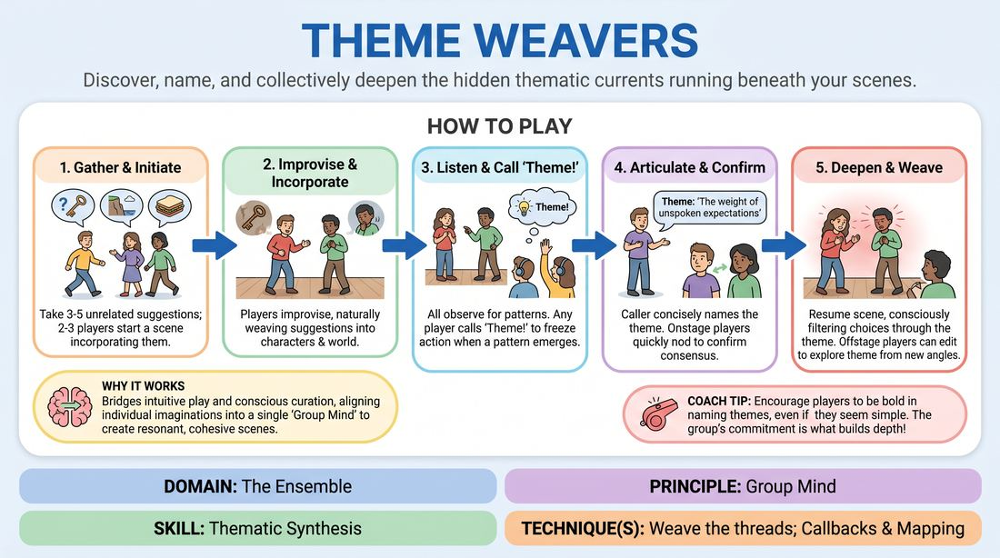{ .cat-game-img loading=lazy }

[Open full game card »](../D4_P1_S5_T2_G254__theme-weavers.md){target=_blank rel=noopener}

### Threaded Solos

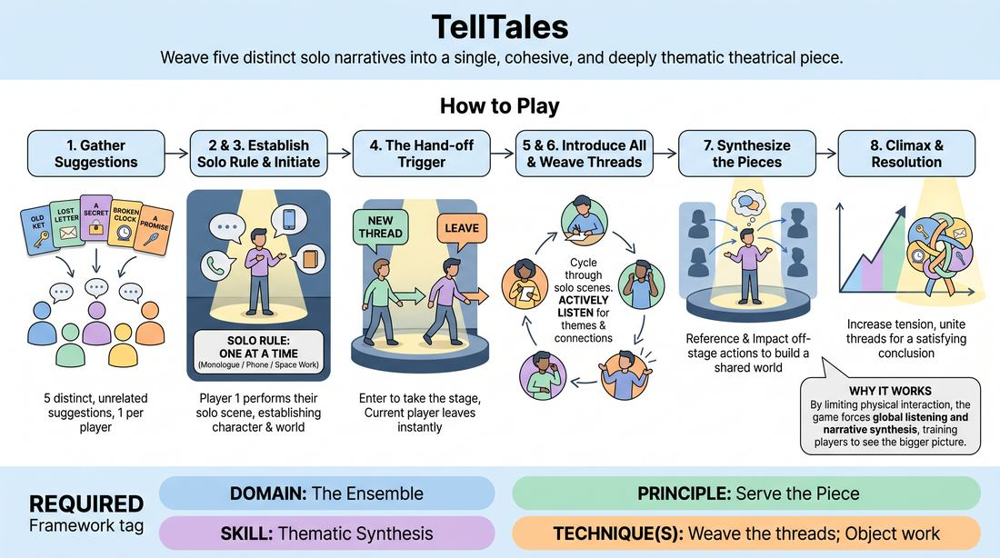{ .cat-game-img loading=lazy }

[Open full game card »](../D4_P3_S5_T2_G1320__telltales.md){target=_blank rel=noopener}

### Township Threads

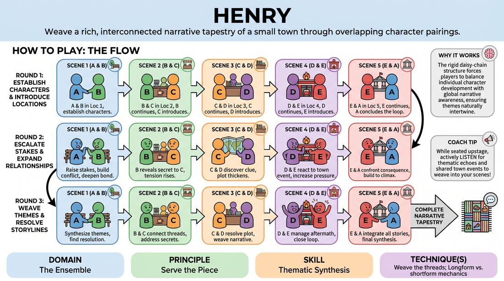{ .cat-game-img loading=lazy }

[Open full game card »](../D4_P3_S5_T2_G725__henry.md){target=_blank rel=noopener}

### Undercurrent Weave

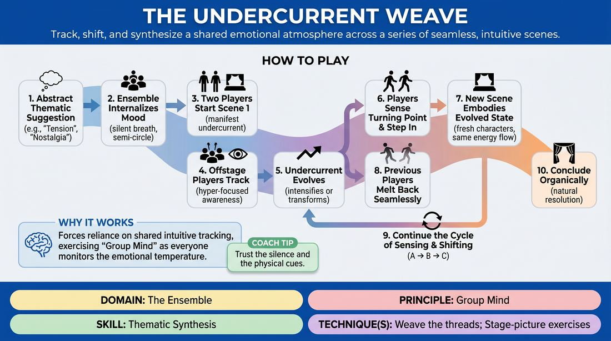{ .cat-game-img loading=lazy }

[Open full game card »](../D4_P1_S5_T2_G263__the-undercurrent-weave.md){target=_blank rel=noopener}

