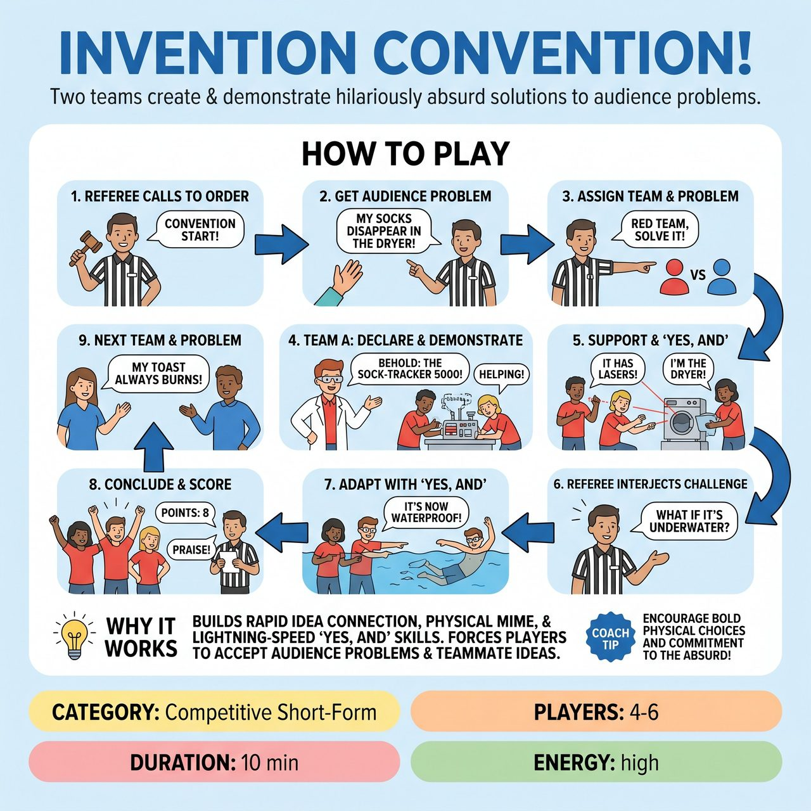

# Invention Convention!

{ .game-hero }

> Two teams of 'inventors' create and demonstrate hilariously absurd solutions to audience-suggested everyday problems.

## Overview
Invention Convention! is an improv game where two teams of 'inventors' create and demonstrate hilariously absurd, yet family-friendly, solutions to audience-suggested everyday problems. Teams rapidly name and physically mime their fantastical inventions, supported by teammates, while a Referee actively interjects with playful, unexpected challenges that force immediate 'Yes, And' adaptation and quick thinking. Teams are scored on ingenuity, demonstration clarity, and adaptability, vying for the 'Golden Gadget' award.

## Setup
Two teams (Red vs. Blue), each with 2-3 players. The Referee stands prominently, holding a clipboard or imaginary 'patent ledger'. A clear playing area is needed for demonstrations.

## How to Play
1. 1. The Referee theatrically calls the 'Invention Convention' to order.
2. 2. The Referee asks the audience for an annoying, everyday problem that technology or common sense has yet to truly solve (e.g., 'My socks disappear in the dryer').
3. 3. The Referee selects the most specific, relatable, and comically frustrating problem and assigns it to either the Red or Blue team.
4. 4. One player from the assigned team steps forward as the primary 'Inventor,' while teammates act as eager 'Assistants.'
5. 5. The Inventor quickly declares the name of their magnificent invention and immediately begins to demonstrate how it works using vivid mime, object work, and energetic descriptions.
6. 6. Teammates actively support the Inventor by 'Yes, And-ing' the description, adding features, operating imaginary parts, or demonstrating the 'before' and 'after' effects.
7. 7. Approximately 15-20 seconds into the demonstration, the Referee interjects with a specific, playful, and often absurd challenge or question related to the invention (e.g., 'But, Inventor! What about its carbon footprint?!').
8. 8. The team must immediately 'Yes, And' this new constraint into their demonstration, proving the invention's surprising versatility or addressing its comedic flaw.
9. 9. The demonstration continues, integrating the Referee's challenge, typically lasting 45-60 seconds, and ends with a flourish or triumphant pose.
10. 10. The Referee praises the team and awards 3-9 points based on Ingenuity & Absurdity, Demonstration Clarity, and Adaptability & 'Yes, And'.
11. 11. The other team then faces a new audience-suggested problem, and the cycle repeats for 5-7 rounds. The team with the highest total points wins the 'Golden Gadget' award.

## Coaching Notes
- The Referee acts as Game Master, Challenger, and Judge, controlling the flow and forcing players to think on their feet with timely, creative challenges.
- Enforce the 'Groaner Foul' (-1 point) if the invention's name or explanation relies on an excessively weak, predictable, or overly-forced pun.
- Enforce the 'Technological Meltdown Foul' (-2 points and an immediate end to their turn) if a team completely fails to accept or address the Referee's challenge, loses character, or has a significant breakdown in their 'Yes, And'.
- Enforce the 'Pre-emptive Patent Foul' (-1 point) if a team tries to start their invention pitch before the Referee officially assigns the problem.
- Encourage active listening; it is crucial for understanding the audience's problem and incorporating the Referee's sudden interventions.
- Emphasize object work and physicality to clearly and comically demonstrate how the imaginary invention works, making the ridiculous tangible.
- Players should fully embody the enthusiastic, slightly mad, but utterly confident persona of a brilliant inventor.

## Why It Works
The game challenges players to rapidly connect disparate ideas, physically manifest the absurd, and pivot with lightning speed. It tests fundamental 'Yes, And' skills by forcing players to accept the audience's problem, their teammates' endowments, and especially the Referee's unexpected challenges, building upon them instantly.

## Safety & Inclusion
Invention Convention! is inherently family-friendly. The focus on inventing solutions to mundane, everyday problems naturally steers the humor towards absurdity and physical comedy rather than mature themes. The explicit content foul ensures a safe environment, penalizing any inappropriate, blue humor, swearing, or innuendo with an immediate -3 points or potential forfeiture of the round.

