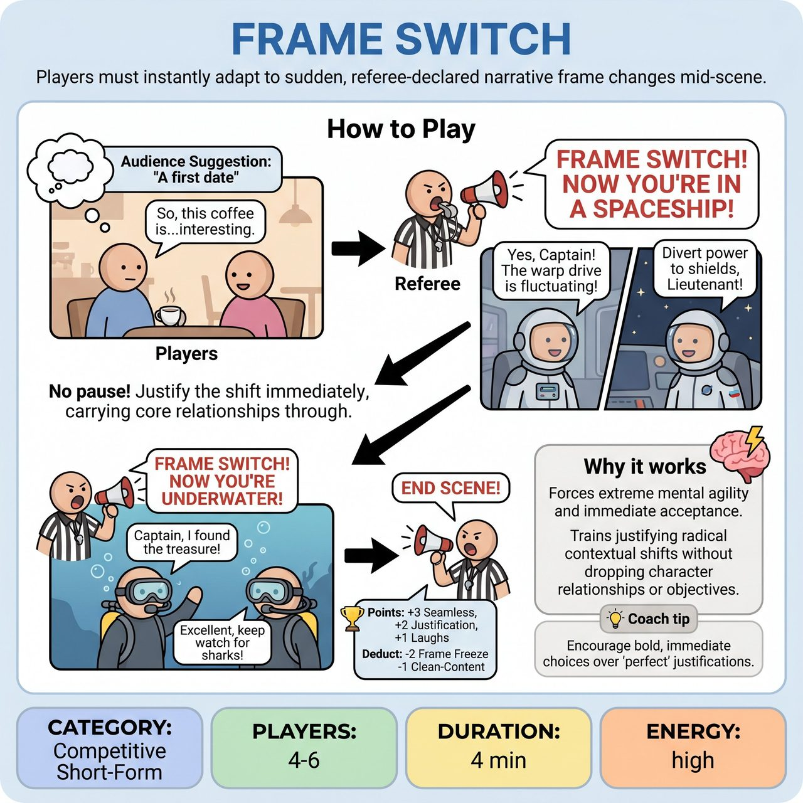

# Frame Switch

{ .game-hero }

> Players must instantly adapt to sudden, referee-declared narrative frame changes mid-scene.

## Overview
In Frame Switch, a scene begins as usual, but at critical, unpredictable moments, the Referee calls out a new narrative frame or context. Players must instantly 'Yes, And' this new reality, justifying the shift within their characters and the ongoing scene.

## Setup
Requires 4-6 players (two teams of 2-3 players each, plus a Referee). All props are mimed. Use a standard competitive short-form match stage configuration. The Referee gets an audience suggestion for a location, two characters/relationship, and a first line.

## How to Play
1. Two players from one team begin a scene based on the audience suggestion.
2. At unpredictable moments, the Referee shouts 'FRAME SWITCH!' and immediately declares a new narrative frame.
3. Players must instantly embrace and justify the new frame within their dialogue, actions, and character choices. There is no pause or discussion.
4. While the frame changes, the core relationship or goal should be carried through and reinterpreted within the new context.
5. The scene continues with the new frame until the Referee calls 'FRAME SWITCH!' again, or calls 'End Scene!'.
6. Award points: +3 for seamless transitions, +2 for strong justification within the frame, +1 for big laughs, and bonus points for bold risks.
7. Deduct points for fouls: -1 for a clean-content foul (blue humor), -1 for a 'Groaner Foul' (bad pun), -2 for a 'Frame Freeze' foul (hesitating or ignoring the new context), and -1 for a 'Context Clash' foul (contradicting the frame without humorous justification).

## Coaching Notes
- Ensure players do not pause or discuss when a frame is called; the change must be instantaneous.
- Keep a list or cards of frames ready. Examples: silent film, video game, rhyming, talking animal, narrating actions, flashback, horror movie, cooking show, slow motion, Shakespeare, commercial.
- Encourage players to maintain their original character dynamics and objectives, just filtered through the new lens.
- Watch for 'Frame Freeze' (hesitation) and 'Context Clash' (contradicting the frame) to enforce the fast-paced, adaptive nature of the game.

## Variations
- Frame Announcer: Instead of the Referee, use a rotating 'Frame Announcer' player from the non-playing team who holds a set of cards to call the switches.

## Why It Works
It forces improvisers to practice extreme mental agility and immediate acceptance, training them to justify radical contextual shifts without dropping their core character relationships or scene objectives.

## Safety & Inclusion
Enforce a standard clean-content foul (-1 point) for any blue humor, swearing, or inappropriate innuendo to maintain a family-friendly, inclusive environment.

