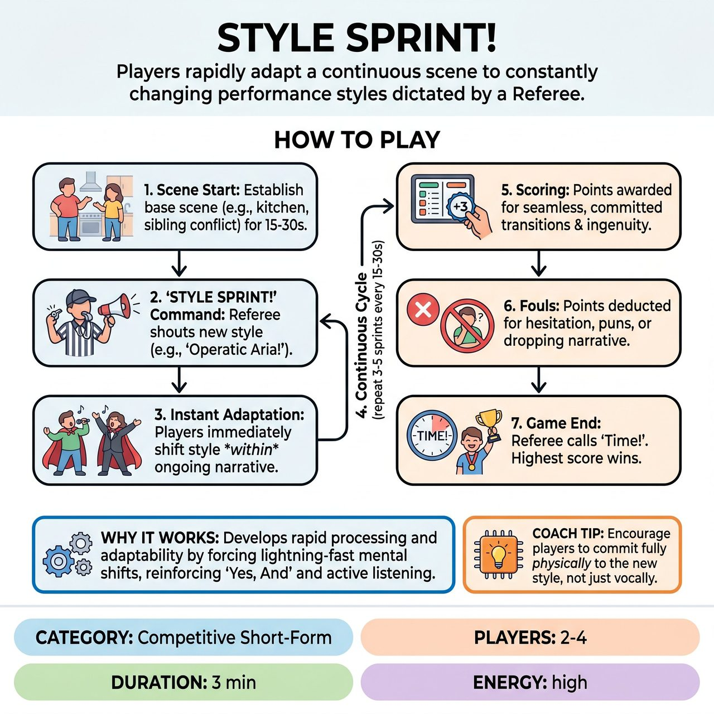

# Style Sprint!

{ .game-hero }

> Players rapidly adapt a continuous scene to constantly changing performance styles dictated by a Referee.

## Overview
Style Sprint! is a competitive improv game where two teams navigate a single, continuous scene based on audience suggestions. A Referee frequently interjects with 'Style Sprint!' commands, instantly altering the performance style (e.g., 'Operatic Aria!', 'Action Movie!'). Players must immediately adapt their dialogue, physicality, and character choices to seamlessly integrate each new style into the ongoing narrative.

## Setup
Four players (two from Team Red, two from Team Blue) take the stage. The Referee asks the audience for a simple scene prompt consisting of a Location, a Relationship between two main characters, and a Simple Conflict/Goal.

## How to Play
1. Scene Start: The Referee declares the location, relationship, and conflict. Players establish the scene naturally for 15-30 seconds, emphasizing strong character introductions and active listening.
2. The Sprint Command: The Referee suddenly shouts 'STYLE SPRINT!' followed by a specific Style Command (e.g., 'Silent Movie!', 'Epic Rap Battle!', 'Action Movie!').
3. Instant Adaptation: Within 1-2 seconds, players must integrate the new style into the ongoing narrative. They do not start a new story; they instantly shift their dialogue, physicality, vocal tone, and character choices to match the style.
4. Continuous Cycle: After 15-30 seconds in the new style, the Referee shouts 'STYLE SPRINT!' with another command. This rapid cycle continues for 3-5 sprints.
5. Scoring: The Referee awards 1-3 points per sprint to teams based on seamless transitions, full commitment, narrative cohesion, and ingenuity.
6. Fouls: The Referee deducts points for pun fouls (bad puns), hesitation, dropping the narrative, or clean-content fouls (inappropriate content).
7. Game End: The Referee shouts 'Time!' to end the scene. The team with the most points on the scoreboard wins.

## Coaching Notes
- The Referee is the primary driver of the game and must deliver clear, energetic Style Commands that ensure variety and escalating challenge.
- Remind players not to invent a new story when the style changes; they must maintain narrative cohesion and justify their actions within the new style.
- Award points explicitly and vocally to individual players' contributions so the audience and teams understand why points are given.
- Watch for hesitation or dropping the narrative. Players should be penalized if they struggle to transition or forget crucial elements of the ongoing story.

## Variations
- Wild Card Suggestion: In a later round, the Referee can solicit one 'Style Command' suggestion directly from the audience (from a pre-vetted list).

## Why It Works
It develops rapid processing and adaptability by forcing lightning-fast mental shifts. It also heavily reinforces 'Yes, And' and active listening, as players must simultaneously accept their partner's offers and the Referee's sudden pivots while maintaining character embodiment and vocal flexibility.

## Safety & Inclusion
The Referee strictly enforces clean-content fouls (immediate -2 points) for any inappropriate language, gestures, or innuendo, briefly stopping the scene to address it. This ensures all content remains family-friendly and relies on skill rather than shock value.

