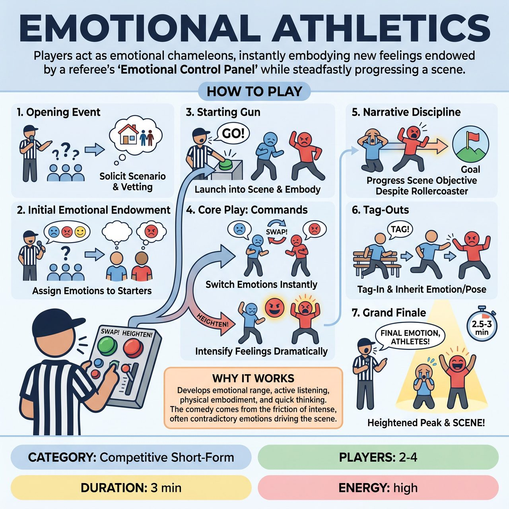

# Emotional Athletics

{ .game-hero }

> Players act as emotional chameleons, instantly embodying new feelings endowed by a referee's 'Emotional Control Panel' while steadfastly progressing a scene.

## Overview
Emotional Athletics is an improvisational game where players perform a scene with emotions that are rapidly endowed, swapped, or dramatically heightened by a referee's command. Players must act as both emotional chameleons and steadfast storytellers, instantly embodying new feelings while courageously striving to progress a central scene objective. The goal is to create comedic brilliance through unpredictable emotional juxtapositions and improvisational fortitude.

## Setup
Two players start on stage with a designated bench area for quick tag-outs. The referee stands at a central station equipped with a fantastical, interactive 'Emotional Control Panel' prop featuring buttons, switches, and levers. Prime the audience for clean, family-friendly suggestions for scenarios and emotions.

## How to Play
1. The Opening Event: The referee solicits a simple, everyday scenario or relationship from the audience, vetting it for clarity and family-friendliness.
2. Initial Emotional Endowment: The referee asks the audience for 2-3 distinct, strong emotions and assigns them to the starting players.
3. The Starting Gun: The referee yells 'GO!' with a dramatic flourish at the panel, and players launch into the scene, embodying their assigned emotions while progressing the scenario's objective.
4. The Core Play: The referee rapidly calls out commands using the panel. 'SWAP!' forces players to instantly switch emotions with each other. 'HEIGHTEN!' makes a player intensify their current emotion (limited to once per emotion). 'NEW EMOTION!' assigns a fresh emotion from the audience or a wildcard list. 'FREEZE!' pauses the action for a brief scene prompt. 'INDIVIDUAL SHIFT!' gives just one player a new emotion.
5. Narrative Discipline: Players must actively strive to progress the underlying objective of the scene despite the emotional roller coaster.
6. Tag-Outs: Players from the bench can tag in, instantly inheriting the exact current emotion, physicality, and context of the character they replace. The referee can also mandate a 'Mid-Match Tag-Out'.
7. The Grand Finale: After 2.5 to 3 minutes, or 5-7 major shifts, the referee calls 'FINAL EMOTION, ATHLETES!' for one last heightened peak, then declares 'SCENE!' or 'GRAND FINALE!'

## Coaching Notes
- Referee as Ultimate Conductor: Be fast, decisive, and loud, using the physical panel prop to emphasize actions and maintain a swift pace.
- Scoring: Award 1-5 points based on seamless transition, total commitment, comedic impact through juxtaposition, physical/vocal embodiment (show, don't tell), and scene advancement.
- Content Foul: Call this for immediate disqualification and point deduction for any inappropriate, vulgar, or non-family-friendly content.
- Execution Foul: Call this and deduct points if a player 'tells' the emotion instead of 'showing' it, mixes up emotions, or stalls the scene's narrative.
- Delay Foul: Call this and deduct points if a player significantly hesitates or struggles to commit instantly to a command.
- Start with broader, clearer emotions and gradually introduce nuanced feelings as players adapt.
- Ensure players use their emotions to serve the story and drive choices, not merely perform them in isolation.

## Why It Works
It develops emotional range, active listening, character adaptability, physical embodiment, and quick thinking. The comedic payoff comes from the friction and juxtaposition of intense, sometimes contradictory emotions driving an otherwise mundane or logical scene objective.

## Safety & Inclusion
Strict audience suggestion vetting, careful selection of emotions (avoiding heavy, complex, or potentially triggering emotions), and the swift, penalizing Content Foul ensure the game remains consistently wholesome and appropriate for all ages.

