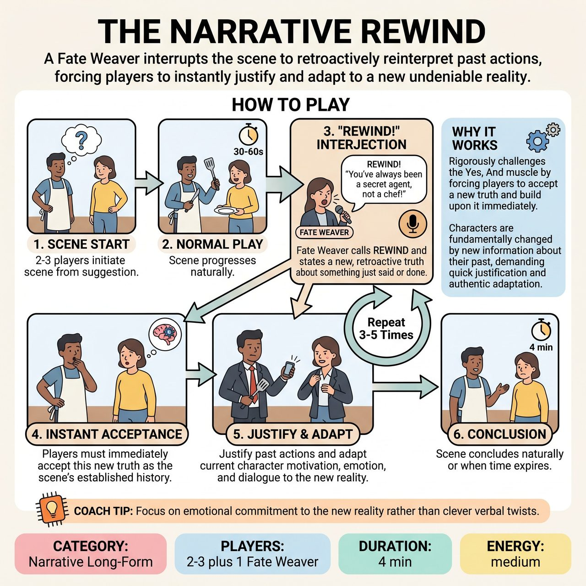

# The Narrative Rewind

{ .game-hero }

> A Fate Weaver interrupts the scene to retroactively reinterpret past actions, forcing players to instantly justify and adapt to a new undeniable reality.

## Overview
The Narrative Rewind is an improvisational game where players collaboratively build a scene, but its past truth is frequently redefined. A Fate Weaver interjects to retroactively reinterpret something just said or done, which players must instantly accept as the new reality. Improvisers then adapt their characters and the scene's direction, justifying past actions in light of this new truth.

## Setup
Designate 2-3 improvisers to perform the scene and one person (typically the Host or a Judge) to act as the Fate Weaver. Get a simple audience suggestion, such as a location, relationship, or object, to begin.

## How to Play
1. Two or three improvisers initiate a scene based on the audience suggestion.
2. The scene plays out normally for approximately 30 to 60 seconds.
3. At any point, the Fate Weaver interjects loudly with the phrase: REWIND!
4. Immediately after calling REWIND, the Fate Weaver delivers a short, declarative statement that reinterprets or reveals a hidden truth about something that has just occurred or been said.
5. The improvisers must instantly accept this statement as having always been true within the scene's history.
6. Players must justify why their previous actions, reactions, or dialogue suddenly make sense in light of this new revelation.
7. Players adapt their character's immediate actions, motivations, emotional state, status, and relationship dynamics, continuing the scene from this altered reality.
8. The Fate Weaver repeats the REWIND intervention 3 to 5 times throughout the scene.
9. The scene concludes when a natural conclusion is reached or the time limit expires.

## Coaching Notes
- The Fate Weaver should control the frequency and impact of the Rewinds to ensure continuous challenge and narrative development.
- Encourage performers to take risks and make definitive initial choices; the stronger the initial action, the more impactful its reinterpretation.
- Remind players that a lack of acceptance or integration from one player hinders the entire scene. They must co-create a new shared reality instantly.
- Active listening is crucial. Players must recall the exact action or line of dialogue being reinterpreted by the Fate Weaver.
- Focus on narrative development over simple gags. Each REWIND is a fundamental plot twist, requiring players to build a story arc that fluidly integrates retroactive truths.

## Why It Works
It rigorously challenges the Yes, And muscle by forcing players to accept a new truth and build upon it immediately. Characters are fundamentally changed by new information about their past, demanding quick justification and authentic adaptation of their entire reality, status, and relationship dynamics.

## Safety & Inclusion
The Fate Weaver should ensure their retroactive reinterpretations respect the physical and emotional boundaries of the players, avoiding twists that force characters into non-consensual, overly aggressive, or unsafe dynamics.

