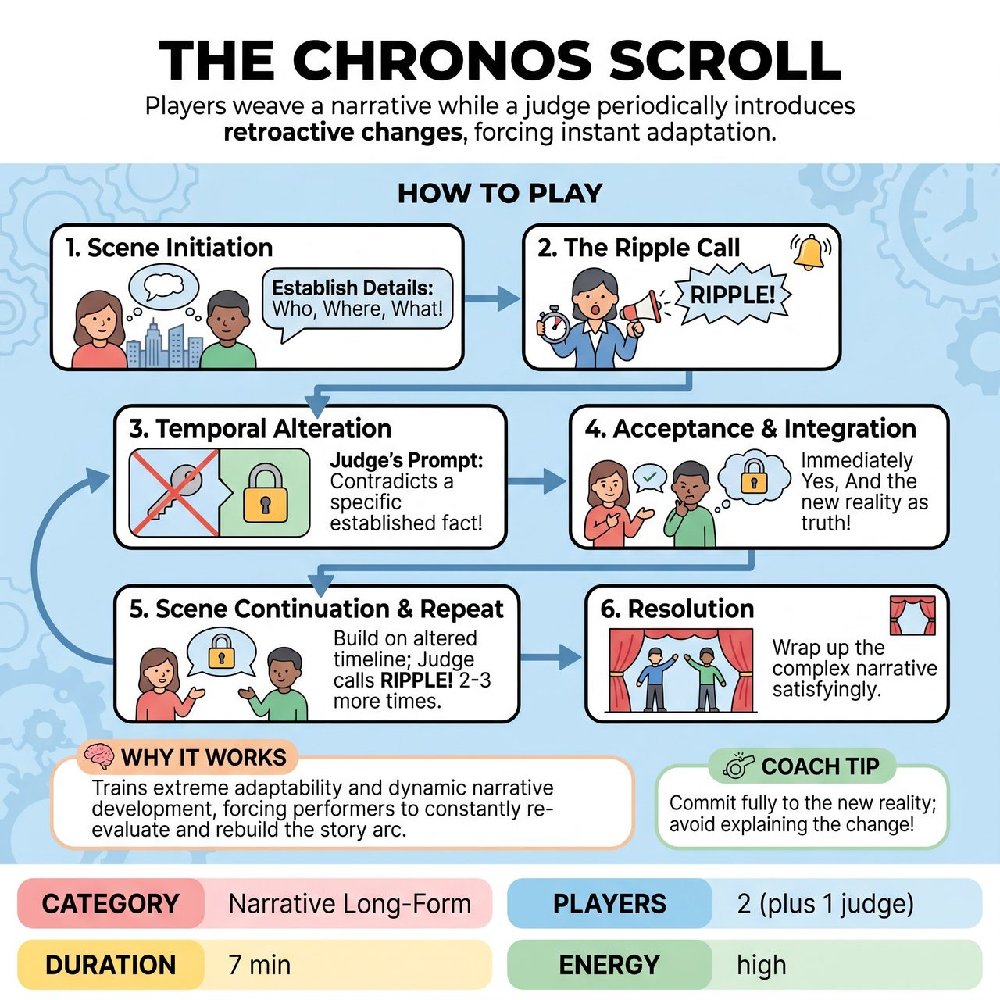

# The Chronos Scroll

{ .game-hero }

> Players weave a narrative while a judge periodically introduces retroactive changes to previously established facts, forcing them to instantly adapt their reality.

## Overview
The Chronos Scroll is an improvisational game where two performers collaboratively weave a narrative, constantly challenged by a judge who introduces Temporal Alterations - retroactive changes to previously established facts within the scene. Players must immediately Yes, And these new realities, seamlessly integrating them into the ongoing story as if they had always been true, thereby re-contextualizing characters, motivations, and plot.

## Setup
Standard improv stage. 2 improvisers per team. One judge dedicated to delivering Temporal Alteration prompts, equipped with a buzzer or bell. The scene starts with a simple audience suggestion: a location and a relationship.

## How to Play
1. Scene Initiation (1-2 minutes): Players establish characters, relationship, location, initial conflict or premise, and crucially, some clear, tangible details or events.
2. The Ripple Call: At the judge's discretion, typically after 1-2 minutes or after a significant fact has been clearly established, the judge calls RIPPLE! (or rings a bell/buzzes). The players freeze or momentarily pause their action.
3. The Temporal Alteration Prompt: The judge delivers a clear, concise prompt that directly contradicts or significantly alters a specific fact or event that was established in the scene moments earlier.
4. Acceptance and Integration: The players must immediately Yes, And this new information. They cannot question the alteration; it is the new reality. They must react as if this new truth has always been the case, and retrospectively integrate it into their character's motivations, relationship dynamics, and the ongoing plot.
5. Scene Continuation: The scene continues from this new point, building on the altered timeline.
6. Repeat: The judge issues 2-3 more RIPPLE! prompts throughout the scene, constantly challenging the players' ability to adapt and maintain coherence.
7. Resolution: The players are challenged to bring the scene to a satisfying (or absurdly fitting) conclusion, wrapping up the increasingly complex narrative within the remaining time.

## Coaching Notes
- Embrace Mistakes/Unexpected Turns: The Temporal Alteration prompts are mandated mistakes. Cheerful acceptance and ingenious integration of these changes turns potential narrative dead-ends into exciting new pathways.
- Collaborative Scene-building: Players must listen intently to their partner and the judge, helping each other adjust to the new reality. If one player is stuck, the other must provide an immediate anchor or suggestion.
- Being Changed: Performers must let the alterations change their characters, motivations, and objectives.
- Active Listening & Memory: Essential to track both the scene's current flow and the judge's specific alteration, remembering the new reality to ensure consistency.
- Narrative Acumen: Practice rapidly re-contextualizing established facts and spinning a new coherent story arc from fragmented or contradictory information.

## Why It Works
This game is all about dynamic narrative development. It forces immediate and drastic shifts in the story, creating unexpected plot points and requiring performers to constantly re-evaluate and rebuild the ongoing arc. It tests extreme adaptability, narrative resilience, and collaborative scene-building by elevating Yes, And to the level of accepting retroactive alterations of reality.

## Safety & Inclusion
Ensure the judge's prompts, while disruptive to the narrative, remain respectful of the players' physical and emotional boundaries, avoiding sensitive, triggering, or non-consensual themes.

