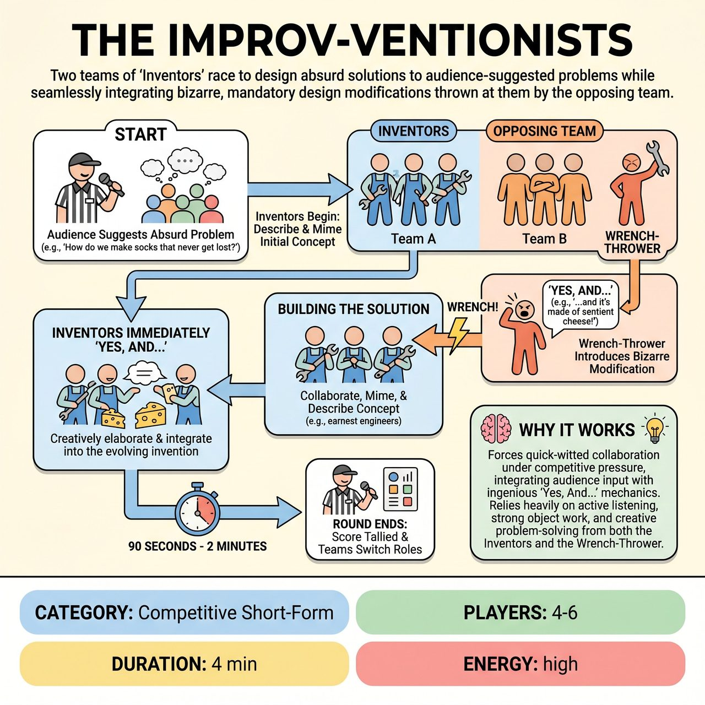

# The Improv-ventionists

{ .game-hero }

> Two teams of 'Inventors' race to design absurd solutions to audience-suggested problems while seamlessly integrating bizarre, mandatory design modifications thrown at them by the opposing team.

## Overview
The Improv-ventionists is a high-energy, collaborative-competitive game where two teams of 'Inventors' race against the clock to design and present an absurd solution to an audience-suggested problem. A designated 'Wrench-Thrower' from the opposing team periodically introduces bizarre, mandatory design modifications that the Inventors must immediately and seamlessly 'Yes, And...' into their burgeoning creation. Points are awarded for creative integration, character work, and comedic impact, while fouls are called for failing to adapt, obvious jokes, or inappropriate content.

## Setup
Divide 4-6 players into two teams (e.g., Team Red and Team Blue), each with 2-3 'Inventors.' No props are used; all objects and inventions are mimed. Use a standard competitive short-form match stage layout with two distinct 'workbench' areas designated for each team, visually separated by a central line or imaginary boundary. The audience provides the initial 'problem' for the Inventors to solve and serves as the ultimate judge of comedic success.

## How to Play
1. The Referee begins by soliciting a single, absurd, and unequivocally family-friendly 'problem' from the audience (e.g., 'How do we make socks that never get lost in the laundry?').
2. One team begins as the 'Inventors.' A designated player from the opposing team steps forward to become the 'Wrench-Thrower' for this round.
3. The Inventors immediately begin describing and miming their initial concept for solving the problem, establishing clear character endowments (e.g., earnest engineers, mad scientists) and actively 'Yes, And...'-ing each other to build the invention.
4. At random, unpredictable intervals, the Referee signals with a distinct sound (like a whistle, bell, or yelling 'WRENCH!').
5. The 'Wrench-Thrower' steps forward and loudly declares a new, absurd, and mandatory design component or modification starting with 'Yes, and...' (e.g., 'Yes, and it must be powered by the dreams of napping kittens!').
6. The Inventors must immediately accept and enthusiastically 'Yes, And...' the Wrench-Thrower's suggestion, creatively elaborating on how this new element functions within their invention using strong object work.
7. The Inventors continue to build, describe, and mime their ever-evolving invention, integrating each 'Wrench' thrown their way.
8. After a set time limit (e.g., 90 seconds to 2 minutes), the Referee signals the end of the round, tallies the score, and the teams switch roles for the next round.

## Coaching Notes
- Maintain fast, dynamic pacing with rapid 'Wrench-Thrower' interventions and short time limits to demand quick thinking.
- Inventors must pay meticulous attention to the specific details of the Wrench-Thrower's suggestion and their partner's contributions.
- Strong object work is critical; miming the absurd inventions and their components is central to the game's humor and clarity.
- Encourage Inventors to maintain their character personas (e.g., eccentric scientists) throughout the chaos to add depth and consistency.
- Award points for: Seamless Integration (+3), Craftsmanship & Character (+2), Audience Delight (+1), Elevated Absurdity (+1), and Master Inventor Bonus for turning the tables on a hard wrench (+5).
- Call a 'No, But... Foul' (-3 points) if an Inventor explicitly or implicitly rejects, ignores, or struggles significantly to integrate a suggestion.
- Call a 'Groaner Foul' (-2 points) if a Wrench-Thrower's suggestion is too obvious/a bad pun, or if Inventors respond with a lazy joke.
- Call a 'Lost Focus' penalty (-1 point) for breaking character, poor listening, or a significant lapse in object work.

## Why It Works
The game forces quick-witted collaboration under competitive pressure, integrating audience input with ingenious 'Yes, And...' mechanics. It relies heavily on active listening, strong object work, and creative problem-solving from both the Inventors and the Wrench-Thrower, reinforcing the absolute cornerstone of accepting and building upon illogical suggestions.

## Safety & Inclusion
The core premise naturally steers content towards imaginative, G-rated humor. The standard clean-content foul (-5 points) is always in effect to penalize any inappropriate content (blue humor, swearing, innuendo), ensuring unwavering family-friendliness.

