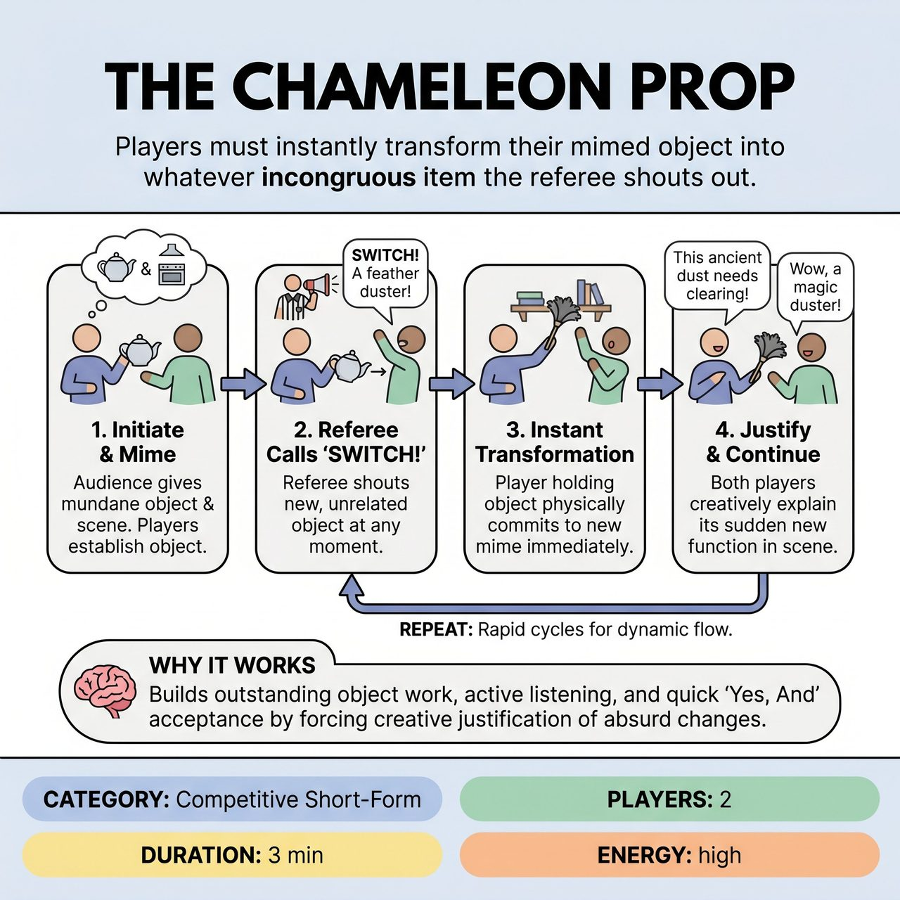

# The Chameleon Prop

{ .game-hero }

> Players must instantly transform their mimed object into whatever incongruous item the referee shouts out.

## Overview
Two players establish a scene around a single mimed object provided by the audience. The referee continuously shouts out new, often incongruous objects, and the players must instantly transform their original mime into the new object. They must justify its sudden appearance and function within the ongoing scene, testing their object work, quick wit, and 'Yes, And' skills.

## Setup
Requires 2 players (one from each team) on a standard open stage. No physical props are used; all objects are mimed. The audience provides an initial mundane object (e.g., 'a stapler') and a scene location. The audience is instructed to cheer for exceptional moments but avoid shouting out new objects themselves, as that is the referee's job.

## How to Play
1. 1. Initiation: The host asks the audience for a mundane, everyday object and a scene location.
2. 2. Scene Start: Two players enter the scene. One player initiates the mime of the audience-suggested object, establishing its presence and initial function. The second player enters and engages with the object and their partner to build the scene.
3. 3. The 'SWITCH!': At any point, the referee dramatically yells 'SWITCH!' followed by a new, often completely unrelated object (e.g., 'a feather duster!', 'a bowling ball!').
4. 4. Instant Transformation: The player currently holding or interacting with the original mimed object must instantly physically transform that mime into the new object. They cannot pick up a new mime; the existing physical shape must morph.
5. 5. Justification: Both players must immediately accept the new object's identity and creatively justify its sudden appearance and new function within the ongoing scene without interruption.
6. 6. Rapid Cycles: The referee calls 'SWITCH!' as frequently as they wish, sometimes allowing moments for a joke to develop, other times throwing changes back-to-back to heighten pressure.
7. 7. Shared Responsibility: While one player physically transforms the object, both players are responsible for the verbal justification and integrating it into the narrative.
8. 8. Game End: The game concludes after 2-3 minutes or when the referee deems an excellent moment has occurred, calling 'Scene!'

## Coaching Notes
- Award +2 points for a 'Seamless Shift' (a quick, clean physical transition to the new object).
- Award +2 points for 'Creative Justification' (a witty, unexpected, or highly logical explanation for the object's presence and use).
- Award +1 point for a 'Strong Character Reaction' to the object's change (e.g., surprise, horror, delight).
- Award +3 points for a 'Big Laugh' generated by successful integration.
- Call a 'Hesitation Foul' (-1 point) for any noticeable delay (more than 1-2 seconds) in physically transforming the object or verbally justifying it.
- Call an 'Identity Crisis Foul' (-1 point) for losing the physical mime of the current object, reverting to a previous object, or failing to acknowledge the new object.
- Call a 'Groaner Foul' (-1 point) for a cheap pun, forced joke, or a line that causes an audible groan rather than a laugh.
- Call an 'Ignoring the Object Foul' (-2 points) if a player acts as though the object didn't change or ignores its presence in the scene.
- Remind players that points are awarded to the team whose player executed the switch or provided the stronger justification, or to both teams for a collaborative win.

## Why It Works
The game demands outstanding object work, active listening, and immediate 'Yes, And' acceptance. The constant referee interventions create a dynamic pacing that keeps the scene energized, while the absurd transformations force players to rely on strong character endowment and creative justification under pressure.

## Safety & Inclusion
Maintain the 'fast, fierce, family-friendly' spirit of a competitive short-form match. Enforce a 'Content Foul' (-3 points) for any inappropriate or 'blue' humor. Ensure players respect physical boundaries during rapid object transformations.

