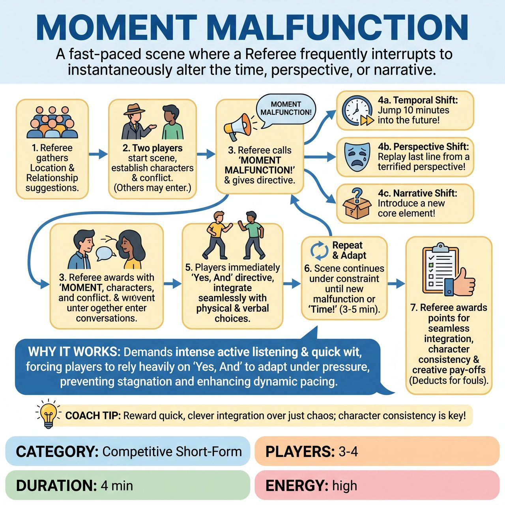

# Moment Malfunction

{ .game-hero }

> A fast-paced scene where a Referee frequently interrupts to instantaneously alter the time, perspective, or narrative.

## Overview
Players establish a scene, but at various points, the Referee shouts 'Moment Malfunction!' and issues a directive that instantaneously alters time, perspective, or a core scene element. Players must 'Yes, And' these malfunctions on the spot, demonstrating lightning-fast adaptability and clever integration to weave a coherent yet chaotically funny narrative.

## Setup
Requires 3-4 players, a Referee, and a Scorekeeper on a standard competitive short-form stage layout. No props are used. The Referee gets a Location and a Relationship suggestion from the audience to begin.

## How to Play
1. The Referee gathers an initial Location and a Relationship suggestion from the audience.
2. Two players immediately start a scene based on these suggestions, establishing characters and an initial interaction or conflict. Additional players may enter as appropriate.
3. At any point during the scene, the Referee loudly calls 'MOMENT MALFUNCTION!' and delivers a specific directive.
4. Directives can be Temporal Shifts (e.g., 'Jump 10 minutes into the future!'), Perspective/Emotional Shifts (e.g., 'Replay that last line from a terrified perspective!'), or Narrative/Objective Shifts (e.g., 'Reverse your current objective!').
5. Players must immediately and seamlessly 'Yes, And' the new directive, integrating it into their ongoing scene with quick physical and verbal choices.
6. The scene continues under the new constraint until the Referee calls another malfunction or calls 'Time!' at the 3-5 minute mark.
7. The Referee awards points for seamless integration, character consistency, and creative pay-offs, and deducts points for fouls.

## Coaching Notes
- The Referee controls the pacing, choosing to make calls rapid-fire for comedic chaos or spacing them out for more developed mini-scenes.
- Players must use strong, instant physical adjustments to sell the time and perspective shifts.
- Maintain acute active listening to both scene partners and the Referee's instructions to make instantaneous transitions believable.
- Avoid the 'Temporal Tangent Foul' by never ignoring the directive, stalling, or questioning the Referee.
- Avoid the 'Anachronism Agony Foul' by ensuring objects and concepts match the specific era if a time shift is called.

## Why It Works
The game demands intense active listening and quick wit under pressure, forcing players to rely heavily on 'Yes, And' to accept and build upon the Referee's directives. It prevents stagnation by facilitating dynamic pacing and requires short-form storytelling skills to create impactful micro-scenes within a chaotic narrative arc.

## Safety & Inclusion
The game relies on situational humor arising from temporal and narrative absurdity. Standard competitive short-form rules apply, including the clean-content foul (deducting 5 points for inappropriate or blue content) to ensure all scenes remain family-friendly and appropriate for all ages.

