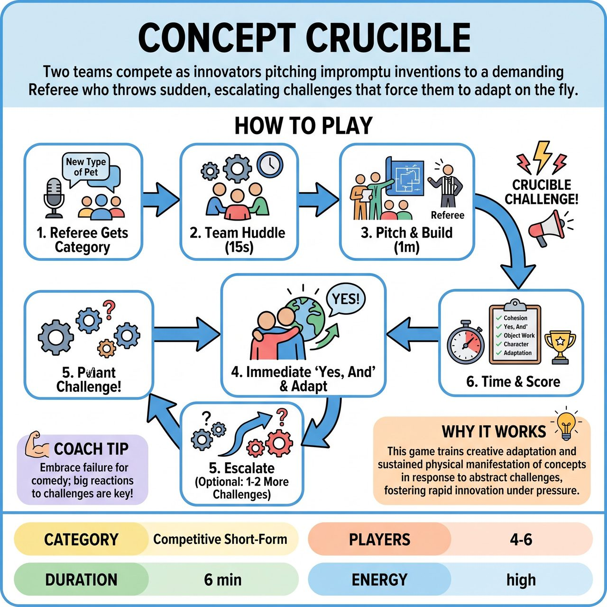

# Concept Crucible

{ .game-hero }

> Two teams compete as innovators pitching impromptu inventions to a demanding Referee who throws sudden, escalating challenges that force them to adapt on the fly.

## Overview
Concept Crucible is a high-energy, fast-paced short-form improv game where two competing teams, as ambitious 'innovators,' present their impromptu inventions, services, or solutions to the discerning Referee. The Referee acts as a demanding 'Venture Capitalist' or 'Head of R&D,' who dynamically introduces unexpected, escalating challenges during the pitch, forcing teams to adapt their concept on the fly. Success hinges on immediate collaboration, clever integration of core improv skills, and comedic problem-solving under pressure.

## Setup
Requires a clear, open stage with a designated 'evaluation desk' or 'judges' podium' (a chair suffices) for the Referee at the front or side. Two teams (Red and Blue) of 2-3 players each participate, with one team performing at a time while the other observes off-stage. No props are used; all objects must be vividly mimed. The audience provides a single, broad 'Category' suggestion for the innovation at the beginning of each round.

## How to Play
1. The Referee solicits a single 'Category' from the audience (e.g., 'new type of pet'). This category applies to both teams in the round.
2. The performing team has 15 seconds to huddle, decide on their specific 'Concept' within the category, and quickly assign basic character endowments for each player (e.g., lead inventor, marketing specialist).
3. The team begins their initial pitch (approx. 1 minute), enthusiastically presenting the Concept to the Referee. They must collaboratively build details using 'Yes, And...', maintain distinct character endowments, and use rich object work to demonstrate the Concept's physical form and function.
4. At their discretion (usually after 45-60 seconds), the Referee interjects by shouting 'CRUCIBLE CHALLENGE!' and introduces a sudden, game-changing problem or unexpected requirement that directly impacts the Concept.
5. Players must immediately 'Yes, And' the Referee's challenge, accepting it as the new reality. They must rapidly innovate, adapting their Concept and demonstrating how they overcome the constraint through strong physical choices and enhanced object work.
6. The Referee may introduce one or two more 'Crucible Challenges' depending on the team's agility and remaining time, escalating the pressure and comedic stakes.
7. The Referee ends the team's turn by calling 'Time!' and calculates the score.
8. The Referee awards positive points for Concept Cohesion (0-5), 'Yes, And...' Fortitude (1 per instance), Object Work Wonder (1 per instance), Character Commitment (0-2), Crucible Conqueror (3 per challenge), and Audience 'Innovation Ignition' (1-3 bonus). Fouls are deducted for Content Foul (-3), Groaner (-1), 'No, But...' (-2), and Passive Innovation (-1).

## Coaching Notes
- Maintain dynamic pacing throughout the game. The Referee should prompt faster responses if the energy lags and keep the momentum high.
- Ensure players are actively listening to hear their teammates' contributions, build upon them, and immediately process the Referee's challenges.
- Enforce sustained physical effort. The effectiveness of the physical transformation is maximized when players don't just briefly mime a solution, but integrate it into their ongoing physical demonstration of the invention.
- The Referee isn't just an arbiter but an active, dynamic 'judge' introducing game-changing elements, similar to a penalty or strategic shift in sports.
- Watch out for 'Passive Innovation' where players stand still or look lost; encourage everyone to actively participate and contribute to the pitch.

## Why It Works
The game deeply integrates core improv skills with a competitive, family-friendly short-form match motif. By demanding creative adaptation and sustained physical manifestation of concepts in response to abstract challenges, it generates visually rich and dynamically engaging performances. The 'Crucible Challenges' force players to physically transform their environment based on verbal cues, leading to highly active and collaborative problem-solving.

## Safety & Inclusion
All challenges and concept categories must be kept wholesome and silly, ensuring appropriate content for all ages. The 'Content Foul' (-3 points) is strictly enforced by the Referee for any blue humor, swearing, or inappropriate innuendo, immediately stopping the action to explain the infraction to the audience and players.

