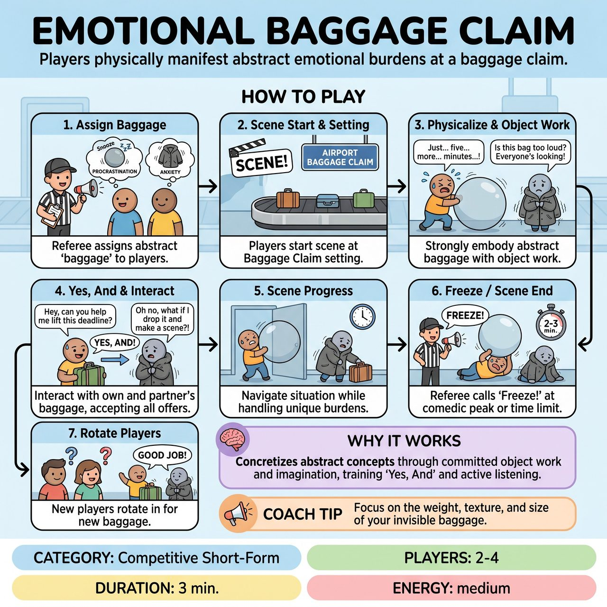

# Emotional Baggage Claim

{ .game-hero }

> Players at a baggage claim physically manifest and interact with abstract emotional burdens suggested by the audience.

## Overview
Emotional Baggage Claim is an improv game where players at a baggage claim setting must physically manifest and interact with abstract 'emotional baggage' suggested by the audience. Players use strong object work and character choices to embody their assigned intangible burdens. The comedy is driven by the absurd juxtaposition of mundane settings and abstract problems.

## Setup
The Referee introduces the premise: characters are at a baggage claim, but instead of physical luggage, they are dealing with their emotional baggage. The Referee solicits 4-6 abstract 'emotional baggage' suggestions from the audience (e.g., 'the weight of unfinished projects', 'the glimmer of new love') and filters them for appropriateness.

## How to Play
1. The Referee assigns one unique piece of 'baggage' to each of the two active players.
2. The Referee calls 'Scene!' and the two players immediately begin a scene at a 'Baggage Claim' (e.g., an airport, a lost-and-found, or a psychic's office).
3. Players must use strong object work to physicalize their abstract 'emotional baggage' (e.g., 'The weight of procrastination' might be a massive, invisible anvil dragging them down).
4. Players must interact with their own baggage while also acknowledging, accepting, and 'Yes, And-ing' their scene partner's visible and verbalized 'emotional baggage.'
5. The scene progresses with the characters trying to navigate their situation while handling their unique 'baggage.'
6. The Referee calls 'Freeze!' or 'Scene!' when the scene reaches a natural comedic peak, runs out of steam, or hits the 2-3 minute time limit.
7. The next two players rotate in, receive new 'baggage,' and start a new scene.

## Coaching Notes
- Commitment to Object Work: Ensure players clearly, consistently, and comically physicalize their abstract 'emotional baggage.' Call an 'Un-Packed Foul' if object work is unclear, inconsistent, or lacks commitment.
- Character Embodiment: Encourage players to make character choices that reflect and are influenced by their 'baggage.'
- Ignoring Your Load Foul: Penalize players if they consistently fail to interact with or acknowledge their 'emotional baggage' through object work or dialogue.
- Groaner Foul: Watch out for excessively bad puns that try to force a laugh out of the 'baggage' concept without genuine comedic context.

## Variations
- Team Matchup: Instead of rotating pairs from each team, two players from the same team can pair up against another two from the opposing team depending on the match structure.

## Why It Works
The game forces players to concretize abstract concepts through object work and character, demanding high levels of commitment and imagination to make the invisible visible. It fully engages core improv skills such as 'Yes, And,' active listening, and endowment while exploring the absurd connections between disparate emotional burdens.

## Safety & Inclusion
The Referee must filter audience suggestions to ensure they are abstract emotions or experiences, avoiding anything ambiguous or inappropriate. Step in immediately (calling a 'content foul') if a suggestion is interpreted in a non-family-friendly way or if a player's object work or dialogue becomes suggestive, reinforcing the commitment to clean performances.

