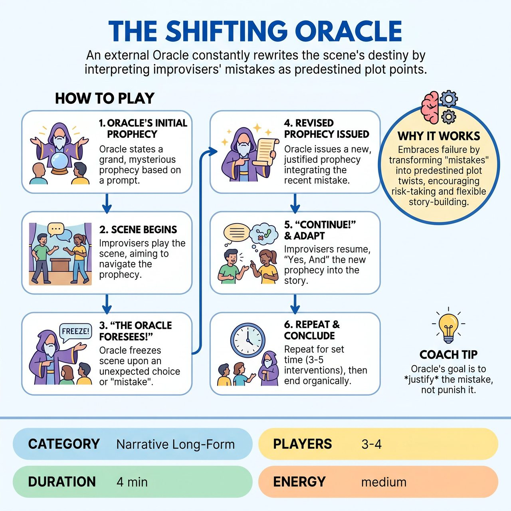

# The Shifting Oracle

{ .game-hero }

> An external Oracle constantly rewrites the scene's destiny by interpreting improvisers' mistakes as predestined plot points.

## Overview
The Shifting Oracle is an improvisational game where two or three performers collaboratively build a narrative whose destiny is constantly rewritten by an external Oracle. This Oracle actively intervenes whenever improvisers make unexpected choices or perceived mistakes, freezing the scene to declare a new prophecy. The performers must then seamlessly integrate these evolving prophetic truths into their ongoing story, transforming mistakes into vital narrative elements.

## Setup
Two or three improvisers take the stage, with one additional player (from either team or the MC) designated as The Oracle. The audience provides a single, evocative word or short phrase to inspire the initial prophecy.

## How to Play
1. The Oracle begins by announcing a grand, mysterious prophecy, drawing inspiration from the audience prompt and setting the initial narrative trajectory.
2. The improvisers begin the scene, aiming to fulfill or navigate the announced prophecy.
3. The Oracle watches intently and freezes the scene by saying 'The Oracle foresees!' whenever an improviser makes a strong, unexpected choice or a perceived mistake.
4. The Oracle issues a new, revised prophecy that seamlessly incorporates and justifies the recent mistake, making it a crucial, predestined part of the unfolding narrative.
5. The Oracle releases the scene by saying 'Continue!', and the improvisers must 'Yes, And' the new prophecy, adapting their characters' understanding and actions to this revised destiny.
6. The game continues for a set time limit, during which The Oracle might intervene 3 to 5 times, constantly reshaping the narrative until the scene ends organically.

## Coaching Notes
- The Oracle must meticulously track the scene and actively look for fumbled props, misremembered names, nonsensical dialogue, or abrupt physical actions to justify.
- The Oracle makes performers look good by retroactively justifying their unexpected choices as part of a grand design.
- Performers must constantly adapt their character's understanding, motivations, and the scene's direction based on the new prophecies.
- Maintain a coherent, albeit shifting, narrative arc within a framework of constant change.

## Why It Works
It forces improvisers to build and rebuild story arcs while actively celebrating mistakes. By transforming failures into vital, predestined plot points, performers are incentivized to take risks, knowing their unexpected choices will become narrative gold through high-level 'Yes, And' collaboration.

## Safety & Inclusion
Ensure physical safety if players are making abrupt physical choices or 'stumbling' as part of the scene. The Oracle should ensure their interventions empower the players rather than punishing or mocking their choices.

