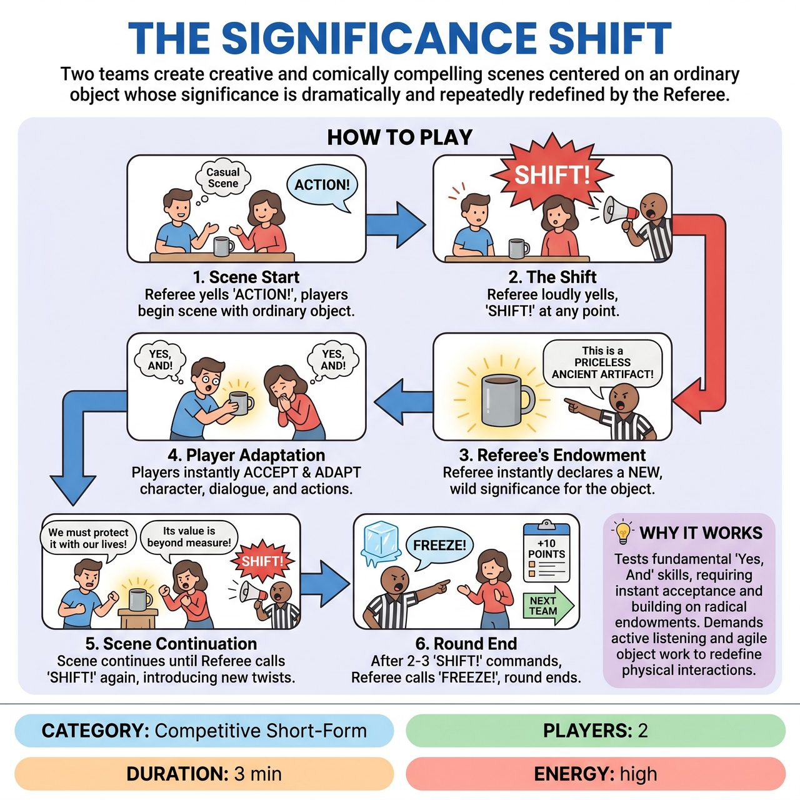

# The Significance Shift

{ .game-hero }

> Two teams create creative and comically compelling scenes centered on an ordinary object whose significance is dramatically and repeatedly redefined by the Referee.

## Overview
The Significance Shift is an improvisational game where two teams create creative and comically compelling scenes centered on an ordinary object. A referee dramatically and repeatedly redefines the object's emotional, historical, or monetary significance with a 'SHIFT!' command, forcing players to instantly accept and adapt their characters, dialogue, and physical interactions to its new reality.

## Setup
The Referee calls for two players to enter the stage, one from the Red Team and one from the Blue Team. The Referee asks the audience for a suggestion of a single, everyday, ordinary object (e.g., a pencil, a piece of string, a rock) and ensures it is appropriate. The Referee then establishes a simple, initial scenario or relationship between the two players involving this object.

## How to Play
1. Scene Start: The Referee yells 'ACTION!' The two players begin an improvised scene around the suggested ordinary object, establishing their characters and relationship to the object.
2. The Shift: At any point, the Referee loudly yells, 'SHIFT!'
3. Referee's Endowment: Immediately after 'SHIFT!', the Referee declares a new, often wildly different, significance for the object. This endowment must be concise and clear, dramatically altering the object's value, danger, emotional impact, or utility.
4. Player Adaptation: The players must instantly accept ('Yes, And') this new reality. Without breaking character, they must adapt their dialogue, physical actions, and relationship to the object to fully reflect its new, profound meaning.
5. Scene Continuation: The scene continues with the new significance until the Referee calls 'SHIFT!' again, introducing yet another twist to the object's identity.
6. Round End: After 2-3 'SHIFT!' commands, the Referee calls 'FREEZE!' The current round ends, points are awarded, and new players take the stage for the next round.

## Coaching Notes
- The Referee's core role is to dynamically control the game's energy by calling 'SHIFT!' and introducing compelling, family-friendly significances that encourage strong 'Yes, And's and comedic contrast.
- Call a 'No, But' Foul if a player rejects, ignores, or argues against the Referee's declared new significance for the object. Immediate acceptance is paramount.
- Call a 'Stagnation Foul' if a player fails to meaningfully integrate the new significance into their actions or dialogue, causing the scene to stall or lose comedic momentum.
- Call a 'Groaner Foul' if a player makes an excessively bad pun, especially one that derails the scene's emotional or narrative reality.
- Players must continuously re-define how they physically interact with and embody the object based on its changing significance (e.g., treating a banana as a fragile heirloom vs. a dangerous weapon).
- Despite the external shifts, challenge players to maintain some semblance of character motivation or relationship arc, making the shifts even funnier when contrasted with underlying continuity.
- Award points based on rapid integration (3 points), creative interpretation (2 points), excellent object work (2 points), and audience laughter (1-3 points). Deduct points for fouls.

## Variations
- The Referee can briefly poll the audience for general categories of significance ('Is it valuable? Dangerous? Sentimental?') before inventing the specific shift, adding another layer of participatory fun.

## Why It Works
The game tests fundamental 'Yes, And' skills, requiring players to instantly accept and build on radical endowments. It demands active listening to catch the specific new significance, agile object work to redefine physical interactions, and rapid character adaptability to adjust perspectives and emotional states to align with the new reality.

## Safety & Inclusion
The nature of the 'SHIFT!' endowments must be kept strictly family-friendly. The Referee ensures all suggested significances and player reactions are wholesome and appropriate for all ages, reinforcing the core philosophy of clean competitive improv. A content foul is called if any player introduces blue humor, swearing, or innuendo, acting as the ultimate guardian against inappropriate content.

