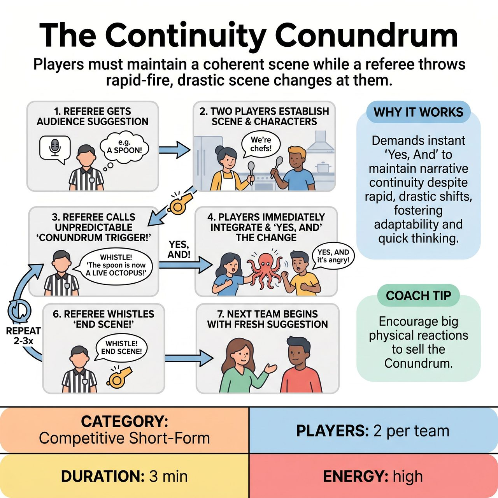

# The Continuity Conundrum

{ .game-hero }

> Players must maintain a coherent scene while a referee throws rapid-fire, drastic scene changes at them.

## Overview
The Continuity Conundrum is a fast-paced improv game where two players must collaboratively establish and maintain a coherent scene despite a referee constantly introducing rapid-fire, drastic 'Conundrums' (unexpected scene changes). Players must immediately 'Yes, And' these disruptions, integrating them creatively and seamlessly into their ongoing story. The game's objective is to navigate this escalating chaos with ingenuity and humor.

## Setup
Two teams compete with a Referee facilitating. Two players from the active team take the stage while the others observe. The Referee prepares a list of 'Conundrum Triggers' (brief, unexpected scene disruptions like 'Change of Genre!', 'Musical Moment!', or 'Silent Movie!').

## How to Play
1. The Referee asks the audience for a single, simple suggestion to kickstart the scene, such as an object, location, or relationship.
2. Two players from the active team immediately begin a scene, incorporating the audience's suggestion and establishing basic characters, their relationship, and a clear situation.
3. After 30-45 seconds, at an unpredictable moment, the Referee blows their whistle and loudly declares a 'Conundrum Trigger!' from their list.
4. The players must immediately 'Yes, And' the Conundrum, physically and verbally integrating the new condition into their ongoing scene without pausing for discussion.
5. The Referee calls 2-3 Conundrums in quick succession for each team's turn, keeping the scene dynamic and challenging.
6. After 2-3 Conundrums have been integrated, the Referee blows the whistle and calls 'End Scene!'
7. The active team returns to the sidelines, and the next team steps up for their turn, starting with a fresh audience suggestion and their own set of Conundrum Triggers.

## Coaching Notes
- The primary role of the Referee is to dynamically and strategically call out the 'Conundrum Triggers' at moments that will create maximum comedic impact and challenge.
- Call a 'Warped Logic Foul' if a player overtly denies a Conundrum, ignores it, takes too long to acknowledge it, or completely gives up on integrating it.
- Call a 'Pacing Lag Foul' if players visibly hesitate or stall for more than 3-5 seconds after a Conundrum is called.
- Award points for successful, immediate, and genuinely creative integration of a 'Conundrum Trigger', and bonus points for exceptionally brilliant integrations that elicit strong audience cheers.
- Players must listen acutely to their scene partner AND to the Referee's sudden, disruptive calls.

## Variations
- Audience Conundrum Brainstorm: At the top of the show, the Referee asks the audience to shout out bizarre, family-friendly scene changes that could be used as Conundrums, making them feel even more involved.

## Why It Works
The entire game is a test of how quickly and effectively players can shift their characters, environment, and narrative direction. It absolutely demands 'Yes, And' as players must fully accept and build upon every Conundrum, maintaining teamwork to create a shared reality even as it warps.

## Safety & Inclusion
The 'Conundrum Triggers' themselves are designed to be imaginative, silly, and never suggestive or offensive. The referee strictly enforces a clean-content foul for blue humor, swearing, or innuendo to ensure the humor comes from adaptation, not edgy content.

