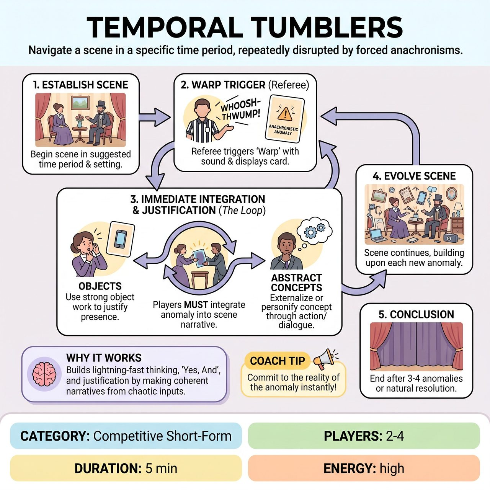

# Temporal Tumblers

{ .game-hero }

> Players navigate a scene in a specific time period, only to have it repeatedly disrupted by the sudden, forced integration of random, anachronistic objects or abstract concepts.

## Overview
Temporal Tumblers is a high-energy short-form improv game where players navigate a scene set in an audience-suggested time period, but are forced to immediately integrate and justify the sudden appearance of random, anachronistic objects or abstract concepts (Anachronistic Anomalies). The humor stems from the creative clashes, rapid justifications, and the evolving absurdity of the scene.

## Setup
The referee prepares a pre-curated deck of wild, family-friendly cards containing both concrete objects (e.g., a smartphone, a toaster) and abstract concepts (e.g., the internet, democracy). Elicit an audience suggestion for a specific time period (e.g., 'The Stone Age'). Then, solicit an audience-suggested relationship and a location within that time period. Players begin a scene within this established framework, grounding the initial reality before the 'tumbling' begins.

## How to Play
1. Players begin a scene based on the suggested time period, relationship, and location.
2. At approximately 45-60 second intervals, or at the referee's discretion (always waiting for a natural beat), the referee initiates a 'Warp Trigger' announcing a new 'Anachronistic Anomaly'.
3. The referee plays a distinctive, unmistakable sound effect (e.g., 'WHOOSH-THWUMP!') and immediately displays the anomaly's card prominently on a stand or held high.
4. Players must immediately integrate the announced Anachronistic Anomaly into the scene.
5. For concrete objects, players must use strong object work and 'Yes, And' to justify its presence and interact with it organically within the scene's established time period.
6. For abstract concepts, players must externalize or personify the concept through dialogue, physical action, or by having it immediately influence character motivations or scene objectives.
7. The scene continues, evolving with each new anomaly, with all players striving to engage with and build upon the anomaly's presence.
8. The referee calls time after 3-4 anomalies have been integrated, or when a strong, comedic, or satisfying scene resolution is naturally reached.

## Coaching Notes
- Referee's Role in Engagement: If a team has more than 3 players or a player hasn't had a significant integration opportunity, the referee should subtly direct the 'Warp Trigger' towards them to ensure equitable participation.
- Points (+2): Awarded for a player's clever, creative, and genuinely funny initial integration of the anomaly, establishing a witty, justified place for it.
- Bonus Point (+1 - The 'Paradox Pivot'): Awarded when a player's integration fundamentally transforms the scene's existing genre, objective, or character relationships in an unexpected, highly comedic way.
- Collaborative Creativity (+1): Awarded to another player who brilliantly builds upon and enhances a previous player's integration of the current anomaly.
- Temporal Turbulence Foul (-2 points): Awarded for ignoring the anomaly, a clear 'No, And' response, or an integration that is lazy, completely illogical, or actively breaks the scene's reality without comedic justification.
- Groaner Foul (-1 point): Called for a cheap, obvious, or forced joke related to the anomaly.

## Why It Works
The game demands lightning-fast thinking and heavily relies on 'Yes, And...', active listening, strong object work, and quick character and environmental adjustments. It pushes players to build coherent narratives out of chaotic inputs, transforming the familiar into the fantastically funny by forcing conceptual thinking into physical comedy.

## Safety & Inclusion
Strictly adheres to family-friendly guidelines. A 'clean-content foul' (-3 points & potential expulsion) is enforced for any inappropriate suggestion, action, or language related to the anomaly. The family-friendly commitment is paramount.

