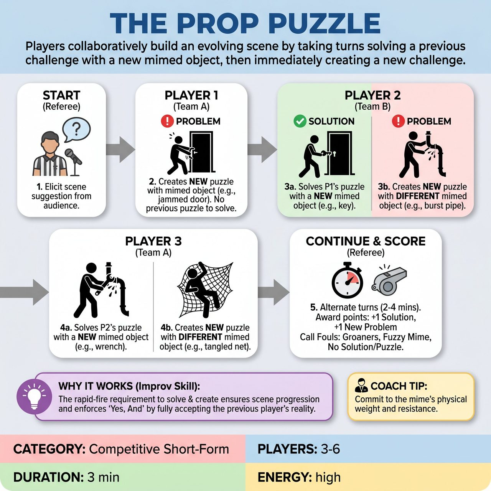

# The Prop Puzzle

{ .game-hero }

> Players collaboratively build an evolving scene by taking turns solving a previous challenge with a new mimed object, then immediately creating a new challenge.

## Overview
In The Prop Puzzle, players take turns building an evolving scene by first solving the previous challenge with a new mimed object, then immediately creating a new challenge for the next player with a different mimed object. This sequential problem-solving, driven by precise mimed object work, creates a fast-paced, competitive, and highly creative Yes, And environment.

## Setup
Divide 4-6 players equally between two competing teams (e.g., Red vs. Blue). All props are strictly mimed; no actual physical props are used. Use a standard competitive short-form performance area with players waiting offstage on their team bench. Get a simple scene suggestion from the audience, such as a location, activity, or scenario.

## How to Play
1. The Referee elicits a simple scene suggestion from the audience.
2. Player 1 from Team A steps onto the stage. Since there is no previous puzzle, they only create a new puzzle by miming an object that causes an immediate problem within the scene's context.
3. Player 2 from Team B enters. They first solve the previous puzzle using a new mimed object, then immediately create a new puzzle with another different mimed object.
4. Player 3 from Team A enters, solves Player 2's puzzle with a new mimed object, and then creates a new puzzle with yet another new mimed object.
5. Play continues, alternating between teams and individual players, for a predetermined amount of time (typically 2-4 minutes), or until the referee calls time.
6. The Referee awards 1 point for a clear solution and 1 point for a creative new problem. Bonus points can be awarded for exceptionally clever, hilarious, or physically impactful object work.
7. The Referee calls fouls (point deductions or loss of turn) for Groaners, Fuzzy object work, No Puzzle/No Solution, Recycling objects, or clean-content violations.

## Coaching Notes
- Impeccable Object Work: Mimes must be precise, understandable, and consistent. The comedic impact stems from the clarity of the mimed object and its interaction with the scene.
- Sequential Problem-Solving: Ensure each turn is a direct response and immediate setup, forcing tight Yes, And.
- Fuzzy Foul: Watch for mimed object work that is unclear, indistinct, or breaks the scene's reality without comedic intent. The Referee may issue a warning first.
- No Puzzle/No Solution Foul: If a player fails to adequately solve the previous problem or fails to clearly introduce a new problem with a new object, they lose their turn and their team loses a point.
- Recycle Foul: If a player uses an object that has already been explicitly mimed and used in that round, deduct a point and make the player re-do their turn with a new object.
- Encourage players to adopt strong physical choices and character endowments, reacting physically to the absurd situations to make the mimed actions more believable and funny.

## Why It Works
The constant requirement to both solve and create a problem ensures rapid-fire turns and prevents scene stagnation. It promotes core improv skills like Yes, And by forcing players to fully accept the previous player's reality, active listening to understand the precise nature of the puzzle, and clear, precise, and imaginative object work.

## Safety & Inclusion
A standard clean-content foul applies for anything crude, inappropriate, or non-family-friendly, resulting in a significant point deduction and a verbal warning. The reliance on physical comedy and mimed objects inherently steers the humor away from adult themes, maintaining an all-ages appropriate environment.

