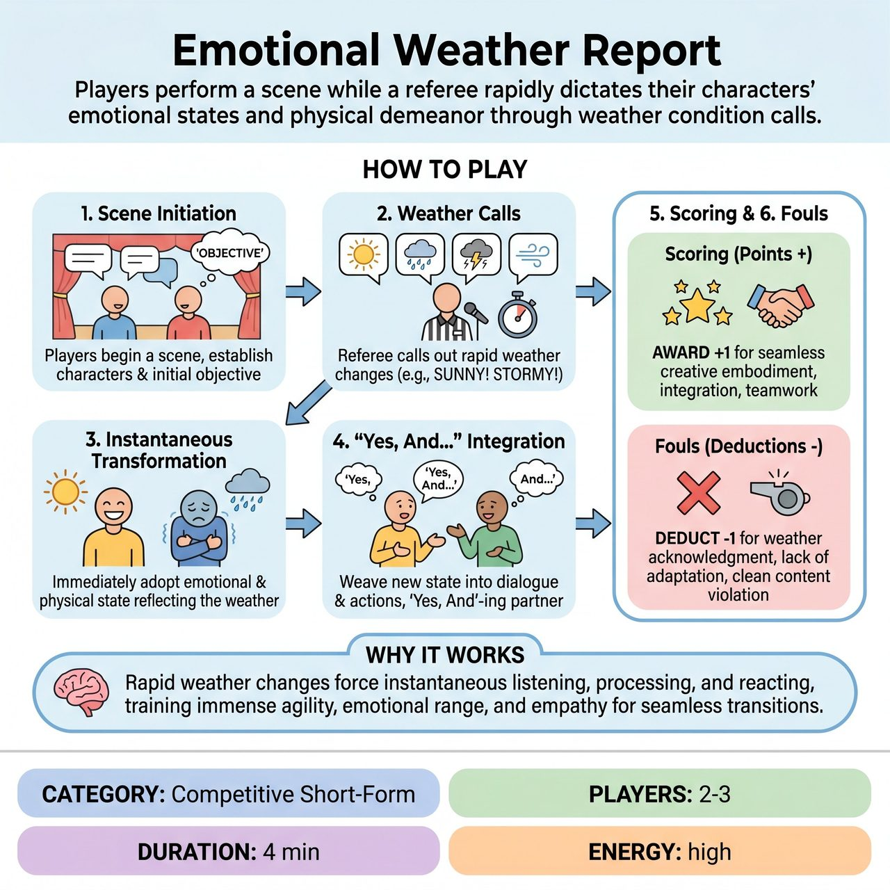

# Emotional Weather Report

{ .game-hero }

> Players perform a scene while a referee rapidly dictates their characters' emotional states and physical demeanor through weather condition calls.

## Overview
Emotional Weather Report is a dynamic and character-driven game where improvisers perform a scene, but their characters' emotional states and physical demeanor are constantly dictated by rapidly changing weather conditions. Called out by the referee, these external weather events force players to instantly transform their internal reality, aiming to create hilarious and surprisingly poignant shifts within a coherent scene. The challenge lies in seamless integration, quick emotional embodiment, and the art of 'Yes, And'-ing under intense, moment-to-moment pressure.

## Setup
Requires 2-3 improvisers on a standard competitive short-form stage, open and clear, with no props (all object work is mimed). The audience provides a scene suggestion (e.g., location, relationship, or conflict) and writes down various distinct weather conditions on individual slips of paper (e.g., 'Sunny & 75', 'Heavy Fog', 'Blizzard'). The referee collects these slips and stands prominently to act as the impartial scorekeeper and omniscient Weather Forecaster.

## How to Play
1. 1. Scene Initiation: Players begin a scene based on the audience's suggestion, establishing their characters, relationships, and an initial objective or point of conflict.
2. 2. Weather Calls: At regular, short intervals (e.g., every 15-30 seconds, or strategically at the referee's discretion), the referee clearly and audibly calls out a new weather condition from the collected audience suggestions.
3. 3. Instantaneous Transformation: Upon hearing the new weather, players must immediately and visibly adopt an emotional state and physical demeanor that reflects the impact of that weather on their character.
4. 4. 'Yes, And...' Integration: Players must seamlessly weave this new internal state into their ongoing dialogue and actions, 'Yes, And'-ing their partner's new emotional reality as if it were a genuine change within themselves or their companion.
5. 5. Scoring: The referee meticulously tracks points, awarding 1 point each for seamless transitions, creative embodiment, integration, and a teamwork bonus when both players adapt exceptionally well together.
6. 6. Fouls: The referee deducts 1 point for direct weather acknowledgment or lack of adaptation, and calls a clean-content foul for any blue humor, swearing, sexual innuendo, or truly egregious groaners.

## Coaching Notes
- Players must embody the effect of the weather as an internal experience (e.g., shivering uncontrollably for a blizzard) rather than directly referencing the weather itself or the referee's call.
- The shift must be immediate and pronounced; failing to change quickly enough, significantly enough, or reverting to a previous state prematurely incurs a point deduction.
- The referee should strategically choose weather conditions for escalation, comedic contrast, or a complete tonal shift to ensure dynamic pacing.
- Avoid meta-commentary and easy, lazy 'Groaner' jokes about the game's premise to maintain character truth.
- Example Embodiments: 'Sunny & 75' brings joy and expansiveness; 'Blizzard' evokes fear, determination, or a profound chill; 'Heavy Fog' portrays confusion, mystery, or introspective sadness; 'Thunderstorm' embodies agitation, anger, or defensiveness; 'Gusty Winds' brings distraction or irritability; 'Heatwave' makes characters sluggish or irritable.

## Why It Works
The 15-30 second intervals for weather changes force instantaneous listening, processing, and reacting, keeping quick wits at the forefront. It demands immense agility, emotional range, and empathy to seamlessly transition through contrasting emotions while maintaining a coherent scene narrative. It promotes key improv skills like 'Yes, And...', active listening, strong physical choices, character endowment, and dynamic pacing.

## Safety & Inclusion
The game adheres to a family-friendly philosophy, utilizing a clean-content foul rule to penalize any blue humor, swearing, sexual innuendo, or egregious groaners. By focusing on emotional embodiment rather than specific plot points, the game ensures content remains suitable for all ages.

