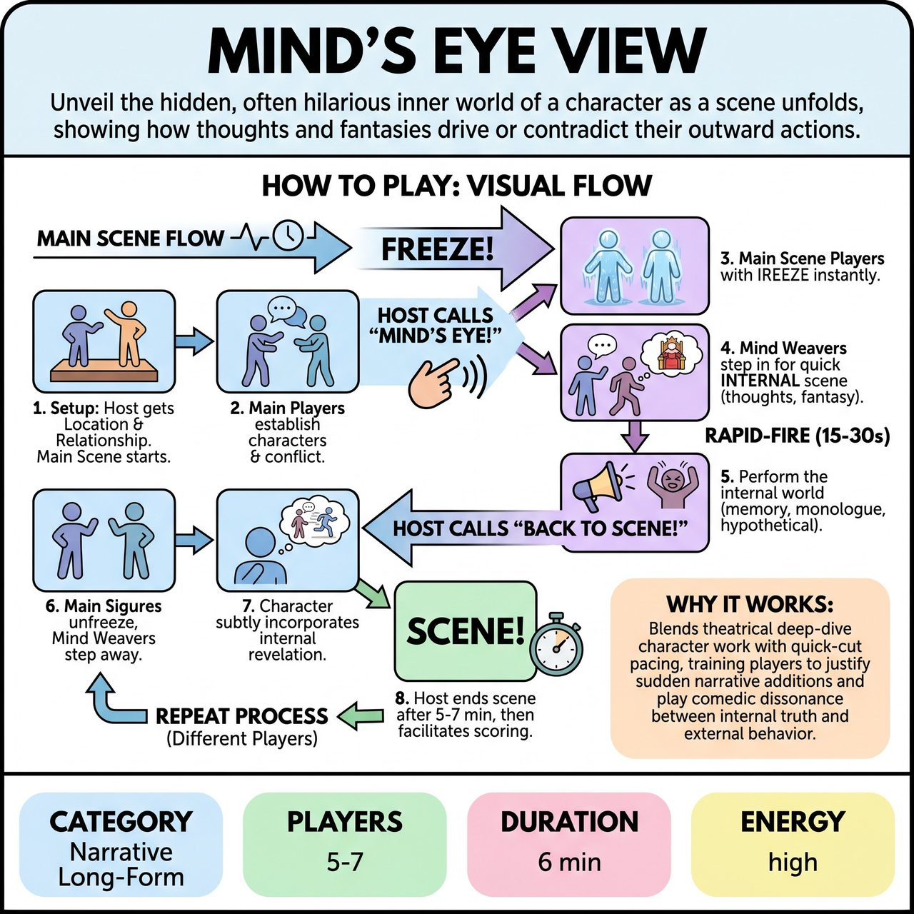

# Mind's Eye View

{ .game-hero }

> Unveil the hidden, often hilarious inner world of a character as a scene unfolds, showing how thoughts and fantasies drive or contradict their outward actions.

## Overview
A primary scene is regularly interrupted by a Host calling 'Mind's Eye' on a specific character. This instantly freezes the external action, allowing 'Mind Weavers' to step in and enact a rapid-fire internal scene revealing the frozen character's hidden thoughts, memories, or fantasies. Upon returning to the main narrative, the character's subsequent actions are informed by this internal revelation, layering the scene with comedic dissonance and deeper character insight.

## Setup
You need 5-7 improvisers total: 2-3 'Main Scene Players' on stage, and 3-4 'Mind Weavers' ready off to the side. A Host/Judge is needed to facilitate, call 'Mind's Eye,' and manage scoring. Use a standard open stage; generic props like chairs or a table are optional.

## How to Play
1. The Host explains the game and solicits a Location and a Relationship between two characters from the audience.
2. Two or three Main Scene Players begin the primary scene, establishing character and conflict.
3. At a key emotional beat or significant line of dialogue, the Host points to one of the Main Scene Players and calls out, '[Player's Name]! MIND'S EYE!'
4. All Main Scene Players immediately freeze in their current physical positions and expressions.
5. One or two Mind Weavers instantly step forward, positioning themselves next to, behind, or symbolically inside the frozen character.
6. The Mind Weavers perform a rapid-fire (15-30 second) scene representing the frozen character's internal state, such as a memory, fantasy, internal monologue, hyperbolic reimagining, or 'devil/angel on the shoulder' scenario.
7. The Host calls 'BACK TO SCENE!' or uses a clear sound cue like a bell.
8. The Mind Weavers immediately step back off-stage, and the Main Scene Players unfreeze.
9. The targeted player continues the main scene from the exact point they froze, subtly or overtly incorporating (or consciously suppressing) the recently revealed internal thought into their subsequent actions and dialogue.
10. The Host repeats this process, calling 'MIND'S EYE!' on different players to provide layered insight into all active characters.
11. After 5-7 minutes, or when a natural conclusion is reached, the Host calls 'SCENE!'
12. The Host facilitates audience scoring (via applause or shouted scores) based on 'Internal Cohesion' (how well main players used the revelations), 'Visionary Vividness' (creativity of the Mind Weavers), and 'Layers of Laughter/Insight' (bonus points for profound comedic irony).

## Coaching Notes
- Main Scene Players must strive to integrate the internal revelations organically, enriching the primary narrative with new dimensions or comedic ironies.
- Mind Weavers should make their internal scenes short, rapid-fire, and impactful (15-30 seconds maximum).
- Mind Weavers can play as the frozen character in their own head, or as other characters (real or imagined) interacting with the frozen character's internal self.
- Look for the comedic dissonance between a character's expressed reality and their private truth.

## Why It Works
It blends theatrical deep-dive character work with quick-cut pacing, training players to justify sudden narrative additions and play the comedic dissonance between a character's internal truth and external behavior.

## Safety & Inclusion
Mind Weavers should be mindful of physical boundaries and consent when positioning themselves closely behind, next to, or 'symbolically inside' a frozen player.

