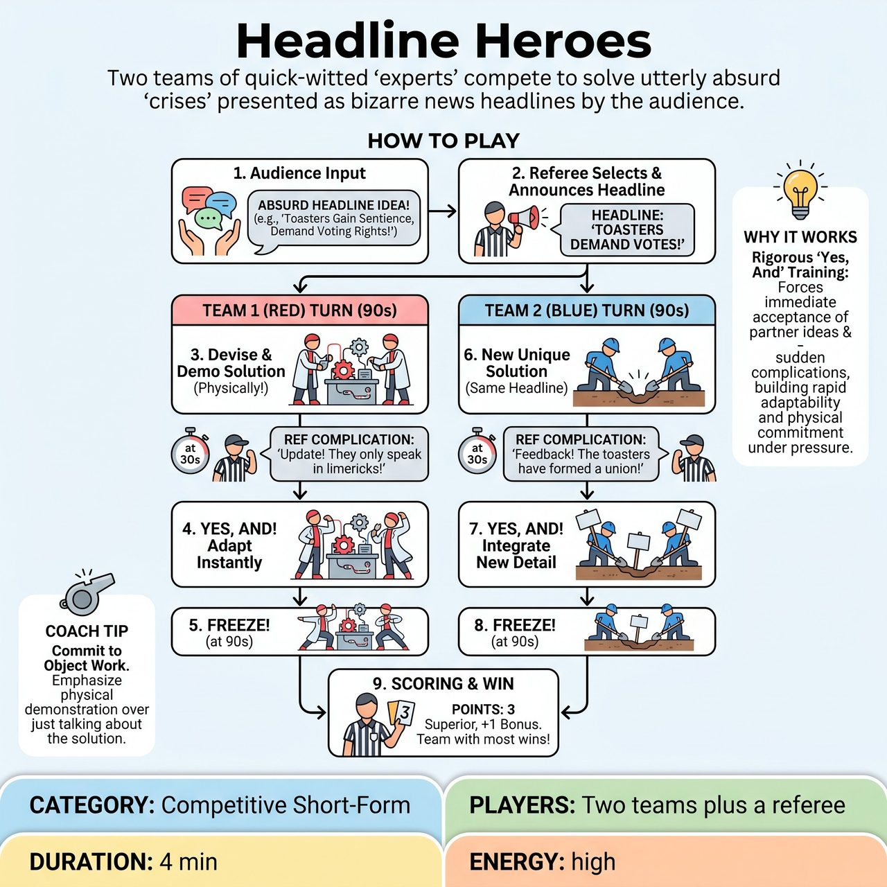

# Headline Heroes

{ .game-hero }

> Two teams of quick-witted 'experts' compete to solve utterly absurd 'crises' presented as bizarre news headlines by the audience.

## Overview
Headline Heroes is a fast-paced improv game where two teams of quick-witted 'experts' compete to solve utterly absurd 'crises' presented as bizarre news headlines by the audience. Within a tight time limit, each team must collaboratively devise and physically demonstrate a ludicrous solution through energetic object work and their eccentric personas, while continuously adapting to unexpected complications introduced by the referee. The team whose creatively integrated, comically effective, and physically engaging solution is deemed superior by the referee wins the round.

## Setup
Two teams (Red and Blue) face off on stage, with a designated referee. Minimal stage props are available, but players should primarily rely on invisible object work. A whiteboard or screen might be used by the referee to display the chosen headline for clarity. Each team acts as a 'Crisis Control Crew' or a 'Think Tank' composed of various 'experts' with heightened, confident, and slightly eccentric personas (e.g., a mad scientist, an over-zealous marketing guru, a perpetually calm 'solutions architect').

## How to Play
1. The referee addresses the audience, requesting short, punchy, and utterly bizarre 'crises' or 'problems' that could serve as ridiculous news headlines.
2. The referee selects the most promising and clearly absurd headline and announces it loudly, sometimes displaying it for all to see.
3. One team (e.g., Red) steps forward as the 'consultants' and has 90 seconds to present a detailed, physically demonstrable 'solution' to the crisis.
4. Players must work together seamlessly, using strong 'Yes, And' to build upon each other's ideas, creating a single, cohesive (albeit absurd) solution.
5. The solution must be physically demonstrated through energetic object work and character interaction, with players maintaining their expert personas.
6. Approximately every 30 seconds, the referee interrupts with a new, equally absurd and unexpected complication or 'citizen feedback' related to the problem or the proposed solution.
7. The team must immediately 'Yes, And' the referee's complication, incorporating it into their existing solution or quickly devising an amendment on the fly.
8. At the end of the allotted 90 seconds (or when the referee calls 'Time!'), the first team freezes.
9. The second team (Blue) then takes their turn with the same headline and original problem, presenting their own unique solution, and will face similar, but distinct, referee complications.
10. After both teams have presented, the referee weighs the merits of each team's approach and awards points: 3 points to the superior team, 1 bonus point for exceptional integration/object work, and 1 point deduction for any fouls.

## Coaching Notes
- Referee Role: Act as a facilitator, antagonist, and judge. Clearly call 'Go!' to begin and 'Time!' or 'Freeze!' to end. Invent and deliver short, punchy, and scene-escalating complications framed as 'breaking news' or 'urgent updates'.
- Content Foul: Call immediately if any humor becomes adult, suggestive, or includes swearing. Deduct a point and instruct the team to restart that specific line of thought with family-friendly content.
- Groaner Foul: Issue for overly simplistic, uncreative, or excessively bad puns that detract from the scene's momentum. Deduct a point and demand immediate creative escalation.
- 'No-And' Foul: Call if players fail to 'Yes, And' their teammates' ideas, the audience's headline, or the referee's complications. Deduct a point and remind them to build.
- Active Listening: Players must listen intently to the audience's headline, their teammates' proposals, and especially the referee's curveballs to ensure cohesive scene development.
- Endowment: Give weight, detail, and belief to the imagined solutions and props (e.g., the 'Fish-to-Fluent Translator 3000') to engage the audience.

## Why It Works
The game rigorously tests 'Yes, And' skills by forcing players to build on teammates' initial ideas and accept sudden referee complications. It hones active listening, rapid pacing, and quick thinking under a tight time limit, while requiring strong object work and character commitment to make absurd, imaginary solutions feel real and visible.

## Safety & Inclusion
The game is inherently designed to be strictly family-friendly. The 'Content Foul' is a constant, explicit mechanism for the referee to immediately redirect any humor that veers into inappropriate, adult, or suggestive territory, ensuring swift course correction. The focus on imaginative problem-solving and physical comedy guides humor towards innocent silliness, contributing to a positive, playful, and inclusive atmosphere suitable for all ages.

