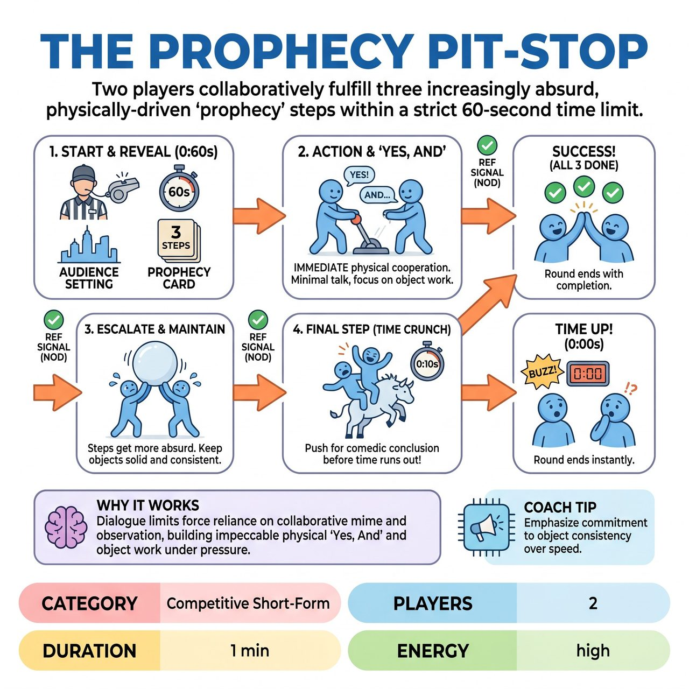

# The Prophecy Pit-Stop

{ .game-hero }

> Two players collaboratively fulfill three increasingly absurd, physically-driven 'prophecy' steps within a strict 60-second time limit.

## Overview
The Prophecy Pit-Stop is a fast-paced improv challenge where two players collaboratively fulfill three increasingly absurd, physically-driven 'prophecy' steps within a strict 60-second time limit. Guided by an audience-suggested setting and a bizarre prophecy card, teams must use only unseen objects and clear non-verbal storytelling, aiming for a cohesive, unexpected comedic conclusion. A referee ensures clear completion of steps and enforces strict family-friendly rules, awarding points for imaginative object work, seamless physical collaboration, and overall hilarious execution.

## Setup
Two players from one team step onto the center stage. The Referee asks the audience for a single, wildly imaginative, and fantastical Setting (e.g., 'A haunted pirate ship's galley at an alien concert'). The Referee then dramatically reveals a pre-written 'Prophecy Card' containing three distinct, bizarre, non-dialogue actions or object uses that must be performed sequentially (e.g., 'Befriend the Grumpy Garden Gnome, Pilot a Submarine made of Cheese, Deliver a Secret Message to the Whispering Willow').

## How to Play
1. On the Referee's start signal (a sharp whistle, gong, or enthusiastic 'QUEST!'), a strict 60-second timer begins immediately.
2. Players instantaneously launch into fulfilling the first step of the prophecy within the audience-suggested setting. There is no time for planning; they must use only action, mime, and movement.
3. Players actively 'Yes, And' each other's physical offers and object work. Minimal dialogue is permitted only to clarify a physical action, express a discovery, or react non-verbally; it must never be used to narrate the scene or substitute for physical work.
4. Players must maintain impeccable object work, ensuring imaginary items possess consistent weight, size, and texture throughout the scene without disappearing or changing properties unjustifiably.
5. Each prophecy step must be distinctly completed. The Referee watches intensely and provides a subtle but clear non-verbal signal (e.g., a decisive nod or thumbs-up) to indicate a step is done, allowing players to advance. Players cannot verbally ask if a step is complete.
6. The round concludes instantly when the team successfully completes all three prophecy steps or when the 60-second timer reaches zero. Competing teams alternate playing turns with new prophecy cards.

## Coaching Notes
- Referee Role: Act as 'The Oracle & The Verifier.' Manage the strict 60-second countdown, observe for clear completion of steps, provide non-verbal signals to advance, and enforce fouls.
- Scoring (Max 28 points): 5 points for completing all 3 steps in 60 seconds. Up to 9 points for clarity/consistency of object work (3 per step). Up to 6 points for team collaboration/physical 'Yes, And'. Up to 5 points for creative/humorous interpretation. Up to 3 points for fierce pace and energy.
- Content Foul (-5 points): For blue humor, swearing, or innuendo. Referee blows a whistle, throws a yellow flag (or signals a clean-content call), and warns.
- Groaner Foul (-3 points): For excessively bad puns, especially if used to substitute physical action or explain a step.
- Phantom Limbs Foul (-2 points): For unclear, inconsistent, or illogically shifting object work. Referee points to the inconsistent object and calls it out; action does not stop.
- Prophecy Jumper Foul (-3 points): Attempting to move to the next step before the Referee signals completion of the current one. Referee buzzes and sends them back to the previous step; the timer does not pause.
- Oracle's Silence Foul (-5 points): Making no progress, stalling, or giving up for more than 5-7 seconds. Referee clears throat, shakes head, and deducts points (may give one single, subtle non-verbal hint).

## Why It Works
The strict limitation on dialogue forces players to rely entirely on physical execution, collaborative mime, and active observation. It develops impeccable object work, physical 'Yes, And', problem-solving under immense time pressure, and storytelling through action.

## Safety & Inclusion
Strict family-friendly standards are enforced via the 'Content Foul' to prevent blue humor, swearing, or inappropriate innuendo. Players should maintain physical safety and spatial awareness during high-energy mime and fast-paced movements.

