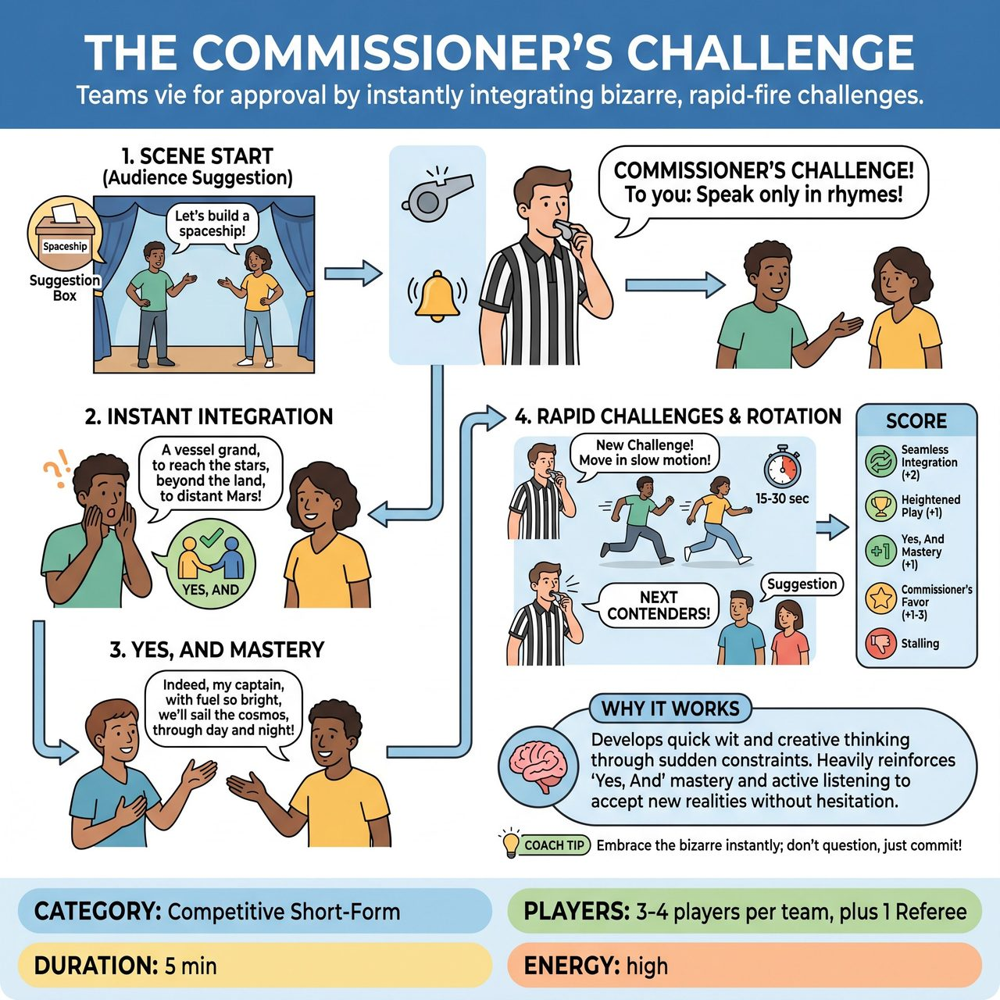

# The Commissioner's Challenge

{ .game-hero }

> Teams of contenders vie for the Commissioner's approval by instantly integrating bizarre, rapid-fire challenges into their scenes.

## Overview
The Commissioner's Challenge is a fast-paced improv game where teams of 'contenders' vie for the approval of a 'Commissioner' (referee). In short, rapidly evolving scenes, the Commissioner frequently interrupts to issue bizarre, individual challenges to one player, who must instantly and seamlessly integrate the new constraint. Their scene partner must then expertly 'Yes, And' this new reality, building upon it without hesitation as challenges layer up.

## Setup
Requires 3-4 players per team (2 players on stage at a time, cycling through) and one Referee designated as 'The Commissioner'. No props are needed (all mimed). Use a standard competitive short-form stage configuration. Get a single suggestion from the audience for the initial scene premise (e.g., location, relationship, activity).

## How to Play
1. Two players from one team enter the stage. The Commissioner asks the audience for a suggestion and players immediately begin a scene based on it, establishing characters, relationship, and environment.
2. At any point, the Commissioner can blow a whistle or ring a bell and loudly declare a 'Commissioner's Challenge!' directed at one specific player on stage (e.g., 'Player A, from now on, you can only speak in questions!').
3. The designated player must immediately and seamlessly integrate the new challenge into their character's actions, dialogue, or perspective for the remainder of that segment. There is no time for hesitation.
4. The other player in the scene must actively listen to, accept, and build upon their partner's new reality ('Yes, And'). They cannot ignore the challenge or question its validity within the scene.
5. After 15-30 seconds, the Commissioner can blow the bell again and issue a new, different challenge to the other player, or to both players simultaneously. Challenges accumulate, meaning players must maintain all active constraints.
6. After 2-3 challenges (or 1-2 minutes), the Commissioner yells 'NEXT CONTENDERS!' A new pair of players from the other team enters, receives a fresh audience suggestion, and begins their own scene.
7. Score the game: Award points for Seamless Integration (2 pts), Heightened Play (1 pt), Yes, And Mastery (1 pt), and Commissioner's Favor (1-3 bonus pts). Deduct points for fouls like Challenge Evasion (-3 pts), No-And (-2 pts), or Waffling (-1 pt).

## Coaching Notes
- Players have no time to overthink; encourage instant, gut-level comedic choices rather than waffling.
- The non-challenged player's role is crucial: they must demonstrate strong active listening and accept the new reality without question.
- Many challenges will naturally lead to strong physical choices and mimed object work. Encourage players to commit fully to these physicalities.
- Players must maintain or adapt their initial character while layering on increasingly strange constraints to create rich, multi-faceted portrayals.
- The Commissioner's whistle acts as a constant disruptor; use it to force immediate shifts in energy, focus, and comedic approach to keep the scene lively.

## Variations
- Bonus Round: At the end of the game, the audience votes for the 'Most Impressive Contender' to award a final bonus round or extra points.

## Why It Works
The game develops quick wit and creative thinking by forcing players to instantly process and integrate bizarre new constraints. It heavily reinforces 'Yes, And' mastery and active listening, as partners must accept sudden new realities without hesitation while maintaining dynamic pacing and character endowments.

## Safety & Inclusion
Challenges should be imaginative, silly, and character-driven, never crude. Enforce the standard clean-content foul (-5 points and immediate scene cut) for any inappropriate, blue, or offensive content. Ensure physical challenges are safe for players to execute on stage.

