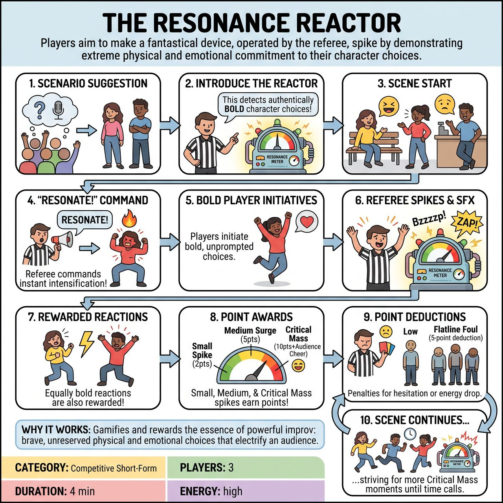

# The Resonance Reactor

{ .game-hero }

> Players aim to make a fantastical device, operated by the referee, spike by demonstrating extreme physical and emotional commitment to their character choices.

## Overview
Players are immersed in a scene under the watchful eye of the Resonance Reactor, a fantastical device operated by the referee. The reactor measures the strength and clarity of a player's physical and emotional character choices. The bolder, more committed, and louder their choices are, the higher the reactor spikes, earning their team precious points in real-time.

## Setup
3 players from one team participate per round while the other team watches. All props are mimed, including the Resonance Reactor itself, which is controlled by the referee (e.g., holding a clipboard with a sliding meter graphic or using distinct hand gestures). Set up in a standard competitive short-form performance area. The audience provides an initial scene suggestion and is encouraged to react vocally to big spikes from the reactor.

## How to Play
1. The referee solicits an audience suggestion for a scenario, and three players assume characters in this scene.
2. The referee introduces the Resonance Reactor, explaining it is designed to detect and quantify truly authentic, committed, and bold emotional and physical character choices.
3. Players initiate and develop the scene, focusing on moment-to-moment choices.
4. At any point, the referee can declare 'Resonate!', commanding players to immediately intensify their current physical or emotional state to its most committed, exaggerated, and justified version.
5. Players are also highly encouraged to make bold, committed choices without the referee's explicit command.
6. As players make these bold choices, the referee visibly and audibly spikes the Resonance Meter with sound effects (e.g., 'Bzzzzp!') and rising hand gestures.
7. Players are rewarded for making equally bold or bolder reactions to their scene partners' choices.
8. The referee awards points: Small Spike (2 points) for a clear choice, Medium Surge (5 points) for amplifying the scene, and Critical Mass (10 points plus Audience Bonus) for a phenomenal, daring, and perfectly justified choice that generates a huge audience reaction.
9. The referee deducts points for fouls: Low Resonance Foul (3-point deduction) for hesitation, The Flatline Foul (5-point deduction) for a collective drop in energy, and standard competitive fouls (clean-content call/groaner) which instantly crash the meter to zero.
10. The scene continues, with players reacting and striving for more Critical Mass moments until the referee calls time.

## Coaching Notes
- The 'Resonate!' command acts as a natural accelerant, ensuring dynamic shifts in pacing. Players learn to build and release energy.
- Crucially, the bold choice must remain justified within the scene's established reality. It shouldn't be arbitrary or purely for a cheap laugh; it should feel like an organic progression of the character or narrative.
- The game is inherently competitive, actively encouraging players to be fierce in their commitment and to push beyond comfortable choices.
- Players must actively listen to identify opportunities for heightening and understand when to react boldly to teammates' actions and the referee's cues.
- Clear, committed miming (object work) is inherently a bold physical choice and a direct path to generating Resonance.

## Why It Works
The Resonance Reactor provides an innovative, gamified mechanism to measure and celebrate the very essence of powerful improv: brave, committed, and unreserved choices that drive a scene forward and electrify an audience. It directly rewards 'Yes, And...', active listening, object work, dynamic pacing, character endowments, strong physical choices, and emotional commitment.

## Safety & Inclusion
All boldness must remain appropriate and family-friendly. The core focus is on clarity, size, and commitment, not on controversial content. The clean-content call is an ever-present guardian, immediately crashing the Reactor if humor dips into inappropriate territory. Exaggerated choices should tend towards cartoonish rather than offensive.

