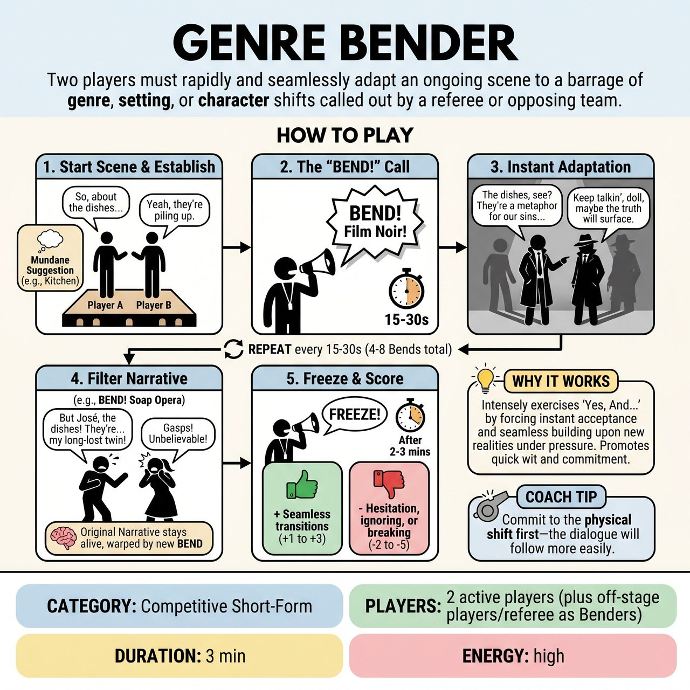

# Genre Bender

{ .game-hero }

> Two players must rapidly and seamlessly adapt an ongoing scene to a barrage of genre, setting, or character shifts called out by a referee or opposing team.

## Overview
Genre Bender challenges two improvisers to maintain an evolving scene while battling a rapid-fire barrage of genre, setting, and character endowment shifts dictated by the referee or the opposing team. The objective is to make immediate, fluid, and hilarious transitions, showcasing strong 'Yes, And...' skills under pressure, all while keeping the initial narrative alive however warped it becomes.

## Setup
Requires 2 active players (one from each team, e.g., Red Team and Blue Team) on a standard open stage. Props are mimed only. The remaining players on both teams and the Referee serve as the 'Benders'. Get a mundane, everyday scene premise from the audience (e.g., 'buying groceries' or 'a first date') to serve as the baseline.

## How to Play
1. The two active players step forward and begin the scene based on the audience's mundane suggestion, establishing their characters, relationship, and the basic situation.
2. Once at least one player has delivered a full line to establish momentum, a 'Bender' (Referee or opposing team member) loudly calls out 'BEND!' followed by a specific genre, setting, or character endowment (e.g., 'BEND! Film Noir!' or 'BEND! Underwater!').
3. Both active players must immediately and seamlessly adapt their dialogue, physicality, and character intentions to incorporate the new constraint.
4. The original narrative of the scene must continue, but now filtered entirely through the new 'Bend'.
5. Every 15-30 seconds, a new 'BEND!' is called out, forcing another instant transformation.
6. The game continues for 2-3 minutes, encompassing 4-8 rapid Bends, until the Referee calls 'Freeze'.
7. The Referee awards points for seamless transitions (+1 to +3) and deducts points for hesitation (-2), ignoring the Bend (-3), groaner puns (-5), or breaking the scene (-10).

## Coaching Notes
- Strong miming and physical choices are paramount to clearly establish the new setting or character trait.
- The designated Bender must wait until one player has delivered at least one full line before calling 'BEND!' to ensure the scene has some initial momentum.
- Players must generate new dialogue, actions, and character choices in split seconds. Hesitation or 'um/uh' lasting more than 2-3 seconds results in a -2 point Hesitation Hinderance (Delay of Game) penalty.
- Avoid overly simplistic, pun-heavy, or groan-inducing responses to a 'Bend' (Groaner Foul).
- Do not give up, complain about the Bend, or break the fourth wall in a non-comedic way (Scene Breaker penalty).
- The referee must ensure a brisk pace, calling Bends frequently to prevent any lulls and maintain a fast and fierce competitive spirit.

## Variations
- Mega-Bend: For a specific 'Bend' during the game, the referee solicits a wild, unique genre or setting directly from the audience to really challenge the players.
- Bender Rotation: The role of 'Bender' rotates between all off-stage players and the Referee, keeping the active players guessing and letting everyone influence the game.

## Why It Works
It intensely exercises the foundational principle of 'Yes, And...' as players must instantly accept the new reality and build upon it. It promotes quick wit, active listening, object work, and character versatility under the pressure of constant, quick-fire constraints.

## Safety & Inclusion
Enforce a clean-content call or buzzer: deduct 5 points for any inappropriate language, innuendo, or subject matter that is not family-friendly. Humor should stem from imaginative juxtapositions, not inappropriate content.

